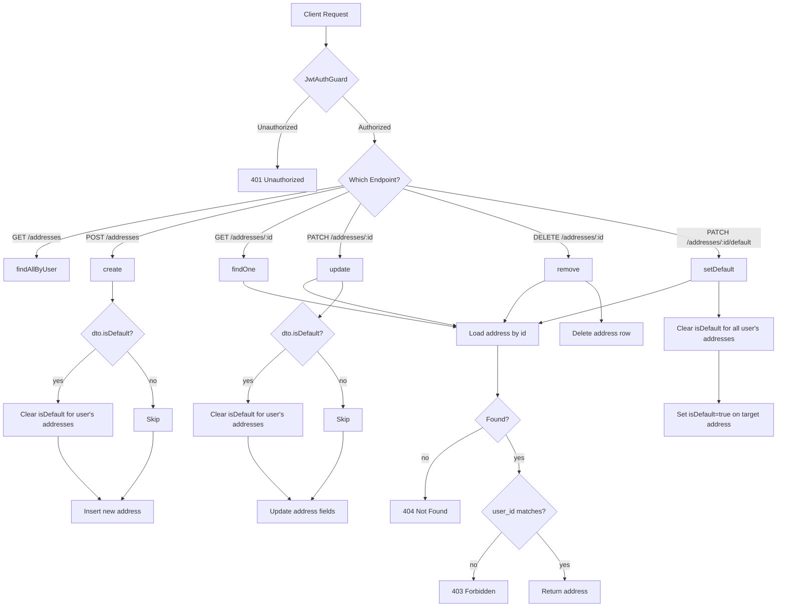
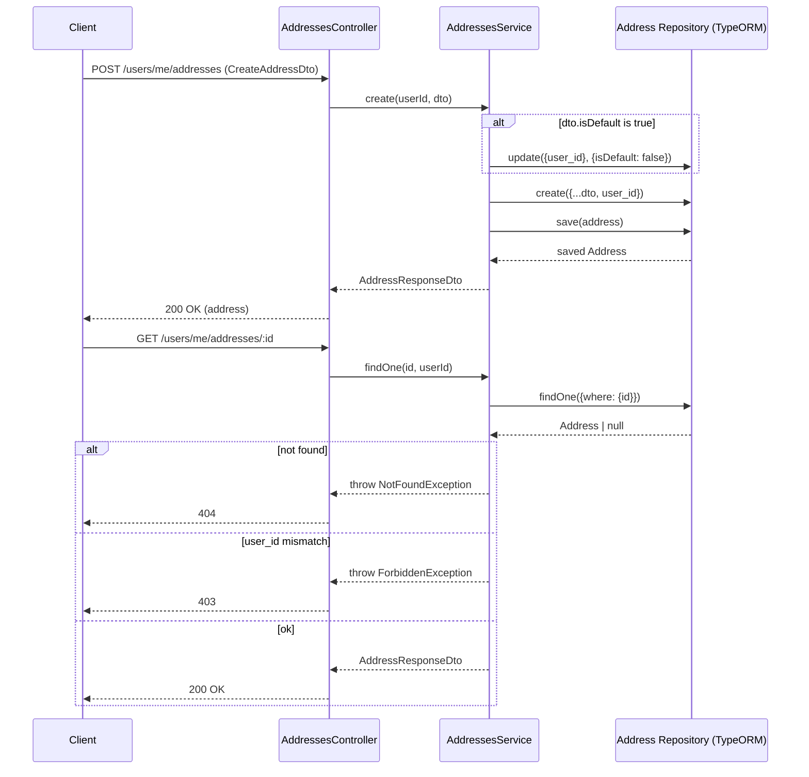

# Addresses

## Overview
- **Purpose**: Manage a user's shipping addresses (create, list, view, update, delete, set default).
- **Scope**: CRUD operations on the authenticated user's own addresses, plus a dedicated action to mark one address as the default. Addresses are consumed by the Orders feature (`address_id` on an order).
- **Entry point**: `AddressesController` at route prefix `users/me/addresses`, protected by `JwtAuthGuard`.

---

## Business Rules

- All endpoints require an authenticated user (`JwtAuthGuard` + Bearer token); there is no admin/other-user access path in this controller.
- Ownership is enforced in the service layer: any address lookup by `id` also checks `address.user_id === userId`; mismatches throw `ForbiddenException`.
- A non-existent address id throws `NotFoundException`.
- Only one address per user can have `isDefault = true`:
  - On `create`, if `dto.isDefault` is truthy, all of the user's existing addresses are set to `isDefault: false` before the new one is inserted.
  - On `update`, if `dto.isDefault` is truthy, all of the user's addresses are set to `isDefault: false` before applying the update.
  - `setDefault` unconditionally clears `isDefault` for all of the user's addresses, then sets it `true` only for the target address.
- `country` defaults to `'VN'` at the entity level if not supplied.
- `addressLine2` and `postalCode` are optional and nullable.
- `fullName`, `phone`, `addressLine1`, `city`, `province` are required, non-empty strings on create.
- `UpdateAddressDto` makes all `CreateAddressDto` fields optional (partial update); no field-level rule prevents clearing required fields to empty via update beyond DTO validation (validation still runs on any field that is provided).
- List results (`findAllByUser`) are ordered with default address first (`isDefault: 'DESC'`), then by creation date ascending.

---

## Flow Diagram



---

## Sequence Diagram



---

## Module Structure

| Module | Responsibility |
|---|---|
| `AddressesController` | Exposes REST endpoints under `users/me/addresses`, enforces JWT auth, delegates to service. |
| `AddressesService` | Business logic: ownership checks, default-address exclusivity, CRUD orchestration via repository. |
| `Address` (entity) | TypeORM entity/table mapping (`addresses`), `ManyToOne` relation to `User`. |
| `CreateAddressDto` | Validation/shape for address creation payload. |
| `UpdateAddressDto` | Partial version of `CreateAddressDto` for updates. |
| `AddressResponseDto` | Swagger-documented response shape returned to clients. |
| `AddressesModule` | Wires up `TypeOrmModule.forFeature([Address])`, controller, service; exports `TypeOrmModule` (so other modules, e.g. Orders, can inject the `Address` repository). |

---

## API

### Endpoint
GET /users/me/addresses

#### Request
No body. Requires `Authorization: Bearer <access-token>`.

#### Response
```json
[
  {
    "id": "e4b5f7a0-1c2d-4e3f-8a9b-0c1d2e3f4a5b",
    "fullName": "Nguyễn Văn A",
    "phone": "0901234567",
    "addressLine1": "123 Đường Lê Lợi",
    "addressLine2": "Phường Bến Nghé",
    "city": "Thành phố Hồ Chí Minh",
    "province": "Hồ Chí Minh",
    "country": "VN",
    "postalCode": "700000",
    "isDefault": true,
    "createdAt": "2026-01-01T10:00:00Z",
    "updatedAt": "2026-01-01T10:05:00Z"
  }
]
```

---

### Endpoint
POST /users/me/addresses

#### Request
```json
{
  "fullName": "Nguyễn Văn A",
  "phone": "0901234567",
  "addressLine1": "123 Đường Lê Lợi",
  "addressLine2": "Phường Bến Nghé",
  "city": "Thành phố Hồ Chí Minh",
  "province": "Hồ Chí Minh",
  "country": "VN",
  "postalCode": "700000",
  "isDefault": false
}
```

#### Response
```json
{
  "id": "e4b5f7a0-1c2d-4e3f-8a9b-0c1d2e3f4a5b",
  "fullName": "Nguyễn Văn A",
  "phone": "0901234567",
  "addressLine1": "123 Đường Lê Lợi",
  "addressLine2": "Phường Bến Nghé",
  "city": "Thành phố Hồ Chí Minh",
  "province": "Hồ Chí Minh",
  "country": "VN",
  "postalCode": "700000",
  "isDefault": false,
  "createdAt": "2026-01-01T10:00:00Z",
  "updatedAt": "2026-01-01T10:00:00Z"
}
```

---

### Endpoint
GET /users/me/addresses/:id

#### Request
No body. `id` path param (UUID).

#### Response
```json
{
  "id": "e4b5f7a0-1c2d-4e3f-8a9b-0c1d2e3f4a5b",
  "fullName": "Nguyễn Văn A",
  "phone": "0901234567",
  "addressLine1": "123 Đường Lê Lợi",
  "addressLine2": null,
  "city": "Thành phố Hồ Chí Minh",
  "province": "Hồ Chí Minh",
  "country": "VN",
  "postalCode": null,
  "isDefault": false,
  "createdAt": "2026-01-01T10:00:00Z",
  "updatedAt": "2026-01-01T10:00:00Z"
}
```

---

### Endpoint
PATCH /users/me/addresses/:id

#### Request
```json
{
  "phone": "0909999999",
  "isDefault": true
}
```

#### Response
```json
{
  "id": "e4b5f7a0-1c2d-4e3f-8a9b-0c1d2e3f4a5b",
  "fullName": "Nguyễn Văn A",
  "phone": "0909999999",
  "addressLine1": "123 Đường Lê Lợi",
  "addressLine2": null,
  "city": "Thành phố Hồ Chí Minh",
  "province": "Hồ Chí Minh",
  "country": "VN",
  "postalCode": null,
  "isDefault": true,
  "createdAt": "2026-01-01T10:00:00Z",
  "updatedAt": "2026-01-01T10:10:00Z"
}
```

---

### Endpoint
DELETE /users/me/addresses/:id

#### Request
No body. `id` path param (UUID).

#### Response
`204 No Content` (empty body).

---

### Endpoint
PATCH /users/me/addresses/:id/default

#### Request
No body. `id` path param (UUID).

#### Response
```json
{
  "id": "e4b5f7a0-1c2d-4e3f-8a9b-0c1d2e3f4a5b",
  "fullName": "Nguyễn Văn A",
  "phone": "0901234567",
  "addressLine1": "123 Đường Lê Lợi",
  "addressLine2": null,
  "city": "Thành phố Hồ Chí Minh",
  "province": "Hồ Chí Minh",
  "country": "VN",
  "postalCode": null,
  "isDefault": true,
  "createdAt": "2026-01-01T10:00:00Z",
  "updatedAt": "2026-01-01T10:15:00Z"
}
```

---

## Processing Steps

**Create (`POST /users/me/addresses`)**
1. `JwtAuthGuard` validates the access token and resolves the current user.
2. Controller calls `AddressesService.create(userId, dto)`.
3. If `dto.isDefault` is truthy, all existing addresses for the user are set `isDefault: false`.
4. A new `Address` entity is built from `dto` plus `user_id`, then saved.
5. The saved address is returned as `AddressResponseDto`.

**Read one (`GET /users/me/addresses/:id`)**
1. Guard validates the token.
2. Service loads the address by `id`.
3. Throws `NotFoundException` if it doesn't exist.
4. Throws `ForbiddenException` if `address.user_id !== userId`.
5. Returns the address.

**Update (`PATCH /users/me/addresses/:id`)**
1. Guard validates the token.
2. Service calls `findOne(id, userId)` (ownership/existence check, steps as above).
3. If `dto.isDefault` is truthy, clears `isDefault` on all of the user's addresses.
4. Applies `dto` fields to the address row via `repo.update(address.id, dto)`.
5. Re-fetches and returns the updated address via `findOne`.

**Delete (`DELETE /users/me/addresses/:id`)**
1. Guard validates the token.
2. Service calls `findOne(id, userId)` to confirm ownership/existence.
3. Deletes the row by id.
4. Controller responds `204 No Content`.

**Set default (`PATCH /users/me/addresses/:id/default`)**
1. Guard validates the token.
2. Service calls `findOne(id, userId)` to confirm ownership/existence.
3. Clears `isDefault` for all of the user's addresses.
4. Sets `isDefault: true` on the target address.
5. Returns the updated address via `findOne`.

---

## Database

| Entity | Description |
|---|---|
| `Address` (`addresses` table) | Stores a user's shipping address: contact info (`fullName`, `phone`), location fields (`addressLine1`, `addressLine2`, `city`, `province`, `country`, `postalCode`), `isDefault` flag, and `user_id` FK to `User` (`onDelete: 'CASCADE'`). Extends `AbstractBaseEntity` (`id`, `createdAt`, `updatedAt`). |
| `User` | Owning side of the relation (`user.addresses`); not modified by this feature but referenced via `user_id`. |
| `Order` (referenced elsewhere) | Holds `address_id` FK to `Address` with `onDelete: 'SET NULL'`; consumed by `OrdersService`, not by this module directly. |

---

## Events

None. TODO: no event emitters (`EventEmitter2`, message queue, etc.) found in `src/addresses/`; confirm with the team if any downstream consumer needs to react to address changes.

---

## Exception Flow

- `NotFoundException('Address not found')` — thrown in `findOne` when no address with the given `id` exists (also surfaces through `update`, `remove`, `setDefault` since they all call `findOne`).
- `ForbiddenException()` — thrown in `findOne` when the address exists but belongs to a different `user_id`.
- Implicit `401 Unauthorized` — from `JwtAuthGuard` when the request lacks a valid bearer token (not thrown in this module's code, enforced by the guard).
- DTO validation errors (`class-validator`, e.g. missing `fullName`/`phone`/`addressLine1`/`city`/`province`, wrong types) — produce NestJS's default `400 Bad Request` via the global validation pipe (not explicit in this module's code).

---

## Related Components

- `AddressesController` — `src/addresses/addresses.controller.ts`
- `AddressesService` — `src/addresses/addresses.service.ts`
- `Address` repository (TypeORM) — injected via `@InjectRepository(Address)`
- `JwtAuthGuard` — `src/auth/guards/jwt-auth.guard.ts`
- `CurrentUser` decorator — `src/common/decorators/current-user.decorator.ts`
- `AddressesModule` — exports `TypeOrmModule` so the `Address` repository is available to other modules
- `OrdersService` / `OrdersModule` — external consumer that injects the `Address` repository directly to validate `address_id` on order creation/update and to load the related `address` relation on orders

---

## Notes

- The response DTO (`AddressResponseDto`) is a Swagger typing artifact only; the service actually returns the raw TypeORM `Address` entity in every method (no explicit mapping/`plainToInstance` step), so `user_id` and the `user` relation are technically present on the returned object even though not declared on the DTO. TODO: confirm whether entity-to-DTO serialization/exclusion is enforced globally (e.g., via `ClassSerializerInterceptor`) elsewhere in the app.
- "Clear all defaults then set new default" is implemented as two separate, non-transactional repository calls in `create`, `update`, and `setDefault`. TODO: verify whether this should be wrapped in a DB transaction to avoid a race condition where two concurrent defaulting requests could both leave `isDefault: true` on more than one address.
- `country` has a DB-level default of `'VN'` (`@Column({ default: 'VN' })`), but this only applies when the column is omitted at the SQL level; the DTO also allows explicitly passing any string value.
- Route base path (`users/me/addresses`) implies addresses are always scoped to the authenticated ("me") user; there is no controller for managing another user's addresses (e.g., admin endpoints) in this module.
