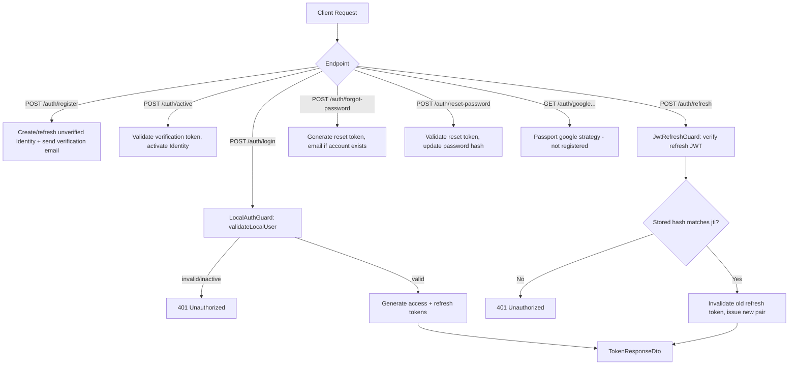
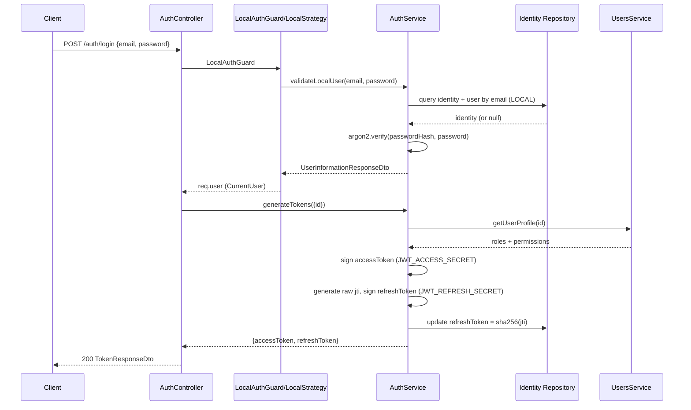

# Auth

## Overview
- **Purpose**: Authenticate users (customers and admins) using local email/password credentials, issue and rotate JWT access/refresh tokens, handle account activation, password reset, and (partially) OAuth (Google) login.
- **Scope**: Covers `src/auth/` — controllers (`AuthController`, `AdminAuthController`), `AuthService`, Passport strategies (`local`, `jwt`, `jwt-refresh`, `google`), guards, DTOs, and the `Identity` entity. Depends on `UsersModule` (`UsersService.getUserProfile`, `findByEmail`) for user/role/permission data, and `MailModule` for verification/reset emails.
- **Entry point**: `AuthModule` (`src/auth/auth.module.ts`), imported by `AppModule`. Public routes are mounted under `/auth/*`; admin-only routes are mounted under `/admin/auth/*`.

---

## Business Rules

- Passwords must be 8–50 characters (`RegisterDto`, `LoginDto`, `ResetPasswordDto`).
- Passwords are hashed with **argon2** (`AuthService.hashedPassword` / `verifiedPassword`).
- `login`, `register`, and `forgot-password` are rate-limited to 5 requests/60s (`@Throttle`), in addition to the global default throttle of 60 requests/60s (`ThrottlerGuard` registered as `APP_GUARD`).
- Local login (`validateLocalUser`) fails with `Invalid credentials` if no local `Identity` exists for the email, or the password hash doesn't match; fails with `Account is not activated` if `identity.isActive` is `false`.
- Registration never reveals whether an email is already registered — it always returns the same generic message, whether the account is new, already exists, or an internal error occurs (the error is caught and swallowed, only logged to console).
- Registering an email that already has an **inactive, expired** local identity re-issues a new verification token and password hash and re-sends the verification email; an email with an **active** or **not-yet-expired** identity is silently ignored (message-only response, no DB change).
- Email verification tokens expire after **1 hour**; activating with an expired, invalid, or already-used token throws `BadRequestException`. An already-active account cannot be re-activated (`Account is already active`).
- Password reset tokens expire after **15 minutes**; `forgotPassword` silently no-ops if the email doesn't exist (anti user-enumeration), but throws `BadRequestException` if the account exists but has no local identity (i.e., is OAuth-only — user is told to log in via that provider instead).
- `resetPassword` requires a valid, non-expired reset token hash and an active identity; otherwise `Invalid or expired token` / `Account is not activated`.
- Refresh tokens are single-use (rotation enforced): the raw `jti` is embedded in the signed refresh JWT, its SHA-256 hash is persisted on the local `Identity.refreshToken` column, and is cleared (`null`) as soon as it is redeemed. Reusing a refresh token, or one that doesn't match the stored hash, throws `Unauthorized: Refresh token is invalid or already used`.
- Both access and refresh JWTs carry `sub` (user id), `email`, `roles`, `permissions` in the payload, and are signed/verified with **separate secrets and expirations** (`JWT_ACCESS_*` vs `JWT_REFRESH_*` env vars); expired tokens are rejected (`ignoreExpiration: false`).
- Admin login/refresh/`me` endpoints require the caller's roles to include `admin` or `super-admin` (`ADMIN_ROLES`), enforced via `AuthService.assertAdminRole` / `adminLogin`; otherwise `ForbiddenException`.
- OAuth login (`validateOAuthLogin`) auto-provisions a `User` (matched or created by email) plus a new `Identity` marked **immediately active** (no email verification step) when no identity exists yet for that `provider`/`providerUserId`; if an identity already exists but is inactive, login is rejected.
- `Identity` has a unique constraint on `(provider, providerUserId)`, preventing duplicate identities per provider.
- The Google OAuth strategy (`GoogleStrategy`) is commented out and **not registered** as a provider in `AuthModule` — the `/auth/google` and `/auth/google/callback` routes exist on the controller but currently have no working `'google'` Passport strategy (see Notes).

---

## Flow Diagram



---

## Sequence Diagram



---

## Module Structure

| Module | Responsibility |
|---|---|
| `AuthModule` | Wires controllers, `AuthService`, Passport strategies, JWT signing config, `Identity` repository |
| `AuthController` | Public customer-facing auth endpoints (`/auth/*`) |
| `AdminAuthController` | Admin-only auth endpoints (`/admin/auth/*`), enforces admin role |
| `AuthService` | Core business logic: hashing, token generation/rotation, registration, activation, password reset, OAuth provisioning |
| Strategies (`local`, `jwt`, `jwt-refresh`) | Passport strategies backing the guards; `google` strategy present but disabled |
| Guards (`LocalAuthGuard`, `JwtAuthGuard`, `JwtRefreshGuard`) | Thin `AuthGuard()` wrappers per strategy |
| `UsersModule` | Provides `UsersService.getUserProfile` (roles/permissions) and `findByEmail` |
| `MailModule` | Sends verification and password-reset emails |

---

## API

### Endpoint
`POST /auth/login`

#### Request
```json
{
  "email": "admin@example.com",
  "password": "12345678"
}
```

#### Response
```json
{
  "accessToken": "eyJhbGciOiJIUzI1NiIsInR5cCI6IkpXVCJ9...",
  "refreshToken": "eyJhbGciOiJIUzI1NiIsInR5cCI6IkpXVCJ9..."
}
```

---

### Endpoint
`POST /auth/register`

#### Request
```json
{
  "email": "user@example.com",
  "password": "P@ssw0rd!"
}
```

#### Response
```json
{
  "message": "If this email is not yet registered, a verification link has been sent."
}
```

---

### Endpoint
`POST /auth/active`

#### Request
```json
{
  "token": "abc123verificationtoken"
}
```

#### Response
```json
{
  "id": "123e4567-e89b-12d3-a456-426614174000",
  "email": "user@example.com",
  "fullName": "John Doe"
}
```

---

### Endpoint
`POST /auth/refresh`
(Bearer refresh JWT in `Authorization` header; no body)

#### Request
```json
{}
```

#### Response
```json
{
  "accessToken": "eyJhbGciOiJIUzI1NiIsInR5cCI6IkpXVCJ9...",
  "refreshToken": "eyJhbGciOiJIUzI1NiIsInR5cCI6IkpXVCJ9..."
}
```

---

### Endpoint
`POST /auth/forgot-password`

#### Request
```json
{
  "email": "letutan500@gmail.com"
}
```

#### Response
```json
{
  "message": "If the email exists, a password reset link has been sent"
}
```

---

### Endpoint
`POST /auth/reset-password`

#### Request
```json
{
  "token": "abc123resettoken",
  "newPassword": "P@ssw0rd!"
}
```

#### Response
```json
{
  "message": "Password has been reset successfully"
}
```

---

### Endpoint
`GET /auth/google`
(Redirects to Google OAuth consent screen — no body/response payload; `'google'` strategy currently not registered, see Notes)

---

### Endpoint
`GET /auth/google/callback`
(Query params/state supplied by Google redirect; no request body)

#### Response
```json
{
  "accessToken": "eyJhbGciOiJIUzI1NiIsInR5cCI6IkpXVCJ9...",
  "refreshToken": "eyJhbGciOiJIUzI1NiIsInR5cCI6IkpXVCJ9..."
}
```

---

### Endpoint
`POST /admin/auth/login`

#### Request
```json
{
  "email": "admin@example.com",
  "password": "12345678"
}
```

#### Response
```json
{
  "accessToken": "eyJhbGciOiJIUzI1NiIsInR5cCI6IkpXVCJ9...",
  "refreshToken": "eyJhbGciOiJIUzI1NiIsInR5cCI6IkpXVCJ9..."
}
```
(403 `Tài khoản không có quyền truy cập trang quản trị` if the account's roles do not include `admin`/`super-admin`)

---

### Endpoint
`GET /admin/auth/me`
(Bearer access JWT required)

#### Request
```json
{}
```

#### Response
```json
{
  "id": "123e4567-e89b-12d3-a456-426614174000",
  "name": "John Doe",
  "email": "admin@example.com",
  "roles": ["admin"],
  "permissions": ["orders.read", "orders.update"]
}
```

---

### Endpoint
`POST /admin/auth/active`

#### Request
```json
{
  "token": "abc123verificationtoken"
}
```

#### Response
```json
{
  "id": "123e4567-e89b-12d3-a456-426614174000",
  "email": "admin@example.com",
  "fullName": "John Doe"
}
```

---

### Endpoint
`POST /admin/auth/refresh`
(Bearer refresh JWT; asserts admin role in addition to standard rotation logic)

#### Request
```json
{}
```

#### Response
```json
{
  "accessToken": "eyJhbGciOiJIUzI1NiIsInR5cCI6IkpXVCJ9...",
  "refreshToken": "eyJhbGciOiJIUzI1NiIsInR5cCI6IkpXVCJ9..."
}
```

---

### Endpoint
`POST /admin/auth/forgot-password`

#### Request
```json
{
  "email": "letutan500@gmail.com"
}
```

#### Response
```json
{
  "message": "If the email exists, a password reset link has been sent"
}
```

---

### Endpoint
`POST /admin/auth/reset-password`

#### Request
```json
{
  "token": "abc123resettoken",
  "newPassword": "P@ssw0rd!"
}
```

#### Response
```json
{
  "message": "Password has been reset successfully"
}
```

---

## Processing Steps

**Login (local):**
1. `LocalAuthGuard` invokes `LocalStrategy.validate(email, password)` → `AuthService.validateLocalUser`.
2. Look up `Identity` (provider = `local`, `providerUserId` = email) joined with `User`.
3. Reject if no identity/user, not active, or no password hash.
4. Verify password with argon2; reject on mismatch.
5. Controller calls `generateTokens({ id })`.
6. `generateTokens` loads the user profile (roles/permissions) via `UsersService.getUserProfile`.
7. Sign access JWT (`accessSecret`, `accessExpiresIn`) with `sub`, `email`, `roles`, `permissions`.
8. Generate random 32-byte `jti`, sign refresh JWT (`refreshSecret`, `refreshExpiresIn`) embedding the same payload plus `jti`.
9. Hash the raw `jti` (SHA-256) and persist it on the user's local `Identity.refreshToken`.
10. Return `{ accessToken, refreshToken }`.

**Register:**
1. Validate DTO (email format, password length).
2. Check for an existing `User` by email (with identities).
3. If existing user has an inactive+expired local identity: rotate verification token, update password hash, resend email.
4. If existing user has an active or not-yet-expired identity: no-op.
5. If no existing user: create `User` + local `Identity` with hashed password and verification token inside a DB transaction; send verification email.
6. Always return the same generic message (errors are caught and swallowed).

**Refresh token rotation:**
1. `JwtRefreshGuard` verifies the refresh JWT signature/expiry via `JwtRefreshStrategy`, extracting `sub` and `jti`.
2. Controller ensures `user.id` and `user.refreshJti` are present, else 401.
3. `rotateRefreshToken` hashes the incoming `jti` and compares it to the stored hash on the local `Identity`.
4. If mismatched/missing → 401 (token reuse or invalidated).
5. Clear stored refresh hash, then call `generateTokens` to issue a fresh access/refresh pair (which re-persists a new hash).

**Account activation / password reset:** token is hashed (SHA-256) and matched against `Identity.verificationToken` / `Identity.resetToken`; expiry and active-state checks applied before mutating the `Identity` row.

---

## Database

| Entity | Description |
|---|---|
| `Identity` (`identities` table) | One row per auth provider per user; stores `passwordHash`, `isActive`, `refreshToken` (hash), `verificationToken`/`verificationTokenExpires`, `resetToken`/`resetTokenExpires`, `rawProfile`, and a `ManyToOne` to `User`. Unique on `(provider, providerUserId)`. |
| `User` | Referenced/created by auth (email, `userCode`, `fullName`, `avatar`); roles/permissions read for JWT payload and profile responses. Owned by `UsersModule`. |
| `Role` / `Permission` | Read-only from auth's perspective — used to build `roles`/`permissions` arrays in the JWT payload and profile DTOs via `UsersService.getUserProfile`. Owned by `RolesModule`/`PermissionsModule`. |

---

## Events

TODO: No event emitter usage found in `src/auth/` (no `EventEmitter2`, `@OnEvent`, or `.emit(...)` calls). None.

---

## Exception Flow

- `UnauthorizedException` — invalid email/password on local login; missing password hash; inactive account on local/OAuth login; missing `id`/`refreshJti` on refresh; refresh token hash mismatch or already used.
- `ForbiddenException` — non-admin role attempting `admin/auth/login`, `admin/auth/me`, or `admin/auth/refresh`.
- `BadRequestException` — OAuth login without an email from the provider; invalid/expired/used activation token; already-active account on activation; invalid/expired reset token; inactive account on reset-password; forgot-password on an OAuth-only account.
- `NotFoundException` — `admin/auth/me` when the resolved user profile no longer exists.
- Registration errors are caught internally and never surfaced to the client — a generic success message is always returned (enumeration-safe); the underlying error is only `console.log`'d.
- `forgotPassword` on a non-existent email silently returns without error (enumeration-safe).
- Rate limiting (`ThrottlerException` via `@Throttle`) on login/register/forgot-password (5 req/60s) and global default (60 req/60s).
- Passport strategy failures (e.g., no `'google'` strategy registered) surface as standard NestJS runtime errors when hitting `/auth/google*` — see Notes.

---

## Related Components

- `AuthController` (`src/auth/auth.controller.ts`) — public endpoints.
- `AdminAuthController` (`src/auth/admin-auth.controller.ts`) — admin endpoints.
- `AuthService` (`src/auth/auth.service.ts`) — business logic.
- `Identity` entity/repository (`src/auth/entities/identity.entity.ts`).
- Guards: `LocalAuthGuard`, `JwtAuthGuard`, `JwtRefreshGuard` (`src/auth/guards/`).
- Strategies: `LocalStrategy`, `JwtStrategy`, `JwtRefreshStrategy` (registered), `GoogleStrategy` (defined but commented out / not registered).
- `CurrentUser` decorator and `CurrentUser` interface (`src/common/decorators/current-user.decorator.ts`, `src/common/interfaces/current-user.interface.ts`).
- `UsersService` (`getUserProfile`, `findByEmail`) — `src/users/users.service.ts`.
- `MailService` (`sendVerificationEmail`, `sendForgotPassword`) — `src/mail/mail.service.ts`.
- `TypedConfigService` (`getJwtConfig`, `getAppConfig`, `getGoogleConfig`) — `src/config/`.
- Global `ThrottlerGuard` (`src/app.module.ts`, `APP_GUARD`).

---

## Notes

- Password hashing: **argon2** (`argon2.hash` / `argon2.verify`), no configurable options set (library defaults).
- Access/refresh tokens: separate secrets and expirations from `JWT_ACCESS_SECRET`/`JWT_ACCESS_EXPIRES_IN`/`JWT_REFRESH_SECRET`/`JWT_REFRESH_EXPIRES_IN` env vars (`src/config/environment/jwt.config.ts`); expiry values are parsed as a number (seconds) or an `ms`-style string.
- Refresh token rotation: the *raw* `jti` is never stored — only its SHA-256 hash, on the local `Identity` row. Rotation invalidates the previous hash before minting the next pair, but the same `Identity.refreshToken` column is used for all rotations, so it is single-slot (not a multi-session/whitelist design).
- Verification token TTL: 1 hour. Password reset token TTL: 15 minutes. Both are raw 32-byte random hex tokens; only their SHA-256 hash is persisted, and the raw value is emailed to the user.
- `RegisterSeederDto` (`src/auth/dtos/register-seeder.dto.ts`) extends `RegisterDto` with a `roles` field but has **no controller/service usage** found in `src/` — appears to be intended for a database seeder script only. TODO: confirm intended consumer.
- Google OAuth is only partially wired: `GoogleStrategy` (`src/auth/strategies/google.strategy.ts`) is fully commented out, and `AuthModule` explicitly comments out its provider registration. The `AuthController` still exposes `GET /auth/google` and `GET /auth/google/callback` guarded by `AuthGuard('google')` and `AuthService.validateOAuthLogin`/`AuthProvider.GOOGLE`/`GoogleProfile` interface exist and are ready to use once the strategy is re-enabled and configured (`getGoogleConfig()`). TODO: re-enable before relying on Google login.
- No `RolesGuard`/`PermissionsGuard` found under `src/common/guards` — admin authorization in this module is enforced ad hoc via `AuthService.assertAdminRole` / `ADMIN_ROLES` (`'super-admin'`, `'admin'`) rather than a shared guard/decorator.
- OAuth-provisioned accounts (`validateOAuthLogin`) are marked `isActive: true` immediately, skipping the email-verification flow used by local registration.
