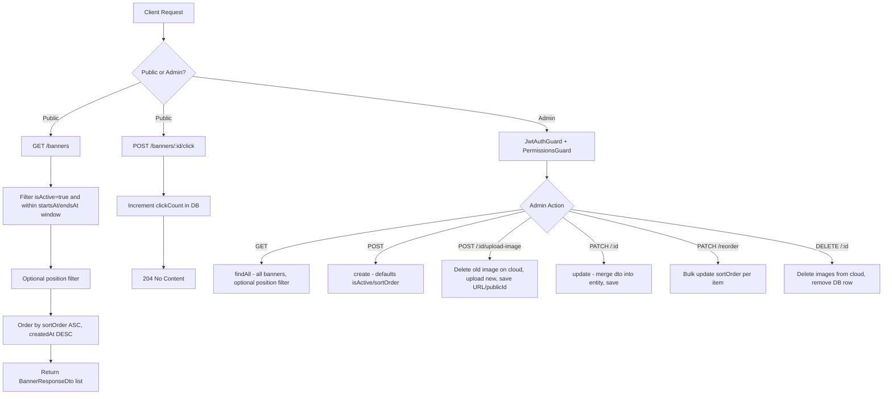
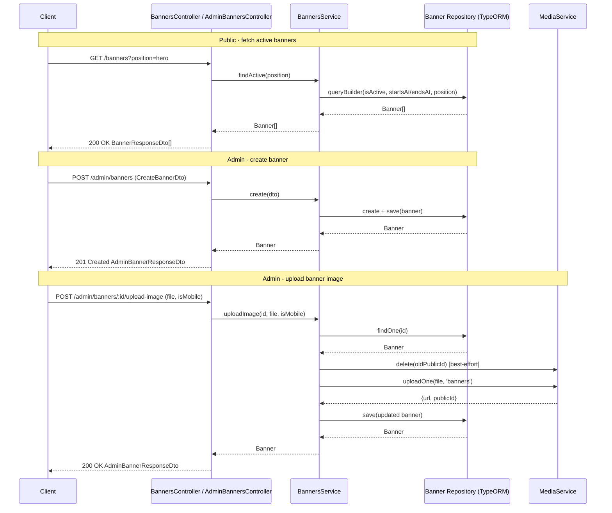

# Banners

## Overview
- **Purpose**: Manage promotional banners displayed across the storefront (hero sections, promo strips, mid-page, popups) with scheduling, ordering, click tracking and image upload.
- **Scope**: Public read/click-tracking endpoints for storefront consumption, plus a full admin CRUD + reorder + image-upload API. Does not cover generic media/upload logic (delegated to `MediaService`) or permission/auth mechanics (delegated to `PermissionsGuard`/`JwtAuthGuard`).
- **Entry point**: `src/banners/banners.module.ts` (`BannersModule`), registering `BannersController` (public) and `AdminBannersController` (admin), backed by `BannersService` and the `Banner` TypeORM entity.

---

## Business Rules

- A banner is considered **active for public display** only if all of the following hold: `isActive = true`, and (`startsAt` is null OR `startsAt <= now`), and (`endsAt` is null OR `endsAt >= now`).
- Public listing (`findActive`) can be filtered by `position` (optional query param); when omitted, all positions are returned.
- Public and admin listings are ordered by `sortOrder ASC`, then `createdAt DESC` as tiebreaker.
- Admin listing (`findAll`) returns **all** banners regardless of `isActive`/date range, optionally filtered by `position`.
- On creation, `isActive` defaults to `true` and `sortOrder` defaults to `0` if not supplied.
- `position` must be one of `hero`, `promo_strip`, `mid_page`, `popup` (`BannerPosition` enum).
- `linkType` must be one of `url`, `product`, `category`, `discount` (`BannerLinkType` enum); no validation ties `linkValue` format to `linkType` in code (e.g. no check that a `product` link value is a valid product id) — TODO: confirm if this is intentional.
- Clicking a banner (`POST /banners/:id/click`) atomically increments `clickCount` by 1 via a DB-level `increment` operation (no existence check is performed before incrementing).
- Reordering (`PATCH /admin/banners/reorder`) accepts a list of `{ id, sortOrder }` pairs and updates each banner's `sortOrder` independently and concurrently (`Promise.all`); it does not validate that all banner IDs exist, nor that sort orders are unique/contiguous.
- Uploading an image (`POST /admin/banners/:id/upload-image`) replaces either the desktop image (`imageUrl`/`imagePublicId`) or the mobile image (`imageMobileUrl`/`imageMobilePublicId`) depending on the `isMobile` flag; the previous image (if any) is deleted from cloud storage first (failures in old-image deletion are swallowed, not fatal).
- Deleting a banner (`DELETE /admin/banners/:id`) removes both desktop and mobile images from cloud storage (if `imagePublicId`/`imageMobilePublicId` are set) before deleting the DB row; image-deletion failures are swallowed and do not block the DB deletion.
- All admin endpoints require `JwtAuthGuard` + `PermissionsGuard`, gated by specific permission strings: `banner.read`, `banner.create`, `banner.update`, `banner.delete`.
- Public endpoints (`GET /banners`, `POST /banners/:id/click`) require no authentication.

---

## Flow Diagram



---

## Sequence Diagram



---

## Module Structure

| Module | Responsibility |
|---|---|
| `BannersController` | Public endpoints: list active banners, track click |
| `AdminBannersController` | Admin CRUD, reorder, image upload endpoints, guarded by auth + permissions |
| `BannersService` | Business logic: filtering active banners, CRUD, reorder, image lifecycle management |
| `Banner` (entity) | TypeORM entity mapping the `banners` table |
| `BannerPosition` (enum) | Valid banner placement slots |
| `BannerLinkType` (enum) | Valid link target types for a banner |
| DTOs (`CreateBannerDto`, `UpdateBannerDto`, `ReorderBannersDto`, `BannerResponseDto`, `AdminBannerResponseDto`) | Request/response validation and shaping |
| `MediaModule` / `MediaService` (external) | Cloud image upload/delete used by banner image lifecycle |
| `JwtAuthGuard`, `PermissionsGuard` (external) | Authentication and permission enforcement for admin routes |

---

## API

### Endpoint
`GET /banners`

Public. Returns active banners, optionally filtered by position.

### Request
```json
// Query params
{
  "position": "hero"
}
```

### Response
```json
[
  {
    "id": "e4b5f7a0-1c2d-4e3f-8a9b-0c1d2e3f4a5b",
    "title": "Flash Sale 6.6",
    "subtitle": "Giảm đến 50% toàn bộ sản phẩm",
    "position": "hero",
    "imageUrl": "https://cdn.example.com/banner.jpg",
    "imageMobileUrl": "https://cdn.example.com/banner-mobile.jpg",
    "linkType": "url",
    "linkValue": "/products?tag=sale",
    "sortOrder": 0,
    "isActive": true,
    "startsAt": "2026-06-06T00:00:00Z",
    "endsAt": "2026-06-07T23:59:59Z",
    "clickCount": 42,
    "createdAt": "2026-01-01T10:00:00Z",
    "updatedAt": "2026-01-01T10:05:00Z"
  }
]
```

---

### Endpoint
`POST /banners/:id/click`

Public. Increments the banner's click counter.

### Request
```json
// No body. Path param: id (uuid)
```

### Response
```json
// 204 No Content
```

---

### Endpoint
`GET /admin/banners`

Admin (`banner.read`). Returns all banners (active or not, expired or not), optionally filtered by position.

### Request
```json
// Query params
{
  "position": "hero"
}
```

### Response
```json
[
  {
    "id": "e4b5f7a0-1c2d-4e3f-8a9b-0c1d2e3f4a5b",
    "title": "Flash Sale 6.6",
    "subtitle": null,
    "position": "hero",
    "imageUrl": "https://cdn.example.com/banner.jpg",
    "imageMobileUrl": null,
    "linkType": "url",
    "linkValue": "/products?tag=sale",
    "sortOrder": 0,
    "isActive": false,
    "startsAt": null,
    "endsAt": null,
    "clickCount": 0,
    "createdAt": "2026-01-01T10:00:00Z",
    "updatedAt": "2026-01-01T10:05:00Z"
  }
]
```

---

### Endpoint
`POST /admin/banners`

Admin (`banner.create`). Creates a new banner.

### Request
```json
{
  "title": "Flash Sale 6.6",
  "subtitle": "Giảm đến 50% toàn bộ sản phẩm",
  "position": "hero",
  "imageUrl": "https://cdn.example.com/banner.jpg",
  "imageMobileUrl": "https://cdn.example.com/banner-mobile.jpg",
  "imagePublicId": "banners/flash-sale-6-6",
  "imageMobilePublicId": "banners/flash-sale-6-6-mobile",
  "linkType": "url",
  "linkValue": "/products?tag=sale",
  "sortOrder": 0,
  "isActive": true,
  "startsAt": "2026-06-06T00:00:00Z",
  "endsAt": "2026-06-07T23:59:59Z"
}
```

### Response
```json
// 201 Created - AdminBannerResponseDto (same shape as GET /admin/banners item)
```

---

### Endpoint
`POST /admin/banners/:id/upload-image`

Admin (`banner.update`). Uploads/replaces desktop or mobile image for a banner (multipart/form-data).

### Request
```json
// multipart/form-data
{
  "file": "<binary>",
  "isMobile": "true"
}
```

### Response
```json
// 200 OK - AdminBannerResponseDto with updated imageUrl/imagePublicId
// or imageMobileUrl/imageMobilePublicId depending on isMobile
```

---

### Endpoint
`PATCH /admin/banners/reorder`

Admin (`banner.update`). Bulk-updates `sortOrder` for a set of banners.

### Request
```json
{
  "items": [
    { "id": "e4b5f7a0-1c2d-4e3f-8a9b-0c1d2e3f4a5b", "sortOrder": 0 },
    { "id": "a1b2c3d4-5678-90ab-cdef-1234567890ab", "sortOrder": 1 }
  ]
}
```

### Response
```json
// 204 No Content
```

---

### Endpoint
`PATCH /admin/banners/:id`

Admin (`banner.update`). Partially updates a banner (all fields from `CreateBannerDto` are optional).

### Request
```json
{
  "title": "Flash Sale Updated",
  "isActive": false
}
```

### Response
```json
// 200 OK - AdminBannerResponseDto (full updated entity)
```

---

### Endpoint
`DELETE /admin/banners/:id`

Admin (`banner.delete`). Deletes a banner and its cloud images.

### Request
```json
// No body. Path param: id (uuid)
```

### Response
```json
// 204 No Content
```

---

## Processing Steps

**Public - list active banners (`GET /banners`)**
1. Build query filtering `isActive = true`.
2. Filter by date window: `startsAt` null or past, `endsAt` null or future.
3. Optionally filter by `position`.
4. Order by `sortOrder ASC`, `createdAt DESC`.
5. Return list.

**Public - track click (`POST /banners/:id/click`)**
1. Atomically increment `clickCount` for the given banner id.
2. Return 204 (no existence validation performed).

**Admin - create banner (`POST /admin/banners`)**
1. Validate `CreateBannerDto` (title, position, imageUrl, linkType required; others optional).
2. Apply defaults: `isActive = true` if unset, `sortOrder = 0` if unset.
3. Save entity to DB.
4. Return created entity.

**Admin - upload image (`POST /admin/banners/:id/upload-image`)**
1. Look up banner by id, throw `NotFoundException` if missing.
2. Determine target field set (`imageUrl`/`imagePublicId` vs `imageMobileUrl`/`imageMobilePublicId`) based on `isMobile`.
3. If an old `publicId` exists for that slot, attempt to delete it from cloud storage (errors ignored).
4. Upload the new file via `MediaService.uploadOne`.
5. Persist new URL/publicId onto the banner.
6. Save and return updated banner.

**Admin - update banner (`PATCH /admin/banners/:id`)**
1. Look up banner by id, throw `NotFoundException` if missing.
2. Merge (`Object.assign`) provided fields from `UpdateBannerDto` onto the entity.
3. Save and return updated entity.

**Admin - reorder (`PATCH /admin/banners/reorder`)**
1. Validate `items` array (non-empty, each item has valid `id` (UUID) and `sortOrder` (int >= 0)).
2. Concurrently run `bannerRepo.update(id, { sortOrder })` for every item.
3. Return 204 (no rollback/transaction; partial failures possible since updates are independent promises).

**Admin - delete banner (`DELETE /admin/banners/:id`)**
1. Look up banner by id, throw `NotFoundException` if missing.
2. Concurrently delete desktop and mobile images from cloud storage if their `publicId`s exist (errors ignored).
3. Remove the banner row from DB.

---

## Database

| Entity | Description |
|---|---|
| `Banner` (`banners` table) | Stores banner content (title/subtitle), placement (`position`), images (desktop/mobile URL + cloud publicId), link target (`linkType`/`linkValue`), display config (`sortOrder`, `isActive`, `startsAt`, `endsAt`), and engagement metric (`clickCount`). Extends `AbstractBaseEntity` (`id`, `createdAt`, `updatedAt`). |

---

## Events

None.

TODO: No event emitters (`EventEmitter2`, message queue, etc.) found in `src/banners`; confirm whether banner click/create/update/delete should emit domain events for analytics or cache invalidation.

---

## Exception Flow

- `findOne` throws `NotFoundException('Banner not found')` when no banner matches the given `id` — surfaced by `update`, `uploadImage`, and `remove`.
- `create`, `update`, `reorder` rely on class-validator DTO validation (global `ValidationPipe`, assumed) — invalid `position`/`linkType` enum values, missing required fields (`title`, `position`, `imageUrl`, `linkType`), or malformed `startsAt`/`endsAt` dates are rejected with a validation error before reaching the service.
- `reorder` items are validated via `IsUUID`, `IsInt`, `Min(0)` — invalid ids/sortOrders rejected at DTO level; however, unresolvable/non-existent banner `id`s inside `items` are **not** explicitly checked in the service (TypeORM `update` on a non-matching id silently affects zero rows, no error is thrown).
- `uploadImage` and `remove` swallow errors from `MediaService.delete` (`.catch(() => null)`) for old/existing images — cloud deletion failures do not block the DB operation or surface to the caller.
- `trackClick` performs no existence check before `increment`; incrementing a non-existent `id` is a no-op at the DB level and does not throw.
- Admin endpoints return 401/403 via `JwtAuthGuard`/`PermissionsGuard` when the caller is unauthenticated or lacks the required permission (`banner.read`/`banner.create`/`banner.update`/`banner.delete`).

---

## Related Components

- `BannersController` (`src/banners/banners.controller.ts`) — public endpoints.
- `AdminBannersController` (`src/banners/admin-banners.controller.ts`) — admin endpoints.
- `BannersService` (`src/banners/banners.service.ts`) — business logic.
- `Banner` repository (TypeORM, injected via `@InjectRepository(Banner)`).
- `MediaService` (`src/media/media.service.ts`) — image upload/delete to cloud storage.
- `JwtAuthGuard` (`src/auth/guards/jwt-auth.guard.ts`) — authentication guard for admin routes.
- `PermissionsGuard` / `Permissions` decorator (`src/permissions/`) — authorization for admin routes.
- `AbstractBaseEntity` (`src/common/entities/base.entity.ts`) — base id/timestamp columns.

---

## Notes

- `AdminBannerResponseDto` currently adds no fields beyond `BannerResponseDto` (empty subclass) — admin and public responses are structurally identical today; only the underlying query (`findAll` vs `findActive`) differs in which rows are visible.
- `linkValue` is a free-form string with no referential integrity to actual products/categories/discounts — TODO: confirm whether validation against real entity IDs is planned.
- File uploads use `FileInterceptor('file')` (single file) with `isMobile` passed as a string form field (`'true'`/`'false'`), manually parsed via `isMobile === 'true'` in the controller.
- No transaction wraps multi-step operations (`uploadImage`'s delete-then-upload-then-save, `remove`'s cloud-cleanup-then-DB-delete, `reorder`'s bulk updates) — partial failures could leave inconsistent state between cloud storage and DB records.
- `reorder` uses `Promise.all` over independent `update` calls; if the DB is under load, this is not one atomic transaction.
