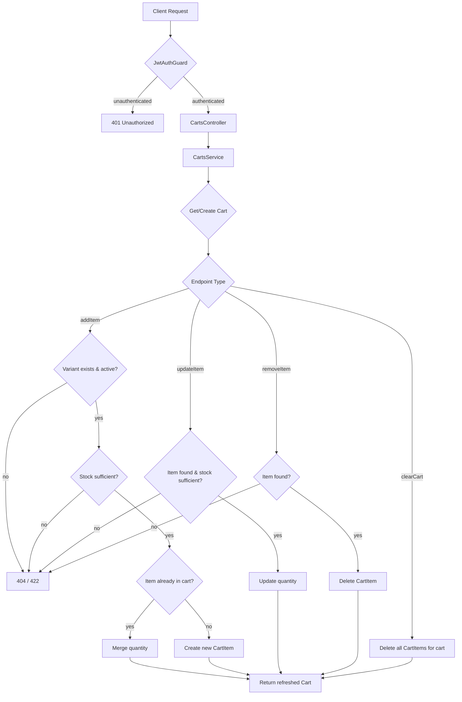
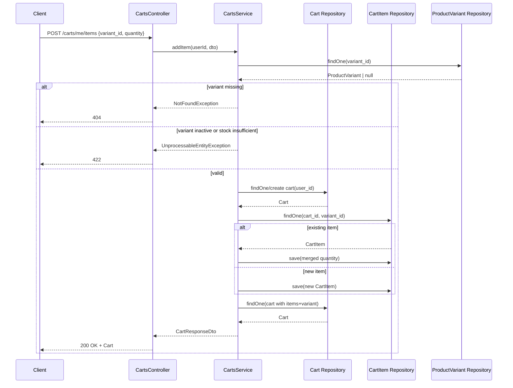

# Carts

## Overview
- **Purpose**: Manage a single per-user shopping cart, allowing authenticated users to add, update, remove, and clear product-variant line items before checkout.
- **Scope**: One cart per user (1:1 with `User`), containing many `CartItem` rows, each referencing a `ProductVariant`. Does not cover checkout/order creation itself (handled by the `orders` module, which reads the cart and clears its items on order placement).
- **Entry point**: `CartsController` (`src/carts/carts.controller.ts`), routes mounted at `/carts`, guarded by `JwtAuthGuard` (all endpoints require an authenticated user).

---

## Business Rules

- Every endpoint requires a valid JWT; the acting user is always resolved from `@CurrentUser()` (no user id is accepted from the request body/params).
- A user has at most one cart; it is **lazily created** the first time `getCart` is called if none exists (`CartsService.getCart`).
- Adding an item requires the target `ProductVariant` to exist (`NotFoundException` otherwise).
- Adding an item requires the variant to be active (`variant.isActive === true`); inactive variants are rejected with `UnprocessableEntityException`.
- Adding an item validates requested quantity (default `1`, minimum `1`) against `variant.stock`; insufficient stock throws `UnprocessableEntityException`.
- If the variant is **already in the cart**, adding it again **merges quantities** (existing quantity + requested quantity) rather than creating a duplicate row; the merged total is re-validated against stock.
- Updating an item's quantity re-validates the new quantity against the variant's current stock before persisting.
- Updating/removing an item only succeeds if the `itemId` belongs to a cart item owned by the current user's cart (`NotFoundException` otherwise) — this enforces per-user isolation without an explicit ownership check on the variant.
- Quantity must be an integer `>= 1` for both add and update operations (enforced by `class-validator` on the DTOs).
- Clearing a cart deletes all cart items for that user's cart but keeps the cart row itself.
- Stock is validated at cart-mutation time only; it is **not** re-locked/reserved, so stock could change between cart update and checkout (no optimistic locking observed in this module).

---

## Flow Diagram



---

## Sequence Diagram



---

## Module Structure

| Module | Responsibility |
|---|---|
| `CartsController` | Exposes `/carts` REST endpoints, delegates to `CartsService`, enforces JWT auth |
| `CartsService` | Business logic: cart retrieval/creation, item add/update/remove/clear, stock & variant validation |
| `Cart` entity | Represents a user's cart (1:1 with `User`, 1:many with `CartItem`) |
| `CartItem` entity | Represents a line item (cart + variant + quantity) |
| `ProductVariant` (external) | Referenced read-only for stock, price, active status |
| `CartsModule` | Wires up TypeORM repositories for `Cart`, `CartItem`, `ProductVariant`; exports `CartsService` (consumed by `OrdersModule`) |

---

## API

### Endpoint
`GET /carts/me`

Get the current user's cart (creating an empty one if none exists).

### Request
```json
{}
```

### Response
```json
{
  "id": "b2f1a2d0-...-cart",
  "user_id": "e4b5f7a0-...-user",
  "items": [
    {
      "id": "9c3e...-item",
      "cart_id": "b2f1a2d0-...-cart",
      "variant_id": "1a2b...-variant",
      "variant": {
        "id": "1a2b...-variant",
        "name": "Red / L",
        "sku": "TSHIRT-RED-L",
        "price": 19.99,
        "stock": 42,
        "attributes": { "color": "red", "size": "L" }
      },
      "quantity": 2,
      "createdAt": "2026-07-20T10:00:00Z",
      "updatedAt": "2026-07-20T10:00:00Z"
    }
  ],
  "createdAt": "2026-07-20T09:00:00Z",
  "updatedAt": "2026-07-20T10:00:00Z"
}
```

---

### Endpoint
`POST /carts/me/items`

Add an item to the cart. Merges quantity if the variant is already present.

### Request
```json
{
  "variant_id": "1a2b3c4d-uuid",
  "quantity": 1
}
```

### Response
```json
{
  "id": "b2f1a2d0-...-cart",
  "user_id": "e4b5f7a0-...-user",
  "items": [
    {
      "id": "9c3e...-item",
      "cart_id": "b2f1a2d0-...-cart",
      "variant_id": "1a2b3c4d-uuid",
      "variant": {
        "id": "1a2b3c4d-uuid",
        "name": "Red / L",
        "sku": "TSHIRT-RED-L",
        "price": 19.99,
        "stock": 42,
        "attributes": { "color": "red", "size": "L" }
      },
      "quantity": 1,
      "createdAt": "2026-07-20T10:00:00Z",
      "updatedAt": "2026-07-20T10:00:00Z"
    }
  ],
  "createdAt": "2026-07-20T09:00:00Z",
  "updatedAt": "2026-07-20T10:00:00Z"
}
```

---

### Endpoint
`PATCH /carts/me/items/:itemId`

Update the quantity of an existing cart item.

### Request
```json
{
  "quantity": 3
}
```

### Response
```json
{
  "id": "b2f1a2d0-...-cart",
  "user_id": "e4b5f7a0-...-user",
  "items": [
    {
      "id": "9c3e...-item",
      "cart_id": "b2f1a2d0-...-cart",
      "variant_id": "1a2b3c4d-uuid",
      "variant": {
        "id": "1a2b3c4d-uuid",
        "name": "Red / L",
        "sku": "TSHIRT-RED-L",
        "price": 19.99,
        "stock": 42,
        "attributes": { "color": "red", "size": "L" }
      },
      "quantity": 3,
      "createdAt": "2026-07-20T10:00:00Z",
      "updatedAt": "2026-07-20T10:05:00Z"
    }
  ],
  "createdAt": "2026-07-20T09:00:00Z",
  "updatedAt": "2026-07-20T10:05:00Z"
}
```

---

### Endpoint
`DELETE /carts/me/items/:itemId`

Remove a single item from the cart.

### Request
```json
{}
```

### Response
```json
{
  "id": "b2f1a2d0-...-cart",
  "user_id": "e4b5f7a0-...-user",
  "items": [],
  "createdAt": "2026-07-20T09:00:00Z",
  "updatedAt": "2026-07-20T10:10:00Z"
}
```

---

### Endpoint
`DELETE /carts/me`

Clear all items from the cart.

### Request
```json
{}
```

### Response
```json
{
  "id": "b2f1a2d0-...-cart",
  "user_id": "e4b5f7a0-...-user",
  "items": [],
  "createdAt": "2026-07-20T09:00:00Z",
  "updatedAt": "2026-07-20T10:15:00Z"
}
```

> Note: controller declares `@ApiNoContentResponse()` for `clearCart`, but the handler actually returns the (empty) `Cart` via `cartsService.clearCart`, i.e. a `200 OK` body is sent, not an empty `204`. TODO: confirm intended HTTP status/response contract — Swagger annotation and actual return type are inconsistent.

---

## Processing Steps

**Add item (`POST /carts/me/items`)**
1. Look up `ProductVariant` by `variant_id`; throw `NotFoundException` if missing.
2. Reject if variant is inactive (`UnprocessableEntityException`).
3. Resolve requested quantity (defaults to `1`); reject if it exceeds `variant.stock`.
4. Get-or-create the user's cart.
5. Look up an existing `CartItem` for this cart + variant.
6. If found, add quantities together, re-validate combined quantity against stock, and save.
7. If not found, create a new `CartItem` row.
8. Reload and return the full cart (with items and variants).

**Update item (`PATCH /carts/me/items/:itemId`)**
1. Get the user's cart.
2. Find the `CartItem` by `id` + `cart_id`; throw `NotFoundException` if not found/not owned.
3. Look up the associated variant; if present, validate new quantity against current stock.
4. Persist the new quantity.
5. Return the refreshed cart.

**Remove item (`DELETE /carts/me/items/:itemId`)**
1. Get the user's cart.
2. Find the item by `id` + `cart_id`; throw `NotFoundException` if missing.
3. Delete the item.
4. Return the refreshed cart.

**Clear cart (`DELETE /carts/me`)**
1. Get the user's cart.
2. Bulk-delete all `CartItem` rows for `cart_id`.
3. Return the refreshed (empty) cart.

---

## Database

| Entity | Description |
|---|---|
| `Cart` (`carts`) | One row per user (`user_id` unique, 1:1 with `User`); holds `items` (1:many `CartItem`, cascade insert/update) |
| `CartItem` (`cart_items`) | Line item: `cart_id`, `variant_id`, `quantity` (default `1`); FK to `Cart` and `ProductVariant`, both `onDelete: 'CASCADE'` |
| `ProductVariant` (`product_variants`, external) | Read-only reference for `stock`, `price`, `isActive`, `attributes`, used for validation and response shaping |

---

## Events

None. TODO: no domain/event emitters (e.g. `EventEmitter2`) found in `src/carts/`; cart mutations are synchronous DB operations only.

---

## Exception Flow

- `NotFoundException` — variant not found when adding an item (`addItem`).
- `UnprocessableEntityException` — variant is inactive (`addItem`).
- `UnprocessableEntityException` — insufficient stock for requested quantity (`addItem`, both new-item and merged-quantity paths).
- `UnprocessableEntityException` — insufficient stock for updated quantity (`updateItem`, only checked when the variant still exists).
- `NotFoundException` — cart item not found for the given `itemId` + user's cart (`updateItem`, `removeItem`).
- `401 Unauthorized` — no/invalid JWT (`JwtAuthGuard`, applied to entire controller).
- Downstream (in `orders` module, not part of this feature but consuming it): `BadRequestException('Cart is empty')` if checkout is attempted with zero cart items.

---

## Related Components

- `CartsController` (`src/carts/carts.controller.ts`)
- `CartsService` (`src/carts/carts.service.ts`)
- `Cart` repository / entity (`src/carts/entities/cart.entity.ts`)
- `CartItem` repository / entity (`src/carts/entities/cart-item.entity.ts`)
- `ProductVariant` repository/entity (`src/products/entities/product-variant.entity.ts`) — read-only dependency for stock/price/active checks
- `JwtAuthGuard` (`src/auth/guards/jwt-auth.guard.ts`) — authentication
- `CurrentUser` decorator/interface (`src/common/decorators/current-user.decorator.ts`, `src/common/interfaces/current-user.interface.ts`)
- `OrdersModule` / `OrdersService` (`src/orders/`) — consumes `CartsService.getCart` during checkout and deletes `CartItem` rows for the cart after order placement

---

## Notes

- The cart is always keyed by `user_id`; there is no support for anonymous/guest carts or multiple carts per user.
- `getCart` is called at the end of every mutating operation to return a consistently shaped, freshly-loaded `Cart` (with `items.variant` relations), rather than manually patching the in-memory object.
- Stock checks compare against the variant's live `stock` value at the time of the cart operation; there is no reservation/locking mechanism, so a race condition is possible between cart update and later checkout (checkout-time stock re-validation, if any, lives in `OrdersService`, outside this feature's scope).
- `removeItem` and `updateItem` scope lookups by `cart_id` (derived from the authenticated user), which is the mechanism preventing a user from mutating another user's cart items — there is no separate ownership guard/decorator.
- The controller's `clearCart` route is annotated `@ApiNoContentResponse()` but the service returns the cart body — see TODO under the `DELETE /carts/me` endpoint above.
