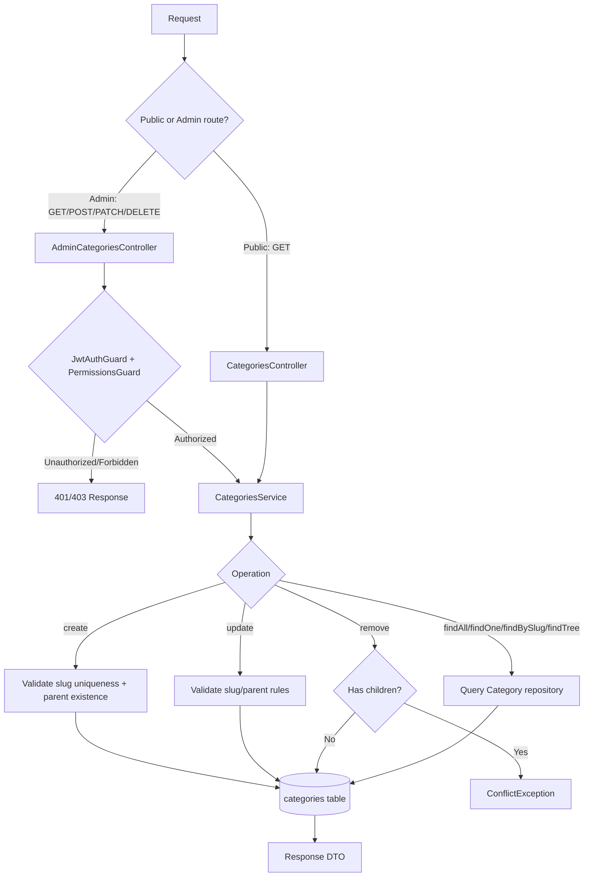
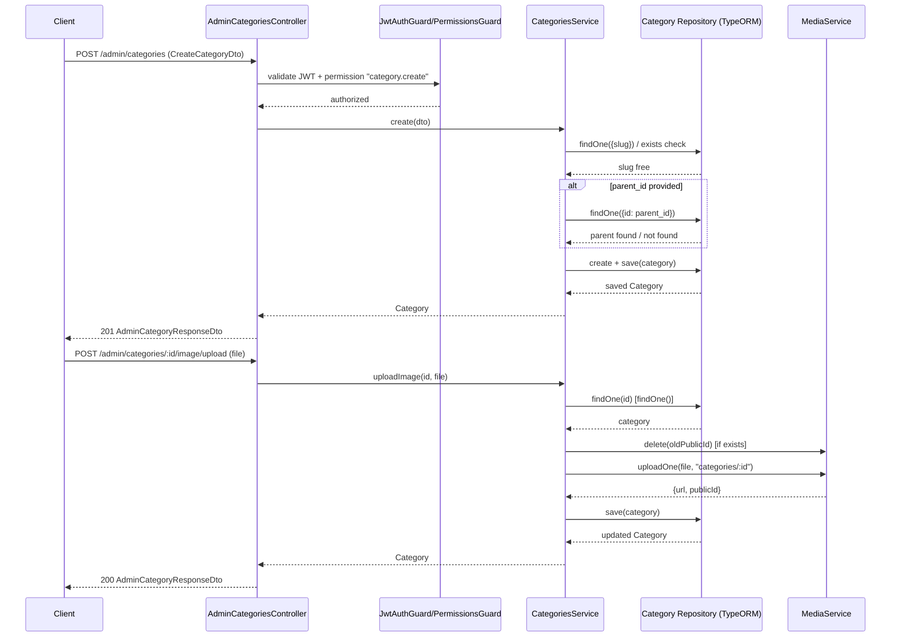

# Categories

## Overview
- **Purpose**: Manage a hierarchical (self-referencing) product category tree used for catalog navigation and organization.
- **Scope**: CRUD for categories, parent/child hierarchy, category image upload/removal, public read-only browsing, and admin management with permission-gated write operations.
- **Entry point**: `src/categories/categories.module.ts` — registers `CategoriesController` (public), `AdminCategoriesController` (admin), and `CategoriesService`.

---

## Business Rules

- A category has an optional `parent_id`; when set, the referenced parent must exist (`NotFoundException` if not) — enforced on both create and update.
- Slug is unique across all categories (`unique: true` on entity column + explicit uniqueness checks in service).
- If `slug` is not provided on create, it is auto-generated from `name` via `generateUniqueSlug` (Vietnamese-aware slugify + random/counter suffix on collision).
- On update, if `slug` is explicitly provided and differs from the current slug, uniqueness is re-checked (`ConflictException` on conflict).
- On update, if `name` changes but `slug` is not explicitly provided, the slug is regenerated from the new name (uniqueness check excludes the category's own id).
- A category cannot be set as its own parent (`ConflictException`) on update.
- A category cannot be deleted if it has children (`ConflictException: Cannot delete a category that has children`) — deletion is blocked, not cascaded.
- `sortOrder` defaults to `0`; `isActive` defaults to `true` on create.
- Category listing (`findAll`) supports partial, case-insensitive name filter (`ILike`), exact `parent_id` filter, and exact `isActive` filter; results ordered by `sortOrder ASC, createdAt DESC` and paginated (default page 1, limit 20, max limit 100).
- `findTree` builds the full hierarchy recursively starting from root nodes (`parent_id IS NULL`), each with a `children` array (unlimited depth).
- `findOne`/`findBySlug` load the `parent` and `children` relations and throw `NotFoundException` if not found.
- Uploading a new image replaces any existing image: the previous cloud asset (`imagePublicId`) is deleted first (best-effort — failures are logged, not thrown) before the new file is uploaded via `MediaService`.
- Removing an image deletes the cloud asset (best-effort, logged on failure) and clears both `image` and `imagePublicId` fields.
- Public endpoints (`CategoriesController`) are unauthenticated and read-only; admin endpoints (`AdminCategoriesController`) require JWT auth and specific permissions (`category.read`, `category.create`, `category.update`, `category.delete`).

---

## Flow Diagram



---

## Sequence Diagram



---

## Module Structure

| Module | Responsibility |
|---|---|
| `categories.module.ts` | Wires `Category` TypeORM repository, imports `MediaModule`, registers both controllers and the service. |
| `categories.controller.ts` | Public, unauthenticated read-only endpoints (list, tree, by slug, by id). |
| `admin-categories.controller.ts` | Admin endpoints (list, tree, by id, create, update, image upload/remove, delete) guarded by JWT + permissions. |
| `categories.service.ts` | All business logic: slug generation/validation, hierarchy validation, CRUD, image handling via `MediaService`. |
| `entities/category.entity.ts` | `Category` TypeORM entity — self-referencing tree via `parent_id`/`parent`/`children`. |
| `dto/create-category.dto.ts` | Validation rules for category creation. |
| `dto/update-category.dto.ts` | Partial version of create DTO (all fields optional) for updates. |
| `dto/category-list-query.dto.ts` | Pagination + filter (name, parent_id, isActive) query params. |
| `dto/category-response.dto.ts` | Response shape: `CategoryResponseDto`, `CategoryTreeNodeDto` (adds `children`), `CategoryPaginatedResponseDto`. |
| `dto/admin-category-response.dto.ts` | Admin response DTO, currently identical to `CategoryResponseDto` (empty extension). |

---

## API

### Endpoint
`GET /categories`

#### Request
```json
{
  "page": 1,
  "limit": 20,
  "name": "phone",
  "parent_id": "123e4567-e89b-12d3-a456-426614174000",
  "isActive": true
}
```

#### Response
```json
{
  "data": [
    {
      "id": "123e4567-e89b-12d3-a456-426614174000",
      "parent_id": null,
      "name": "Smartphones",
      "slug": "smartphones",
      "description": "All smartphones and mobile phones",
      "image": "https://cdn.example.com/cat.jpg",
      "sortOrder": 0,
      "isActive": true,
      "createdAt": "2026-01-01T00:00:00.000Z",
      "updatedAt": "2026-01-01T00:00:00.000Z"
    }
  ],
  "total": 1,
  "page": 1,
  "limit": 20
}
```

---

### Endpoint
`GET /categories/tree`

#### Request
_No parameters._

#### Response
```json
[
  {
    "id": "123e4567-e89b-12d3-a456-426614174000",
    "parent_id": null,
    "name": "Electronics",
    "slug": "electronics",
    "description": null,
    "image": null,
    "sortOrder": 0,
    "isActive": true,
    "createdAt": "2026-01-01T00:00:00.000Z",
    "updatedAt": "2026-01-01T00:00:00.000Z",
    "children": [
      {
        "id": "223e4567-e89b-12d3-a456-426614174001",
        "parent_id": "123e4567-e89b-12d3-a456-426614174000",
        "name": "Smartphones",
        "slug": "smartphones",
        "description": null,
        "image": null,
        "sortOrder": 0,
        "isActive": true,
        "createdAt": "2026-01-01T00:00:00.000Z",
        "updatedAt": "2026-01-01T00:00:00.000Z",
        "children": []
      }
    ]
  }
]
```

---

### Endpoint
`GET /categories/slug/:slug`

#### Request
Path param: `slug=smartphones`

#### Response
```json
{
  "id": "123e4567-e89b-12d3-a456-426614174000",
  "parent_id": null,
  "name": "Smartphones",
  "slug": "smartphones",
  "description": "All smartphones and mobile phones",
  "image": "https://cdn.example.com/cat.jpg",
  "sortOrder": 0,
  "isActive": true,
  "createdAt": "2026-01-01T00:00:00.000Z",
  "updatedAt": "2026-01-01T00:00:00.000Z"
}
```

---

### Endpoint
`GET /categories/:id`

#### Request
Path param: `id=123e4567-e89b-12d3-a456-426614174000`

#### Response
Same shape as `GET /categories/slug/:slug` above.

---

### Endpoint
`GET /admin/categories`

_Requires JWT + permission `category.read`. Same query/response shape as `GET /categories`._

---

### Endpoint
`GET /admin/categories/tree`

_Requires JWT + permission `category.read`. Same response shape as `GET /categories/tree`._

---

### Endpoint
`GET /admin/categories/:id`

_Requires JWT + permission `category.read`. Same response shape as `GET /categories/:id`._

---

### Endpoint
`POST /admin/categories`

_Requires JWT + permission `category.create`._

#### Request
```json
{
  "name": "Smartphones",
  "slug": "smartphones",
  "parent_id": "123e4567-e89b-12d3-a456-426614174000",
  "description": "All smartphones and mobile phones",
  "image": "https://cdn.example.com/cat.jpg",
  "sortOrder": 0,
  "isActive": true
}
```

#### Response
```json
{
  "id": "223e4567-e89b-12d3-a456-426614174001",
  "parent_id": "123e4567-e89b-12d3-a456-426614174000",
  "name": "Smartphones",
  "slug": "smartphones",
  "description": "All smartphones and mobile phones",
  "image": "https://cdn.example.com/cat.jpg",
  "sortOrder": 0,
  "isActive": true,
  "createdAt": "2026-01-01T00:00:00.000Z",
  "updatedAt": "2026-01-01T00:00:00.000Z"
}
```

---

### Endpoint
`PATCH /admin/categories/:id`

_Requires JWT + permission `category.update`. All fields optional (partial update)._

#### Request
```json
{
  "name": "Smartphones & Tablets",
  "sortOrder": 1,
  "isActive": false
}
```

#### Response
Same shape as `POST /admin/categories` response, reflecting updated fields.

---

### Endpoint
`POST /admin/categories/:id/image/upload`

_Requires JWT + permission `category.update`. `multipart/form-data`, field name `file`._

#### Request
```
Content-Type: multipart/form-data
file: <binary image data>
```

#### Response
```json
{
  "id": "223e4567-e89b-12d3-a456-426614174001",
  "parent_id": "123e4567-e89b-12d3-a456-426614174000",
  "name": "Smartphones",
  "slug": "smartphones",
  "description": "All smartphones and mobile phones",
  "image": "https://cdn.example.com/uploaded-image.jpg",
  "sortOrder": 0,
  "isActive": true,
  "createdAt": "2026-01-01T00:00:00.000Z",
  "updatedAt": "2026-01-01T00:00:00.000Z"
}
```

---

### Endpoint
`DELETE /admin/categories/:id/image`

_Requires JWT + permission `category.update`._

#### Request
_No body._

#### Response
```json
{
  "id": "223e4567-e89b-12d3-a456-426614174001",
  "parent_id": "123e4567-e89b-12d3-a456-426614174000",
  "name": "Smartphones",
  "slug": "smartphones",
  "description": "All smartphones and mobile phones",
  "image": null,
  "sortOrder": 0,
  "isActive": true,
  "createdAt": "2026-01-01T00:00:00.000Z",
  "updatedAt": "2026-01-01T00:00:00.000Z"
}
```

---

### Endpoint
`DELETE /admin/categories/:id`

_Requires JWT + permission `category.delete`. Fails if the category has children._

#### Request
_No body._

#### Response
```json
{ "success": true }
```

---

## Processing Steps

### Create category (`POST /admin/categories`)
1. Guards validate JWT and `category.create` permission.
2. If `slug` provided: check uniqueness (`ConflictException` if taken); else auto-generate a unique slug from `name`.
3. If `parent_id` provided: verify parent category exists (`NotFoundException` if not).
4. Build entity with defaults (`sortOrder=0`, `isActive=true`) and save.
5. Return saved category.

### Update category (`PATCH /admin/categories/:id`)
1. Guards validate JWT and `category.update` permission.
2. Load existing category (`NotFoundException` if missing).
3. If `slug` changed: check uniqueness against other categories.
4. If `parent_id` changed: reject self-parenting; verify new parent exists if non-null.
5. Apply provided fields; if `name` changed without explicit `slug`, regenerate slug (unique, excluding self).
6. Save and return updated category.

### Upload image (`POST /admin/categories/:id/image/upload`)
1. Guards validate JWT and `category.update` permission.
2. Load category (`NotFoundException` if missing).
3. If an existing `imagePublicId` is present, attempt to delete old cloud asset (failure logged, not thrown).
4. Upload new file via `MediaService.uploadOne` under path `categories/:id`.
5. Persist new `image` URL and `imagePublicId`.

### Remove image (`DELETE /admin/categories/:id/image`)
1. Guards validate JWT and `category.update` permission.
2. Load category (`NotFoundException` if missing).
3. If `imagePublicId` present, attempt cloud delete (failure logged, not thrown).
4. Clear `image` and `imagePublicId`, save.

### Delete category (`DELETE /admin/categories/:id`)
1. Guards validate JWT and `category.delete` permission.
2. Load category (`NotFoundException` if missing).
3. Count children (`parent_id = id`); if any exist, throw `ConflictException`.
4. Remove category row, return `{ success: true }`.

### Get tree (`GET /categories/tree`, `GET /admin/categories/tree`)
1. Fetch all root categories (`parent_id IS NULL`), ordered by `sortOrder`.
2. Recursively fetch children for each node (`buildTreeNode`) to build a nested tree of arbitrary depth.

---

## Database

| Entity | Description |
|---|---|
| `Category` (`categories` table) | Self-referencing category entity: `id`, `parent_id` (nullable FK to `categories.id`), `parent`/`children` relations, `name`, unique `slug`, `description`, `image`, `imagePublicId`, `sortOrder`, `isActive`, `createdAt`, `updatedAt` (via `AbstractBaseEntity`). |

---

## Events

None. TODO: no event emitters (e.g. `EventEmitter2`) found in `src/categories/`; confirm with the team whether category changes should notify other modules (e.g. catalog cache invalidation).

---

## Exception Flow

- `ConflictException('Slug '<slug>' already exists')` — create/update with a duplicate slug.
- `NotFoundException('Parent category '<id>' not found')` — create/update referencing a non-existent `parent_id`.
- `ConflictException('A category cannot be its own parent')` — update with `parent_id === id`.
- `NotFoundException('Category not found')` — `findOne`/`findBySlug` (and any operation built on them: update, uploadImage, removeImage, remove) when the category id/slug doesn't exist.
- `ConflictException('Cannot delete a category that has children')` — delete attempted on a category with existing children.
- Image cloud-delete failures (`MediaService.delete`) are caught and logged as warnings, not surfaced to the caller — upload/removal still proceeds.

---

## Related Components

- `AdminCategoriesController` (`src/categories/admin-categories.controller.ts`)
- `CategoriesController` (`src/categories/categories.controller.ts`)
- `CategoriesService` (`src/categories/categories.service.ts`)
- `Category` repository (TypeORM, injected via `@InjectRepository(Category)`)
- `MediaModule` / `MediaService` (`src/media/`) — category image upload/delete
- `JwtAuthGuard`, `PermissionsGuard`, `Permissions` decorator (`src/auth/`, `src/permissions/`) — admin route protection
- `generateUniqueSlug` / `generateSlug` (`src/common/utils/slug.util.ts`) — slug generation
- `PaginationDto` / `PaginatedResponseDto` (`src/common/dto/pagination.dto.ts`) — shared pagination contracts

---

## Notes

- `AdminCategoryResponseDto` is currently an empty subclass of `CategoryResponseDto` — no admin-only fields are added today; if internal-only fields (e.g. `imagePublicId`) are meant to be admin-visible, they are not currently exposed via a distinct shape (both entity fields pass through since controllers return the raw `Category` entity, not an explicitly mapped DTO instance).
- Both `findAll` and `findTree` fetch children without a depth guard — very deep hierarchies will result in recursive queries per level in `findTree` (N+1 pattern via repeated `find` calls).
- `parent_id` filter in `CategoryListQueryDto` is validated with `@IsUUID(4)`, so filtering explicitly for root-level categories (`parent_id = null`) via query string is not directly supported by that DTO (comment in code says "use null for root" but no mechanism accepts a literal `null`/empty value given the `IsUUID` validator).
- Slug generation uses Vietnamese-locale-aware `slugify` with a random/counter suffix fallback for collisions (see `src/common/utils/slug.util.ts`).
- Image upload/removal treats `MediaService` failures as non-fatal (logged only), meaning stale cloud assets could remain if delete calls fail intermittently.
