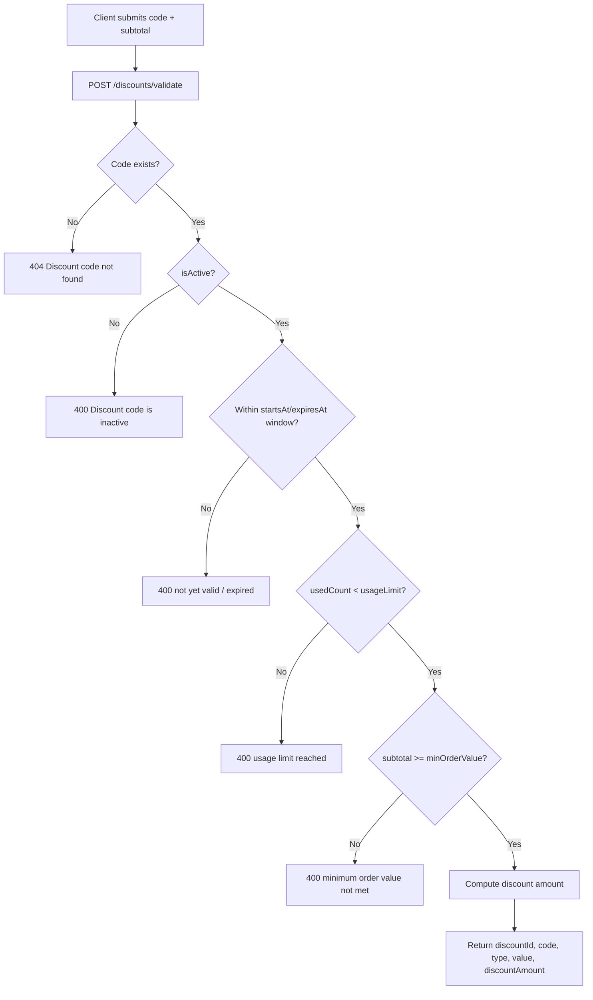
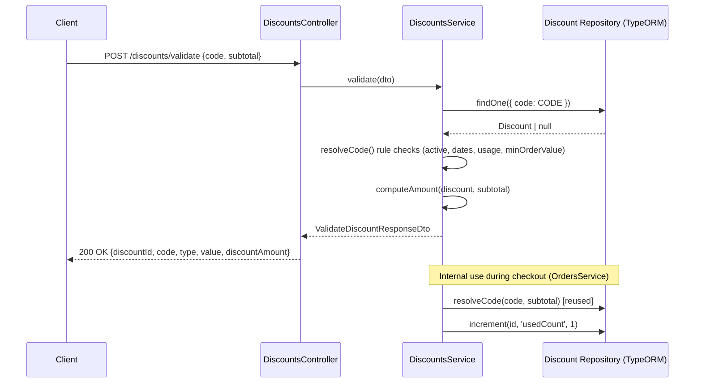

# Discounts

## Overview
- **Purpose**: Manage discount/coupon codes (percent or fixed-amount) that reduce an order's subtotal, including admin CRUD management and client-side validation before checkout.
- **Scope**: Discount code creation/management (admin), code validation against a subtotal (client), and resolution/consumption during order creation and order edits (used internally by the Orders module).
- **Entry point**: `src/discounts/discounts.controller.ts` (client-facing) and `src/discounts/admin-discounts.controller.ts` (admin-facing), backed by `src/discounts/discounts.service.ts`.

---

## Business Rules

- Discount `code` is stored uppercased and must be unique (`ConflictException` on duplicate at create/update).
- `type` is either `percent` or `fixed` (`DiscountType` enum).
- `value` must be a positive number; interpreted as a percentage (0–100) for `percent` type, or a fixed VND amount for `fixed` type.
- `minOrderValue` (optional): minimum subtotal required to apply the code; if the subtotal is below this, validation fails.
- `usageLimit` (optional, `null` = unlimited): maximum number of times a code can be used in total; enforced via `usedCount >= usageLimit`.
- `usedCount` increments by 1 each time a discount is successfully applied to an order (`incrementUsedCount`); not decremented on order cancellation/refund.
- `isActive` flag: inactive codes are rejected (`BadRequestException`).
- `startsAt` / `expiresAt` (optional): code is invalid before `startsAt` and after `expiresAt`.
- Percent discount amount = `round(subtotal * value / 100)`.
- Fixed discount amount = `min(round(value), subtotal)` — never exceeds the subtotal.
- A discount can be linked to multiple orders and an order can have multiple discounts (many-to-many via `order_discount` join table), though the current checkout flow (`Orders` module) only applies a single `discountCode` per order.
- When a pending order is edited (items changed), each already-applied discount's `minOrderValue` is re-checked against the recalculated subtotal; if no longer met, a `BadRequestException` is thrown (see `OrdersService`).
- Discount CRUD endpoints require authentication (`JwtAuthGuard`) plus fine-grained permissions (`PermissionsGuard` + `@Permissions('discount.create' | 'discount.read' | 'discount.update' | 'discount.delete')`).
- The client `validate` endpoint requires authentication only (`JwtAuthGuard`), no special permission.

---

## Flow Diagram



---

## Sequence Diagram



---

## Module Structure

| Module | Responsibility |
|---|---|
| `discounts.controller.ts` | Client-facing endpoint to validate a discount code against a subtotal |
| `admin-discounts.controller.ts` | Admin CRUD endpoints for managing discount codes |
| `discounts.service.ts` | Business logic: create/list/get/update/remove, code resolution, amount computation, usage tracking |
| `entities/discount.entity.ts` | `Discount` TypeORM entity, many-to-many with `Order` |
| `enums/discount-type.enum.ts` | `DiscountType` enum (`percent`, `fixed`) |
| `dto/*` | Request/response validation and Swagger schema definitions |
| `discounts.module.ts` | Wires controllers/service/repository together, exports `DiscountsService` for use by `OrdersModule` |

---

## API

### Endpoint
`POST /discounts/validate`

Auth: `JwtAuthGuard` (any authenticated user).

### Request
```json
{
  "code": "SALE20",
  "subtotal": 500000
}
```

### Response
```json
{
  "discountId": "e4b5f7a0-1c2d-4e3f-8a9b-0c1d2e3f4a5b",
  "code": "SALE20",
  "type": "percent",
  "value": 20,
  "discountAmount": 100000
}
```

---

### Endpoint
`POST /admin/discounts`

Auth: `JwtAuthGuard`, `PermissionsGuard` — requires `discount.create`.

### Request
```json
{
  "code": "SALE20",
  "type": "percent",
  "value": 20,
  "minOrderValue": 100000,
  "usageLimit": 100,
  "isActive": true,
  "startsAt": "2026-01-01T00:00:00Z",
  "expiresAt": "2026-12-31T23:59:59Z"
}
```

### Response
```json
{
  "id": "e4b5f7a0-1c2d-4e3f-8a9b-0c1d2e3f4a5b",
  "code": "SALE20",
  "type": "percent",
  "value": 20,
  "minOrderValue": 100000,
  "usageLimit": 100,
  "usedCount": 0,
  "isActive": true,
  "startsAt": "2026-01-01T00:00:00Z",
  "expiresAt": "2026-12-31T23:59:59Z",
  "createdAt": "2026-01-01T10:00:00Z",
  "updatedAt": "2026-01-01T10:00:00Z"
}
```

---

### Endpoint
`GET /admin/discounts`

Auth: `JwtAuthGuard`, `PermissionsGuard` — requires `discount.read`.

Query params: `page` (default 1), `limit` (default 20, max 100), `search` (matches `code` via `ILIKE`), `isActive` (boolean filter).

### Request
```
GET /admin/discounts?page=1&limit=20&search=SALE&isActive=true
```

### Response
```json
{
  "data": [
    {
      "id": "e4b5f7a0-1c2d-4e3f-8a9b-0c1d2e3f4a5b",
      "code": "SALE20",
      "type": "percent",
      "value": 20,
      "minOrderValue": 100000,
      "usageLimit": 100,
      "usedCount": 3,
      "isActive": true,
      "startsAt": null,
      "expiresAt": null,
      "createdAt": "2026-01-01T10:00:00Z",
      "updatedAt": "2026-01-01T10:00:00Z"
    }
  ],
  "total": 1,
  "page": 1,
  "limit": 20
}
```

---

### Endpoint
`GET /admin/discounts/:id`

Auth: `JwtAuthGuard`, `PermissionsGuard` — requires `discount.read`.

### Request
```
GET /admin/discounts/e4b5f7a0-1c2d-4e3f-8a9b-0c1d2e3f4a5b
```

### Response
```json
{
  "id": "e4b5f7a0-1c2d-4e3f-8a9b-0c1d2e3f4a5b",
  "code": "SALE20",
  "type": "percent",
  "value": 20,
  "minOrderValue": 100000,
  "usageLimit": 100,
  "usedCount": 3,
  "isActive": true,
  "startsAt": null,
  "expiresAt": null,
  "createdAt": "2026-01-01T10:00:00Z",
  "updatedAt": "2026-01-01T10:00:00Z"
}
```

---

### Endpoint
`PATCH /admin/discounts/:id`

Auth: `JwtAuthGuard`, `PermissionsGuard` — requires `discount.update`.

### Request
```json
{
  "isActive": false,
  "usageLimit": 50
}
```

### Response
```json
{
  "id": "e4b5f7a0-1c2d-4e3f-8a9b-0c1d2e3f4a5b",
  "code": "SALE20",
  "type": "percent",
  "value": 20,
  "minOrderValue": 100000,
  "usageLimit": 50,
  "usedCount": 3,
  "isActive": false,
  "startsAt": null,
  "expiresAt": null,
  "createdAt": "2026-01-01T10:00:00Z",
  "updatedAt": "2026-01-02T09:00:00Z"
}
```

---

### Endpoint
`DELETE /admin/discounts/:id`

Auth: `JwtAuthGuard`, `PermissionsGuard` — requires `discount.delete`.

### Request
```
DELETE /admin/discounts/e4b5f7a0-1c2d-4e3f-8a9b-0c1d2e3f4a5b
```

### Response
`204 No Content` (empty body)

---

## Processing Steps

**Validate (`POST /discounts/validate`)**
1. Client submits `code` and `subtotal`.
2. Service uppercases the code and looks it up in the `discounts` table.
3. If not found → 404.
4. Checks `isActive`, `startsAt`/`expiresAt` window, `usedCount` vs `usageLimit`, and `subtotal` vs `minOrderValue`, throwing `400` on the first failed rule.
5. Computes the discount amount (`percent`: rounded percentage of subtotal; `fixed`: min(value, subtotal)).
6. Returns `discountId`, `code`, `type`, `value`, `discountAmount`.

**Admin create**
1. Uppercase incoming `code`, check for existing discount with same code (409 if found).
2. Create entity with `isActive` defaulted to `true` if not provided.
3. Persist and return the saved entity.

**Admin update**
1. Load discount by id (404 if missing).
2. If `code` is being changed, uppercase it and check for conflicts (409 if found).
3. Merge DTO fields onto the entity and save.

**Admin delete**
1. Load discount by id (404 if missing).
2. Remove the row.

**Order checkout / order creation (external, `OrdersService`)**
1. If a `discountCode` is supplied, call `DiscountsService.resolveCode(code, subtotal)` (same rule checks as `validate`).
2. Compute discount amount via `computeAmount`.
3. Insert a row into `order_discount` linking the order to the discount.
4. Call `incrementUsedCount(discountId)`.

**Pending order edit (external, `OrdersService`)**
1. Recalculate subtotal from updated items.
2. For each linked discount, re-check `minOrderValue` against the new subtotal; throw `400` if no longer satisfied.
3. Recompute total discount amount and order total.

---

## Database

| Entity | Description |
|---|---|
| `Discount` (`discounts` table) | Discount/coupon record: code, type, value, min order value, usage limit/count, active flag, validity window |
| `Order` (`orders` table, external) | Many-to-many related via `order_discount` join table; stores applied `discount` amount and `total` |
| `order_discount` (join table) | Links orders to the discounts applied to them (columns: `order_id`, `discount_id`) |

---

## Events

None. TODO: no event emitters (e.g. EventEmitter2/queue) found in `src/discounts/*`; discount usage is tracked synchronously via `usedCount` increment only.

---

## Exception Flow

- `POST /admin/discounts` — code already exists → `409 ConflictException`.
- `PATCH /admin/discounts/:id` — new code already exists (different discount) → `409 ConflictException`.
- `GET /admin/discounts/:id`, `PATCH /admin/discounts/:id`, `DELETE /admin/discounts/:id` — id not found → `404 NotFoundException`.
- `resolveCode` (used by `validate` and by Orders on checkout):
  - Code not found → `404 NotFoundException`.
  - `isActive === false` → `400 BadRequestException` ("Discount code is inactive").
  - `now < startsAt` → `400 BadRequestException` ("Discount code is not yet valid").
  - `now > expiresAt` → `400 BadRequestException` ("Discount code has expired").
  - `usedCount >= usageLimit` → `400 BadRequestException` ("Discount code has reached its usage limit").
  - `subtotal < minOrderValue` → `400 BadRequestException` ("Minimum order value for this code is {minOrderValue}").
- Order edit flow: recalculated subtotal below a linked discount's `minOrderValue` → `400 BadRequestException` ("Order no longer meets the minimum value for discount code \"{code}\"").
- Missing/invalid auth token on any endpoint → `401` (`JwtAuthGuard`).
- Missing required permission on admin endpoints → `403` (`PermissionsGuard`).

---

## Related Components

- Controller: `DiscountsController` (`/discounts`), `AdminDiscountsController` (`/admin/discounts`)
- Service: `DiscountsService`
- Repository: TypeORM `Repository<Discount>` (via `@InjectRepository(Discount)`)
- Entity: `Discount` (many-to-many with `Order`)
- Guards: `JwtAuthGuard`, `PermissionsGuard` (with `@Permissions` decorator, module `discount`, actions `create`/`read`/`update`/`delete`)
- External consumer: `OrdersService` (`src/orders/orders.service.ts`) — calls `resolveCode`, `computeAmount`, `incrementUsedCount` during order creation/checkout and order edits
- Seed data: `src/database/seeds/discount.seed.ts` (sample discounts), `src/database/seeds/permission.seed.ts` (defines `discount.create/read/update/delete` permissions)

---

## Notes

- All monetary values (`value`, `minOrderValue`) are stored as `decimal` columns and coerced to `Number` in service logic before arithmetic.
- Discount amounts are always rounded (`Math.round`) and fixed-type discounts are capped at the subtotal, so a fixed discount can never make the order total negative.
- `resolveCode` and `computeAmount` are public service methods explicitly intended for reuse by `OrdersService` (see inline comment in `discounts.service.ts`), rather than duplicating validation logic there.
- `usedCount` is only ever incremented, never decremented — order cancellation/refund does not appear to release usage slots (TODO: confirm intended behavior if this matters for business rules).
- The `Discount.orders` relation and `order_discount` join table support multiple discounts per order at the schema level, but current DTOs (`CreateOrderDto`, `CheckoutDto`) only accept a single `discountCode`.
