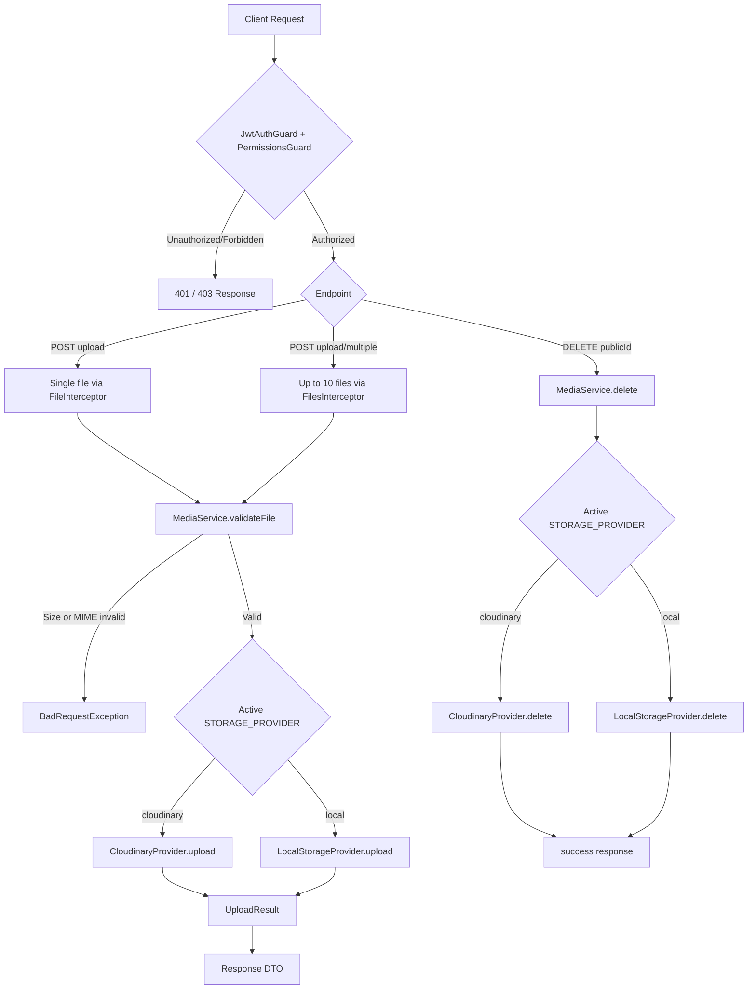
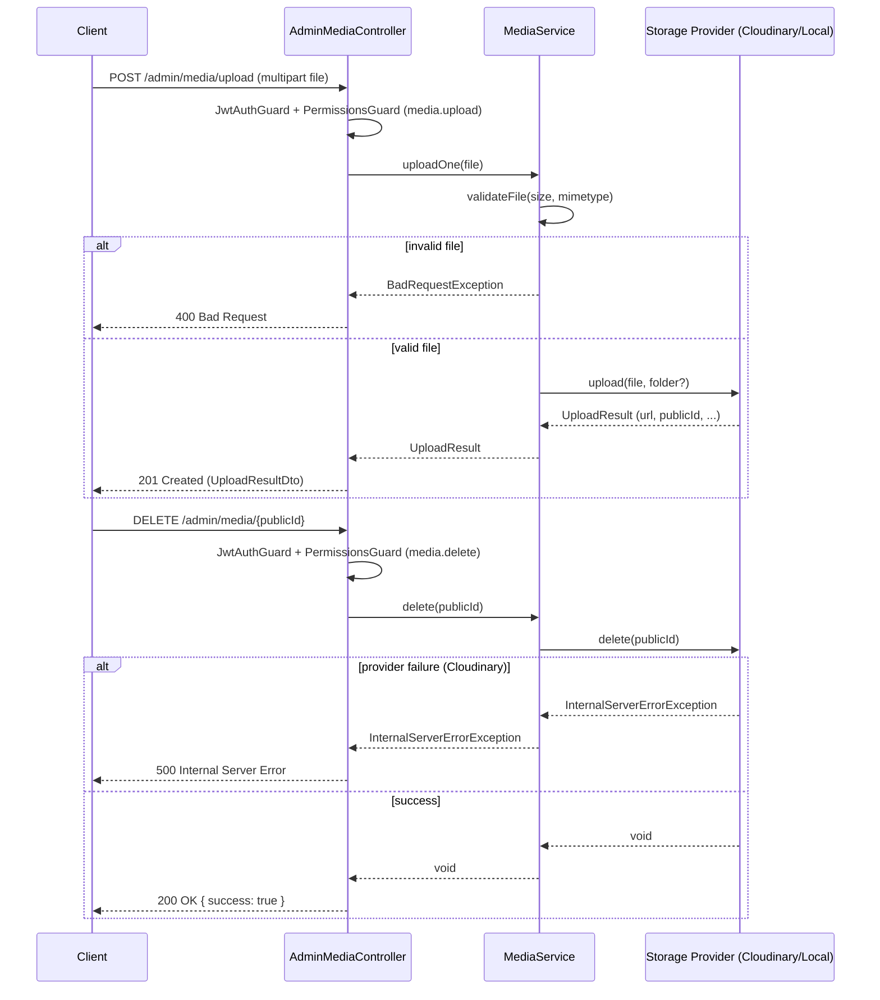

# Media

## Overview
- **Purpose**: Provide a generic image upload/delete abstraction used across the API (e.g. by categories, products) via a pluggable storage backend.
- **Scope**: Admin-only single/multiple image upload, image deletion by `publicId`, file validation (size/type), and provider abstraction (Cloudinary or local disk).
- **Entry point**: `src/media/media.module.ts` — registers `AdminMediaController`, `MediaService`, `CloudinaryProvider`, `LocalStorageProvider`, and binds the active `STORAGE_PROVIDER` based on config.

---

## Business Rules

- All endpoints require JWT authentication (`JwtAuthGuard`) and permission checks (`PermissionsGuard`).
- Upload requires `media.upload` permission; delete requires `media.delete` permission.
- Every uploaded file is validated in `MediaService.validateFile`:
  - File size must not exceed `maxFileSizeBytes` (env `MAX_FILE_SIZE_BYTES`, default `5242880` = 5MB) — else `BadRequestException`.
  - File MIME type must be in `allowedMimeTypes` (env `ALLOWED_MIME_TYPES`, default `image/jpeg,image/png,image/webp,image/gif`) — else `BadRequestException`.
- Multiple upload accepts at most 10 files per request (`FilesInterceptor('files', 10)`); each file is validated individually before any upload call is made.
- Active storage provider is selected at module-bootstrap time from `STORAGE_PROVIDER` env var (`cloudinary` or `local`, default `local`) — not switchable per request.
- Cloudinary uploads always use `resource_type: 'image'`, `unique_filename: true`, `use_filename: false`, and are placed in the configured folder (`CLOUDINARY_FOLDER`, default `ec-api`) unless a `folder` argument is passed programmatically.
- Local uploads generate a random UUID-based filename (original extension preserved) and are written under `LOCAL_UPLOAD_PATH` (default `./uploads`); the target directory is created recursively if missing.
- Local file `publicId` returned to callers is the UUID (optionally prefixed by folder), not the physical filename with extension — the file's actual extension must be resolved again on delete.
- Delete is best-effort per provider:
  - Cloudinary: calls `cloudinary.uploader.destroy(publicId)`; any failure throws `InternalServerErrorException`.
  - Local: looks up files in the target directory whose name starts with the `publicId` basename and deletes all matches; if the directory doesn't exist, delete is silently skipped (only logged as a warning), no exception is thrown.
- The delete route accepts a wildcard path segment (`*publicId`) so provider public IDs containing slashes (e.g. `ec-api/a1b2c3d4`) are supported.

---

## Flow Diagram



---

## Sequence Diagram



---

## Module Structure

| Module | Responsibility |
|---|---|
| `AdminMediaController` | Exposes admin-only HTTP endpoints for upload (single/multiple) and delete; enforces auth guards and permissions. |
| `MediaService` | Validates files (size/MIME) and delegates upload/delete to the active storage provider. |
| `CloudinaryProvider` | Implements `IStorageProvider` using Cloudinary SDK (stream upload, destroy). |
| `LocalStorageProvider` | Implements `IStorageProvider` using local filesystem (writes to disk, builds public URL, deletes matching files). |
| `storage-provider.interface.ts` | Defines `IStorageProvider` contract, `UploadResult` shape, and `STORAGE_PROVIDER` DI token. |
| `media.config.ts` (`src/config/environment`) | Supplies provider selection and validation limits from environment variables. |
| `dto/media-response.dto.ts` | Swagger-documented response shapes (`UploadResultDto`, `MultiUploadResultDto`). |

---

## API

### Endpoint
`POST /admin/media/upload`

**Auth**: JWT + permission `media.upload`

#### Request
```json
// multipart/form-data
{
  "file": "<binary image file>"
}
```

#### Response
```json
{
  "url": "https://res.cloudinary.com/demo/image/upload/sample.jpg",
  "publicId": "ec-api/a1b2c3d4",
  "width": 1920,
  "height": 1080,
  "format": "jpg",
  "bytes": 204800,
  "originalName": "photo.jpg"
}
```

---

### Endpoint
`POST /admin/media/upload/multiple`

**Auth**: JWT + permission `media.upload`

#### Request
```json
// multipart/form-data, field name "files", max 10 files
{
  "files": ["<binary image file>", "<binary image file>"]
}
```

#### Response
```json
{
  "files": [
    {
      "url": "https://res.cloudinary.com/demo/image/upload/sample1.jpg",
      "publicId": "ec-api/a1b2c3d4",
      "width": 1920,
      "height": 1080,
      "format": "jpg",
      "bytes": 204800,
      "originalName": "photo1.jpg"
    },
    {
      "url": "https://res.cloudinary.com/demo/image/upload/sample2.jpg",
      "publicId": "ec-api/e5f6g7h8",
      "width": 800,
      "height": 600,
      "format": "png",
      "bytes": 102400,
      "originalName": "photo2.png"
    }
  ]
}
```

---

### Endpoint
`DELETE /admin/media/*publicId`

**Auth**: JWT + permission `media.delete`

#### Request
```json
// No body. publicId passed as path (wildcard, may contain slashes)
// Example: DELETE /admin/media/ec-api/a1b2c3d4
```

#### Response
```json
{
  "success": true
}
```

---

## Processing Steps

**Upload (single/multiple)**
1. `JwtAuthGuard` verifies the access token; `PermissionsGuard` checks `media.upload` permission.
2. `FileInterceptor`/`FilesInterceptor` parses multipart form data into `Express.Multer.File` (buffer in memory).
3. `MediaService.uploadOne`/`uploadMany` validates each file's size against `maxFileSizeBytes` and MIME type against `allowedMimeTypes`.
4. On validation failure, a `BadRequestException` is thrown immediately (no upload call is made for any file in a multi-upload batch if one fails validation, since validation runs synchronously before any upload starts).
5. Valid file(s) are passed to the injected `STORAGE_PROVIDER` (`CloudinaryProvider` or `LocalStorageProvider`).
6. Cloudinary: buffer is piped through `cloudinary.uploader.upload_stream` to the configured/target folder; response mapped to `UploadResult`.
   Local: target folder is created if missing, file is written to disk under a UUID-based filename, and a public URL is built from `publicUrl` config.
7. Result(s) returned as `UploadResultDto` / `MultiUploadResultDto`.

**Delete**
1. `JwtAuthGuard` + `PermissionsGuard` check `media.delete` permission.
2. `MediaService.delete(publicId)` calls the active provider's `delete`.
3. Cloudinary: calls `cloudinary.uploader.destroy`; throws `InternalServerErrorException` on failure.
   Local: scans the target directory for files whose name starts with the `publicId` basename and removes all matches; missing directory is logged as a warning and treated as a no-op (no exception).
4. Controller returns `{ success: true }` regardless of whether any local file was actually found (local delete never throws on "not found").

---

## Database

| Entity | Description |
|---|---|
| — | The media feature itself defines no TypeORM entity; it only produces `UploadResult` values (`url`, `publicId`, etc.) that other modules (e.g. categories, products) persist on their own entities. |

TODO: Confirm which entities store media references (e.g. `Category.image`/`imagePublicId`) — not defined within `src/media/`.

---

## Events

None — no event emitters (`EventEmitter2`, domain events) found in `src/media/`.

---

## Exception Flow

- File exceeds `maxFileSizeBytes` → `BadRequestException` (`MediaService.validateFile`).
- File MIME type not in `allowedMimeTypes` → `BadRequestException` (`MediaService.validateFile`).
- Cloudinary upload stream error → `InternalServerErrorException` (`CloudinaryProvider.uploadStream`).
- Cloudinary delete (`destroy`) failure → logged, then `InternalServerErrorException` (`CloudinaryProvider.delete`).
- Local disk write failure (`fs.writeFileSync`) → logged, then `InternalServerErrorException` (`LocalStorageProvider.upload`).
- Local delete: individual `fs.unlinkSync` failures are caught and logged per-file but do not throw; missing target directory is logged as a warning only — delete always resolves successfully from the caller's perspective.
- Auth/permission failures (missing/invalid JWT, missing `media.upload`/`media.delete` permission) → handled by `JwtAuthGuard`/`PermissionsGuard` (401/403), outside `MediaService`.

---

## Related Components

- `AdminMediaController` (`src/media/admin-media.controller.ts`)
- `MediaService` (`src/media/media.service.ts`)
- `CloudinaryProvider` (`src/media/providers/cloudinary.provider.ts`)
- `LocalStorageProvider` (`src/media/providers/local-storage.provider.ts`)
- `IStorageProvider` / `STORAGE_PROVIDER` token (`src/media/providers/storage-provider.interface.ts`)
- `JwtAuthGuard` (`src/auth/guards/jwt-auth.guard.ts`)
- `PermissionsGuard` / `@Permissions` decorator (`src/permissions/`)
- `TypedConfigService` + `media.config.ts` (`src/config/environment/media.config.ts`)
- Consumers outside this module (e.g. `CategoriesService`) that inject `MediaService` to upload/delete images tied to their own entities.

---

## Notes

- Files are handled fully in memory (`Express.Multer.File.buffer`); no disk streaming for Cloudinary uploads, and local uploads are written synchronously (`fs.writeFileSync`/`fs.readdirSync`/`fs.unlinkSync`), which can block the event loop for large files.
- The local provider builds public URLs from `LOCAL_PUBLIC_URL`, but no static-file serving (`ServeStaticModule`/`useStaticAssets`) for the upload directory was found elsewhere in `src/` — TODO: verify how `./uploads` is actually served in the local-provider configuration, if at all.
- `MediaService.uploadOne`/`uploadMany` accept an optional `folder` parameter, but `AdminMediaController` never passes one — folder override is only usable by other services calling `MediaService` directly (e.g. categories).
- `LocalStorageProvider.delete` contains an unused `candidates` variable (glob-style paths) that is computed but never applied — actual lookup uses `fs.readdirSync` + `startsWith` filtering instead.
- Response DTOs (`UploadResultDto`/`MultiUploadResultDto`) are Swagger-only decorated classes; the service's actual return type is the plain `UploadResult` interface, structurally compatible.
