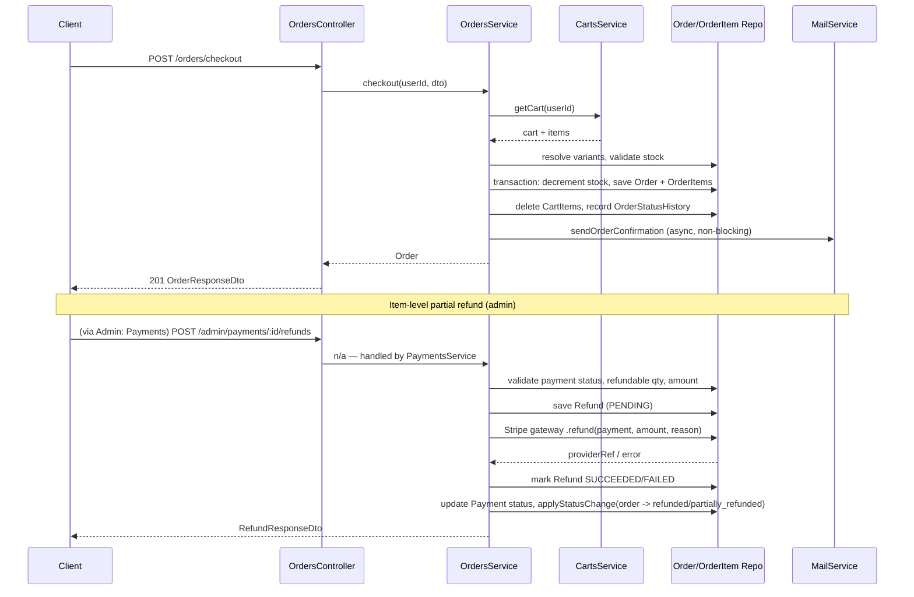

# Orders

## Overview
- **Purpose**: Manage the customer order lifecycle — creation (direct or from cart/checkout), listing, editing while pending, cancellation, admin status transitions, and status audit history.
- **Scope**: `src/orders/` (controllers, service, DTOs, entities, enums). Integrates with `src/payments/` for payment status transitions and item-level refunds (Stripe gateway), and with `src/carts/` for checkout.
- **Entry point**: `OrdersController` (`/orders`, customer-facing) and `AdminOrdersController` (`/admin/orders`, staff-facing), both backed by `OrdersService`.

---

## Business Rules

- An order can only be created against an address that belongs to the requesting user (`address_id` + `user_id` lookup); otherwise `404 Address not found`.
- Order items reference `ProductVariant`s; a variant must exist (`404`) and be active (`isActive`, else `422 Variant ... is inactive`).
- Stock is decremented atomically per item using a conditional `UPDATE ... WHERE stock >= qty`; if the affected row count is 0, the order fails with `422 Insufficient stock for variant <sku>` (prevents overselling under concurrency).
- `checkout` requires a non-empty cart (`400 Cart is empty`) and, on success, deletes the user's cart items.
- Discount codes are optional; when present, resolved/validated via `DiscountsService.resolveCode` and its usage counter incremented.
- New orders always start in `OrderStatus.PENDING`, with `total = subtotal + shippingFee - discount` (shippingFee from app config).
- Every order creation and status change is recorded in `OrderStatusHistory` for audit purposes.
- **Editing an order** (`PATCH /orders/me/:id`) is only allowed while `status === PENDING`; otherwise `400 Cannot edit an order with status "<status>"`.
  - Editing items replaces the entire item list: stock for old items is restored first, then stock for new items is decremented (same conditional-update/oversell protection as creation).
  - If the order has applied discounts, the new subtotal is re-validated against each discount's `minOrderValue`; if it no longer qualifies, `400 Order no longer meets the minimum value for discount code "<code>"`.
  - Address can be changed only to another address owned by the same user (`404` otherwise).
- **Cancellation** (`PATCH /orders/me/:id/cancel`) is only allowed when status is `PENDING` or `CONFIRMED`; otherwise `400 Cannot cancel order with status "<status>"`. Cancelling restores stock for all items.
- **Admin status transitions** (`PATCH /admin/orders/:id/status`) follow a strict forward-only state machine (`ALLOWED_TRANSITIONS`); any transition not explicitly listed is rejected with `400 Cannot transition order from "<from>" to "<to>"`:
  - `pending` → `confirmed`, `cancelled`
  - `confirmed` → `processing`, `cancelled`
  - `processing` → `shipped`, `cancelled`
  - `shipped` → `delivered`
  - `delivered` → `refunded`
  - `partially_refunded` → `refunded`
  - `cancelled`, `refunded` are terminal (no further transitions)
  - Transitioning to `cancelled` restores stock.
- Order status can also change as a side effect of payment events (`OrdersService.applyStatusChange`, used only by the payments module): payment completed → order `confirmed`; payment/refund fully refunded → order `refunded`; item-level partial refund → order `partially_refunded`.
- Non-admin users can only see/act on their own orders (`ForbiddenException` if `order.user_id !== userId` in `findOne`).
- **Refund eligibility** (payments module, item-level, tied to orders):
  - Refund only allowed if payment status is `COMPLETED` or `PARTIALLY_REFUNDED`; otherwise `400`.
  - Each requested order item must belong to the order's payment and not be duplicated in the request.
  - Refundable quantity per item = `orderItem.quantity - alreadyRefundedQty` (sum of quantities from prior `SUCCEEDED` refunds); requesting more throws `400`.
  - Total already-refunded amount + new refund amount must not exceed `payment.amount`; otherwise `400 Refund amount exceeds the remaining refundable balance`.
  - Refund is first persisted as `PENDING`, sent to the resolved gateway (e.g. Stripe) if it supports `refund()`, then marked `SUCCEEDED`/`FAILED` based on outcome; a gateway error still leaves an auditable `FAILED` refund record and rethrows.
  - Payment status becomes `REFUNDED` if fully refunded, else `PARTIALLY_REFUNDED`; the linked order status is updated the same way via `applyStatusChange`.
  - Refunds can also be inferred from a Stripe `charge.refunded` webhook (`refundFromGatewayEvent`), using the charge's running `amount_refunded` total, and are idempotent against refunds already recorded (by Stripe refund id).

---

## Flow Diagram

```mermaid
flowchart TD
    A[Client: create / checkout order] --> B{Address valid & owned by user?}
    B -- No --> B1[404 Not Found]
    B -- Yes --> C{Cart non-empty? (checkout only)}
    C -- No --> C1[400 Cart is empty]
    C -- Yes --> D[Resolve items: variant exists & active]
    D -- invalid --> D1[404 / 422]
    D -- valid --> E[Resolve discount code, if any]
    E --> F[Transaction: decrement stock atomically]
    F -- insufficient stock --> F1[422 Insufficient stock]
    F -- ok --> G[Create Order + OrderItems, status=PENDING]
    G --> H[Record OrderStatusHistory: null -> PENDING]
    H --> I[If checkout: clear cart items]
    I --> J[Send order confirmation email async]
    J --> K[Return Order]

    K --> L{Order status change requested?}
    L -- Edit while PENDING --> M[Restore old stock, re-resolve items, re-check discounts, decrement new stock]
    L -- Cancel (pending/confirmed) --> N[Restore stock, status=CANCELLED]
    L -- Admin status update --> O{Transition allowed?}
    O -- No --> O1[400 Invalid transition]
    O -- Yes --> P[Update status, record history, notify]
```

---

## Sequence Diagram



---

## Module Structure

| Module | Responsibility |
|---|---|
| `OrdersController` | Customer-facing endpoints under `/orders` (create, checkout, list mine, get mine, edit while pending, cancel, history) |
| `AdminOrdersController` | Staff endpoints under `/admin/orders` (list all, get detail, update status, history), gated by `order.read`/`order.update` permissions |
| `OrdersService` | Core business logic: order creation/checkout, listing/filtering, pending-order edit, cancel, status transitions, status history, stock reconciliation, email notifications |
| `Order` / `OrderItem` / `OrderStatusHistory` entities | Persistence models for orders, line items, and audit trail |
| `DiscountsService` (external) | Resolves/validates discount codes and computes discount amounts |
| `CartsService` (external) | Supplies cart contents for checkout, cleared after order creation |
| `MailService` (external) | Sends order confirmation and status-update emails (fire-and-forget) |
| `PaymentsService` (`src/payments`) | Consumes `OrdersService.applyStatusChange` to move orders between statuses as a side effect of payments/refunds; owns refund business logic |
| `StripeGatewayProvider` (`src/payments/gateways/stripe`) | Executes actual Stripe refund/charge calls invoked by `PaymentsService.createRefund` |

---

## API

### Endpoint
`POST /orders`

#### Request
```json
{
  "address_id": "uuid-v4",
  "items": [
    { "variant_id": "uuid-v4", "quantity": 2 }
  ],
  "discountCode": "SALE20",
  "notes": "Giao giờ hành chính"
}
```

#### Response
```json
{
  "id": "uuid-v4",
  "user_id": "uuid-v4",
  "address_id": "uuid-v4",
  "orderNumber": "ORD-20260722-AB12CD",
  "status": "pending",
  "subtotal": 100.0,
  "shippingFee": 5.0,
  "discount": 10.0,
  "total": 95.0,
  "notes": "Giao giờ hành chính",
  "items": [
    {
      "id": "uuid-v4",
      "order_id": "uuid-v4",
      "variant_id": "uuid-v4",
      "productName": "T-Shirt",
      "variantName": "Red / L",
      "unitPrice": 50.0,
      "quantity": 2,
      "total": 100.0
    }
  ],
  "discounts": [
    { "id": "uuid-v4", "code": "SALE20", "type": "percentage", "value": 10 }
  ],
  "createdAt": "2026-07-22T00:00:00.000Z",
  "updatedAt": "2026-07-22T00:00:00.000Z"
}
```

---

### Endpoint
`POST /orders/checkout`

#### Request
```json
{
  "address_id": "uuid-v4",
  "discountCode": "SALE20",
  "notes": "Giao giờ hành chính"
}
```
Items are taken from the user's current cart (not supplied by the client).

#### Response
Same shape as `OrderResponseDto` (see above). Cart is cleared on success.

---

### Endpoint
`GET /orders/me`

#### Request
Query params (all optional): `page`, `limit`, `status`, `order_number`, `from_date`, `to_date`, `sort_by` (`createdAt`|`total`|`orderNumber`, default `createdAt`), `sort_order` (`ASC`|`DESC`, default `DESC`).

#### Response
```json
{
  "data": [
    {
      "id": "uuid-v4",
      "user_id": "uuid-v4",
      "orderNumber": "ORD-20260722-AB12CD",
      "status": "pending",
      "total": 95.0,
      "createdAt": "2026-07-22T00:00:00.000Z"
    }
  ],
  "total": 1,
  "page": 1,
  "limit": 20
}
```

---

### Endpoint
`GET /orders/me/:id`

#### Request
Path param: `id` (uuid).

#### Response
Same shape as `OrderResponseDto` (see `POST /orders` response). `403` if the order belongs to another user, `404` if not found.

---

### Endpoint
`PATCH /orders/me/:id`

#### Request
```json
{
  "address_id": "uuid-v4",
  "items": [
    { "variant_id": "uuid-v4", "quantity": 3 }
  ],
  "notes": "Updated delivery note"
}
```
All fields optional; supplying `items` replaces the entire item list. Only allowed while `status = pending`.

#### Response
Same shape as `OrderResponseDto`, recalculated totals.

---

### Endpoint
`PATCH /orders/me/:id/cancel`

#### Request
No body. Path param: `id`.

#### Response
Same shape as `OrderResponseDto`, `status: "cancelled"`. Only allowed while `status` is `pending` or `confirmed`.

---

### Endpoint
`GET /orders/me/:id/history`

#### Request
Path param: `id`.

#### Response
```json
[
  {
    "id": "uuid-v4",
    "order_id": "uuid-v4",
    "fromStatus": null,
    "toStatus": "pending",
    "changedByType": "customer",
    "changedById": "uuid-v4",
    "note": null,
    "createdAt": "2026-07-22T00:00:00.000Z"
  }
]
```

---

### Endpoint
`GET /admin/orders` (permission: `order.read`)

#### Request
Same query params as `GET /orders/me`, plus `user_id` (filter by any user).

#### Response
Same paginated shape as `GET /orders/me`, across all users.

---

### Endpoint
`GET /admin/orders/:id` (permission: `order.read`)

#### Request
Path param: `id`.

#### Response
Same shape as `OrderResponseDto` (no ownership check — any admin can view any order).

---

### Endpoint
`PATCH /admin/orders/:id/status` (permission: `order.update`)

#### Request
```json
{
  "status": "confirmed",
  "note": "Customer requested cancellation via hotline"
}
```

#### Response
Same shape as `OrderResponseDto`. `400` if the transition is not in `ALLOWED_TRANSITIONS`.

---

### Endpoint
`GET /admin/orders/:id/history` (permission: `order.read`)

#### Request
Path param: `id`.

#### Response
Same shape as `GET /orders/me/:id/history` response.

---

### Endpoint (payments module — order-adjacent)
`POST /admin/payments/:id/refunds` (permission: `payment.update`)

#### Request
```json
{
  "items": [
    { "order_item_id": "uuid-v4", "quantity": 1 }
  ],
  "reason": "Sản phẩm bị lỗi khi giao hàng"
}
```

#### Response
```json
{
  "id": "uuid-v4",
  "payment_id": "uuid-v4",
  "order_id": "uuid-v4",
  "amount": 50.0,
  "reason": "Sản phẩm bị lỗi khi giao hàng",
  "status": "succeeded",
  "transactionId": "re_123",
  "actorId": "uuid-v4",
  "items": [
    { "id": "uuid-v4", "order_item_id": "uuid-v4", "quantity": 1, "amount": 50.0 }
  ],
  "createdAt": "2026-07-22T00:00:00.000Z"
}
```

---

## Processing Steps

**Order creation / checkout**
1. Validate delivery address belongs to the user.
2. (Checkout only) Load cart; reject if empty.
3. Resolve each requested variant: must exist and be active; compute unit price/line total.
4. Resolve discount code (optional) and compute discount amount.
5. In a DB transaction: atomically decrement stock per item (reject on insufficient stock), create `Order` (status `PENDING`) and `OrderItem`s, link discount (if any) and increment its usage count, delete cart items (checkout), record `OrderStatusHistory` (`null` → `PENDING`).
6. Re-fetch and return the persisted order; send confirmation email asynchronously (fire-and-forget).

**Edit pending order**
1. Load order, verify ownership and `status === PENDING`.
2. Validate new address (if provided) belongs to the user.
3. If `items` provided: restore stock for existing items, re-resolve new items, atomically decrement stock for the new set, re-validate remaining discounts against the new subtotal, delete old `OrderItem`s and insert new ones, recompute `subtotal`/`discount`/`total`.
4. Apply address/notes changes.
5. Persist via targeted `update()` (not cascading `save()`, to avoid re-persisting stale item relations) and re-read the updated order within the same transaction.

**Cancel order**
1. Load order, verify ownership and cancellable status (`pending`/`confirmed`).
2. Restore stock for all items, set status `CANCELLED`, record status history, notify user by email.

**Admin status update**
1. Load order by id.
2. Validate the requested transition against `ALLOWED_TRANSITIONS`.
3. If transitioning to `CANCELLED`, restore stock.
4. Update status, record history (actor = admin), notify user.

**Item-level partial refund**
1. Load payment with order + order items; validate payment status is `COMPLETED`/`PARTIALLY_REFUNDED`.
2. Validate no duplicate item ids in the request and that each item belongs to the order.
3. Compute already-refunded quantity per item (from prior `SUCCEEDED` refunds) and reject over-refund per item.
4. Sum requested refund amount; reject if it would exceed the payment's total remaining refundable balance.
5. Persist `Refund` (`PENDING`) with `RefundItem`s.
6. Call the resolved payment gateway's `refund()` (e.g. Stripe `refunds.create`), mark `SUCCEEDED` on success or `FAILED` (with error metadata) on failure, rethrowing the error.
7. Update `Payment.status` to `REFUNDED` (fully refunded) or `PARTIALLY_REFUNDED`.
8. Call `OrdersService.applyStatusChange` to move the order to `REFUNDED`/`PARTIALLY_REFUNDED`, recording the change in order status history.

---

## Database

| Entity | Description |
|---|---|
| `Order` (`orders`) | Core order record: user, address, order number, status, subtotal/shippingFee/discount/total, notes, items, applied discounts |
| `OrderItem` (`order_items`) | Line item snapshot: variant reference (nullable, `SET NULL` on variant delete), product/variant name, unit price, quantity, total |
| `OrderStatusHistory` (`order_status_history`) | Audit trail of status transitions: from/to status, actor type/id, optional note |
| `Payment` (`payments`, `src/payments`) | Payment attempt for an order: method, status, amount, gateway transaction id, metadata, paidAt |
| `Refund` (`refunds`, `src/payments`) | Refund record for a payment: amount, reason, status, gateway transaction id, actor, items |
| `RefundItem` (`refund_items`, `src/payments`) | Per-order-item portion of a refund: order_item_id, quantity, amount |
| `PaymentWebhookEvent` (`src/payments`) | Idempotency/audit record of inbound gateway webhook events (e.g. Stripe) |

---

## Events

TODO: No domain/integration events (e.g. `EventEmitter2`) are emitted by the orders or payments modules in the current code. Order confirmation and status-update emails are sent directly via `MailService` calls (`void this.notifyOrderConfirmation(...)`, `void this.notifyOrderStatusUpdate(...)`), not through an event bus.

---

## Exception Flow

- `404 NotFoundException` — address not found/not owned by user; variant not found; order not found; refund not found after creation; payment not found.
- `403 ForbiddenException` — order/payment does not belong to the requesting (non-admin) user.
- `400 BadRequestException`:
  - Cart is empty (checkout).
  - Editing an order that is not `PENDING`.
  - Order no longer meets a discount's minimum order value after item edit.
  - Cancelling an order not in `pending`/`confirmed`.
  - Invalid admin status transition (not in `ALLOWED_TRANSITIONS`).
  - Paying for an order that is `CANCELLED`/`REFUNDED`.
  - An active payment (`PENDING`/`COMPLETED`) already exists for the order.
  - Updating a payment already `COMPLETED`/`PARTIALLY_REFUNDED`/`REFUNDED`.
  - Refunding a payment not `COMPLETED`/`PARTIALLY_REFUNDED`.
  - Duplicate order item in a refund request; order item not belonging to the order.
  - Refund quantity exceeds refundable quantity for an item.
  - Refund amount exceeds the payment's remaining refundable balance.
  - Stripe refund requested but payment has no `transactionId` (no payment intent to refund).
- `422 UnprocessableEntityException` — variant inactive; insufficient stock (create, checkout, and edit-item flows) via the atomic conditional stock update.
- Stripe/gateway errors during `provider.refund()` are caught, recorded on the `Refund` record as `FAILED` with the error message in `metadata`, and rethrown to the caller.
- Stripe webhook handler: missing/invalid signature → `400 Missing Stripe signature`; unresolvable `payment_id` metadata or unknown payment → event marked `ERROR` (not thrown to Stripe, returns `{ received: true }`); already-terminal payment/duplicate refund → idempotently marked `already_terminal`/ignored.

---

## Related Components

- `OrdersController` (`src/orders/orders.controller.ts`) — customer endpoints.
- `AdminOrdersController` (`src/orders/admin-orders.controller.ts`) — admin endpoints, `PermissionsGuard` + `order.read`/`order.update`.
- `OrdersService` (`src/orders/orders.service.ts`) — business logic, transactions, stock management, notifications.
- `Order`, `OrderItem`, `OrderStatusHistory` repositories (TypeORM, injected via `@InjectRepository`).
- `DiscountsService` (`src/discounts`) — discount resolution and amount computation.
- `CartsService` (`src/carts`) — cart retrieval for checkout.
- `MailService` (`src/mail`) — order confirmation / status update emails.
- `UsersService` (`src/users`) — resolves user email for notifications.
- `PaymentsService` (`src/payments/payments.service.ts`) — payment lifecycle, refunds, calls `OrdersService.applyStatusChange`.
- `PaymentGatewayRegistry` / `StripeGatewayProvider` (`src/payments/gateways/stripe`) — Stripe checkout session + refund execution.
- `PaymentWebhooksController`/`PaymentWebhooksService` — Stripe webhook ingestion driving order/payment status via `PaymentsService`.

---

## Notes

- Order numbers are generated client-side as `ORD-<YYYYMMDD>-<6-char random>` (`generateOrderNumber`), not from a DB sequence; uniqueness is enforced by a unique DB constraint on `orderNumber` but there is no explicit collision-retry loop in code.
- Stock adjustments always use conditional `UPDATE`/`increment` at the DB level, never read-modify-write in application code, to avoid race conditions across concurrent orders.
- `OrdersService.applyStatusChange` is the sanctioned integration point for other modules (currently only `PaymentsService`) to move an order's status while still writing to `OrderStatusHistory`; it is a no-op (returns without recording history) if the order is already at the target status.
- `to_date` filters in `findAll` special-case a date-only string (10 chars, e.g. `"2026-12-31"`) by expanding it to end-of-day (`T23:59:59.999Z`) so the whole day is included.
- Refunds tied to Stripe dashboard-initiated actions (not via this API) are reconciled through the `charge.refunded` webhook and the running `amount_refunded` total on the Stripe charge, and are de-duplicated by Stripe refund id against refunds already recorded locally.
- COD and other non-Stripe payment methods are not required to implement `refund()` on `PaymentGatewayProvider` (optional); refund still records locally even if no gateway call is made (`provider?.refund` guarded).
- `OrdersService.update` reads back the updated order through the same transactional `EntityManager` rather than the injected repository, since the repository's separate connection cannot see uncommitted transaction writes.
