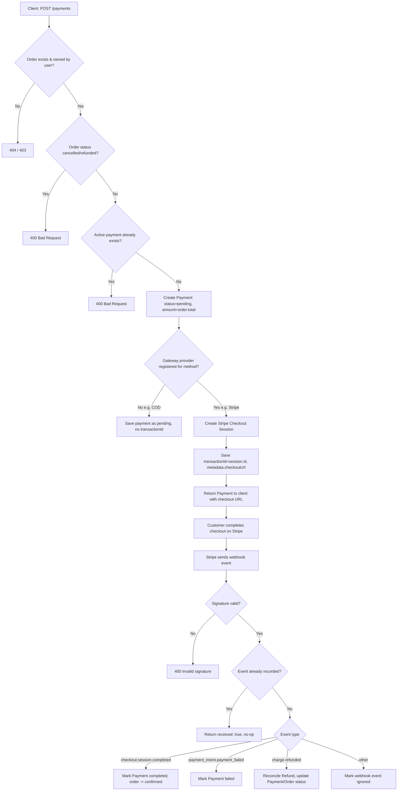
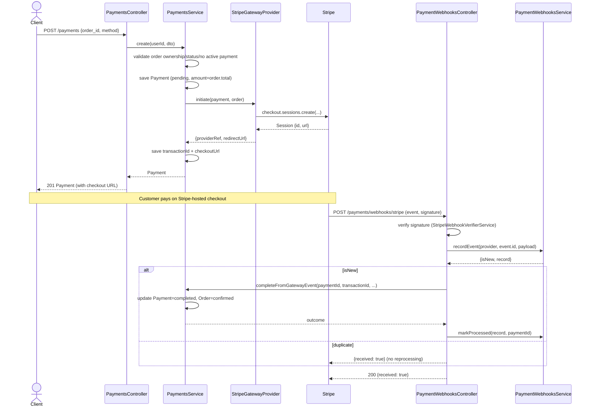

# Payments

## Overview
- **Purpose**: Manage payments for orders (creation, status tracking, refunds) and integrate with external payment gateways, currently Stripe (Checkout Sessions + webhooks).
- **Scope**: Payment creation and lookup for customers, admin payment/refund management, and Stripe webhook ingestion for asynchronous payment/refund confirmation. Other methods (`cod`, `vnpay`, `momo`, `zalopay`, `bank_transfer`) exist in the enum but only `stripe` has a registered gateway provider — the rest are recorded as pending payments with no gateway interaction.
- **Entry point**: `src/payments/payments.module.ts` — registers `PaymentsController`, `AdminPaymentsController`, `PaymentWebhooksController`, `PaymentsService`, `PaymentWebhooksService`, `PaymentGatewayRegistry`, and the Stripe providers.

---

## Business Rules

- A payment can only be created for an order owned by the requesting user (`order.user_id !== userId` → `403 Forbidden`).
- A payment cannot be created for an order whose status is `cancelled` or `refunded` (`400 Bad Request`).
- Only one "active" payment (`pending` or `completed`) may exist per order at a time; creating another while one is active is rejected (`400`).
- Payment `amount` is always taken from `order.total` — never from client input.
- If the resolved gateway provider has no `initiate` support (i.e. method has no registered provider, e.g. `cod`), the payment is saved as `pending` with no `transactionId`/checkout URL.
- Stripe Checkout Sessions are created with `payment_id`/`order_id` metadata on both the session and `payment_intent_data`, so the same metadata is available on `payment_intent.*` events.
- A payment's status cannot be manually updated (`PATCH /admin/payments/:id/status`) once it is in a terminal state: `completed`, `partially_refunded`, or `refunded` (`400`).
- Manually setting status to `completed` stamps `paidAt` and transitions the order to `confirmed` (actor: admin).
- Manually setting status to `refunded` transitions the order to `refunded` (actor: admin). This path does not create a `Refund` record.
- A refund can only be created against a payment in status `completed` or `partially_refunded` (`400` otherwise).
- A refund request cannot list the same `order_item_id` more than once (`400`).
- Every `order_item_id` in a refund request must belong to the order tied to the payment (`400`).
- Per-item refundable quantity = `orderItem.quantity` − sum of quantities already refunded via `succeeded` refunds for that item; requesting more than this is rejected (`400`).
- Total refunded amount (already-succeeded + new request) cannot exceed `payment.amount` (`400`, "Refund amount exceeds the remaining refundable balance").
- Refunding via Stripe requires the payment to already have a `transactionId` (PaymentIntent id); otherwise rejected (`400`).
- If the gateway refund call fails, the `Refund` record is persisted with status `failed` and the error message, and the error is re-thrown to the caller (payment status is left unchanged).
- On refund success, payment status becomes `refunded` if total refunded ≥ `payment.amount`, otherwise `partially_refunded`; order status is updated to match (`refunded` / `partially_refunded`, actor: admin).
- Stripe webhook requests must include a `Stripe-Signature` header and the raw request body; otherwise rejected (`400`, "Missing Stripe signature") — signature verification failure also yields `400` ("Invalid Stripe signature").
- Webhook events are deduplicated by `(provider, eventId)` — a duplicate delivery is detected via a unique-constraint violation and short-circuits with `{ received: true }` without reprocessing.
- Gateway-driven completion/failure/refund events are idempotent against a payment's terminal state (`completed`/`partially_refunded`/`refunded`) — already-terminal payments are left untouched (`already_terminal` outcome, no error).
- `charge.refunded` events reconcile refunds issued outside the API (e.g. directly in the Stripe dashboard): the new refund amount is computed as `charge.amount_refunded` minus the sum of already-recorded `succeeded` refunds for that payment, and skipped if the delta is ≤ 0 or the latest refund id was already recorded.
- Only users with `payment.read` / `payment.update` permissions may access admin payment/refund endpoints; regular users can only see their own payments (`GET /payments/me`, `GET /payments/me/:id`).
- The Stripe webhook controller is excluded from Swagger docs (`@ApiExcludeController`) and exempt from rate throttling (`@SkipThrottle`).

---

## Flow Diagram



---

## Sequence Diagram



---

## Module Structure

| Module | Responsibility |
|---|---|
| `PaymentsController` | Customer-facing endpoints: create payment, list/view own payments |
| `AdminPaymentsController` | Admin endpoints: list/view all payments, update payment status, create/list refunds |
| `PaymentWebhooksController` | Ingests and dispatches Stripe webhook events |
| `PaymentsService` | Core business logic for payments and refunds; applies order status transitions |
| `PaymentWebhooksService` | Persists webhook events, provides idempotency (unique `provider`+`eventId`) and processing-status tracking |
| `PaymentGatewayRegistry` | Resolves a `PaymentGatewayProvider` implementation by `PaymentMethod` |
| `StripeGatewayProvider` | Stripe implementation: creates Checkout Sessions (`initiate`), issues refunds (`refund`) |
| `StripeClientProvider` | Instantiates the Stripe SDK client from config |
| `StripeWebhookVerifierService` | Verifies Stripe webhook signatures against the raw request body |

---

## API

### Endpoint
`POST /payments`

Creates a payment for an order (customer, JWT auth required).

### Request
```json
{
  "order_id": "b3f1c2b0-1234-4a56-9abc-000000000001",
  "method": "stripe"
}
```

### Response
```json
{
  "id": "9c2e...",
  "order_id": "b3f1c2b0-1234-4a56-9abc-000000000001",
  "method": "stripe",
  "status": "pending",
  "amount": 250000,
  "transactionId": "cs_test_...",
  "metadata": { "checkoutUrl": "https://checkout.stripe.com/c/pay/..." },
  "paidAt": null,
  "createdAt": "2026-07-22T00:00:00.000Z",
  "updatedAt": "2026-07-22T00:00:00.000Z"
}
```

---

### Endpoint
`GET /payments/me`

Lists the current user's payments (paginated, filterable by `status`, `order_id`).

### Request
```
GET /payments/me?page=1&limit=20&status=completed
```

### Response
```json
{
  "data": [
    {
      "id": "9c2e...",
      "order_id": "b3f1c2b0-...",
      "method": "stripe",
      "status": "completed",
      "amount": 250000,
      "transactionId": "pi_...",
      "metadata": {},
      "paidAt": "2026-07-22T00:05:00.000Z",
      "createdAt": "2026-07-22T00:00:00.000Z",
      "updatedAt": "2026-07-22T00:05:00.000Z"
    }
  ],
  "total": 1,
  "page": 1,
  "limit": 20
}
```

---

### Endpoint
`GET /payments/me/:id`

Gets a single payment owned by the current user (`403` if payment belongs to a different user's order).

### Request
```
GET /payments/me/9c2e...
```

### Response
```json
{
  "id": "9c2e...",
  "order_id": "b3f1c2b0-...",
  "method": "stripe",
  "status": "completed",
  "amount": 250000,
  "transactionId": "pi_...",
  "metadata": {},
  "paidAt": "2026-07-22T00:05:00.000Z",
  "createdAt": "2026-07-22T00:00:00.000Z",
  "updatedAt": "2026-07-22T00:05:00.000Z"
}
```

---

### Endpoint
`GET /admin/payments` — requires permission `payment.read`

Lists all payments (paginated, filterable by `status`, `order_id`, `user_id`).

### Request
```
GET /admin/payments?page=1&limit=20&status=pending&user_id=<uuid>
```

### Response
```json
{
  "data": [
    {
      "id": "9c2e...",
      "order_id": "b3f1c2b0-...",
      "method": "cod",
      "status": "pending",
      "amount": 250000,
      "transactionId": null,
      "metadata": null,
      "paidAt": null,
      "createdAt": "2026-07-22T00:00:00.000Z",
      "updatedAt": "2026-07-22T00:00:00.000Z"
    }
  ],
  "total": 1,
  "page": 1,
  "limit": 20
}
```

---

### Endpoint
`GET /admin/payments/:id` — requires permission `payment.read`

### Request
```
GET /admin/payments/9c2e...
```

### Response
```json
{
  "id": "9c2e...",
  "order_id": "b3f1c2b0-...",
  "method": "stripe",
  "status": "completed",
  "amount": 250000,
  "transactionId": "pi_...",
  "metadata": {},
  "paidAt": "2026-07-22T00:05:00.000Z",
  "createdAt": "2026-07-22T00:00:00.000Z",
  "updatedAt": "2026-07-22T00:05:00.000Z"
}
```

---

### Endpoint
`PATCH /admin/payments/:id/status` — requires permission `payment.update`

Manually sets payment status (e.g. for offline/COD reconciliation). Rejected if payment is already `completed`, `partially_refunded`, or `refunded`.

### Request
```json
{
  "status": "completed",
  "transactionId": "TXN-ABC123",
  "metadata": { "note": "Confirmed via bank transfer" }
}
```

### Response
```json
{
  "id": "9c2e...",
  "order_id": "b3f1c2b0-...",
  "method": "bank_transfer",
  "status": "completed",
  "amount": 250000,
  "transactionId": "TXN-ABC123",
  "metadata": { "note": "Confirmed via bank transfer" },
  "paidAt": "2026-07-22T00:10:00.000Z",
  "createdAt": "2026-07-22T00:00:00.000Z",
  "updatedAt": "2026-07-22T00:10:00.000Z"
}
```

---

### Endpoint
`POST /admin/payments/:id/refunds` — requires permission `payment.update`

Creates a full or partial (item-level) refund for a payment. Only valid for `completed`/`partially_refunded` payments.

### Request
```json
{
  "items": [
    { "order_item_id": "a1b2c3d4-...", "quantity": 1 }
  ],
  "reason": "Sản phẩm bị lỗi khi giao hàng"
}
```

### Response
```json
{
  "id": "r1a2...",
  "payment_id": "9c2e...",
  "order_id": "b3f1c2b0-...",
  "amount": 100000,
  "reason": "Sản phẩm bị lỗi khi giao hàng",
  "status": "succeeded",
  "transactionId": "re_...",
  "actorId": "admin-user-uuid",
  "items": [
    { "id": "ri1...", "order_item_id": "a1b2c3d4-...", "quantity": 1, "amount": 100000 }
  ],
  "createdAt": "2026-07-22T00:15:00.000Z"
}
```

---

### Endpoint
`GET /admin/payments/:id/refunds` — requires permission `payment.read`

### Request
```
GET /admin/payments/9c2e.../refunds
```

### Response
```json
[
  {
    "id": "r1a2...",
    "payment_id": "9c2e...",
    "order_id": "b3f1c2b0-...",
    "amount": 100000,
    "reason": "Sản phẩm bị lỗi khi giao hàng",
    "status": "succeeded",
    "transactionId": "re_...",
    "actorId": "admin-user-uuid",
    "items": [
      { "id": "ri1...", "order_item_id": "a1b2c3d4-...", "quantity": 1, "amount": 100000 }
    ],
    "createdAt": "2026-07-22T00:15:00.000Z"
  }
]
```

---

### Endpoint
`POST /payments/webhooks/stripe`

Stripe webhook receiver. No JWT auth — secured via Stripe signature verification. Excluded from Swagger, exempt from throttling.

### Request
```
Headers: Stripe-Signature: t=...,v1=...
Body: raw Stripe Event JSON, e.g.
{
  "id": "evt_...",
  "type": "checkout.session.completed",
  "data": { "object": { "metadata": { "payment_id": "9c2e..." }, "payment_intent": "pi_..." } }
}
```

### Response
```json
{ "received": true }
```

---

## Processing Steps

**Create payment (`POST /payments`)**
1. Look up order by `order_id`; `404` if missing.
2. Verify the order belongs to the requesting user; `403` if not.
3. Reject if order status is `cancelled` or `refunded`.
4. Reject if an active (`pending`/`completed`) payment already exists for the order.
5. Create `Payment` with `status=pending`, `amount=order.total`.
6. Resolve a gateway provider for the payment method; if none registered, return the pending payment as-is.
7. Call `provider.initiate()` (Stripe: create Checkout Session with `payment_id`/`order_id` metadata).
8. Persist `transactionId` (session id) and `metadata.checkoutUrl`.

**Stripe webhook handling (`POST /payments/webhooks/stripe`)**
1. Require `Stripe-Signature` header and raw body; verify signature via `StripeWebhookVerifierService`.
2. Record the event by `(provider, eventId)`; if already recorded (unique violation), acknowledge without reprocessing.
3. Dispatch by `event.type`:
   - `checkout.session.completed`: read `payment_id` from session metadata, call `completeFromGatewayEvent` (sets `Payment.status=completed`, `paidAt`, transitions order to `confirmed`).
   - `payment_intent.payment_failed`: read `payment_id` from intent metadata, call `failFromGatewayEvent` (sets `Payment.status=failed`).
   - `charge.refunded`: resolve payment by `transactionId` (payment_intent id), call `refundFromGatewayEvent` to reconcile refund delta and update payment/order status.
   - other types: mark webhook event `ignored`.
4. Mark the webhook event `processed` (with the resolved `payment_id`) or `error` (with a message) accordingly.
5. Always respond `{ received: true }` (errors are recorded internally, not surfaced to Stripe, to avoid retry storms — except signature failures which return `400`).

**Create refund (`POST /admin/payments/:id/refunds`)**
1. Load payment with `order` and `order.items`; `404` if missing.
2. Reject if payment status is not `completed`/`partially_refunded`.
3. Validate no duplicate `order_item_id` in the request.
4. For each requested item: verify it belongs to the order, compute refundable quantity (`orderItem.quantity` − already-refunded qty), reject if requested quantity exceeds it.
5. Sum requested refund amount; reject if `already-refunded total + new amount` exceeds `payment.amount`.
6. Save a `Refund` (status `pending`) with its `RefundItem` rows.
7. If the gateway supports `refund()`, call it (Stripe: `refunds.create` against the payment intent); on success store `transactionId`/`metadata` and set `status=succeeded`; on failure set `status=failed` with the error message and re-throw.
8. Update `Payment.status` to `refunded` (fully covered) or `partially_refunded`, and transition the order status to match.

---

## Database

| Entity | Description |
|---|---|
| `Payment` (`payments`) | One payment attempt per order (unique-in-practice via "active payment" rule); tracks method, status, amount, gateway `transactionId`, `metadata`, `paidAt`. |
| `Refund` (`refunds`) | A refund against a `Payment`, with amount, reason, status, gateway `transactionId`, `actorId` (admin who initiated it, if any). |
| `RefundItem` (`refund_items`) | Line-item breakdown of a `Refund`, tied to a specific `OrderItem` and quantity/amount refunded. |
| `PaymentWebhookEvent` (`payment_webhook_events`) | Log of inbound gateway webhook deliveries; unique on `(provider, eventId)` for idempotency, tracks `status` (`received`/`processed`/`ignored`/`error`) and linked `payment_id`. |
| `Order` / `OrderItem` (external, `src/orders`) | Referenced for ownership checks, `total` (payment amount), status transitions, and item-level refund validation. |

---

## Events

| Event | Trigger |
|---|---|
| `checkout.session.completed` | Stripe Checkout Session finished successfully → marks `Payment` `completed`, order → `confirmed`. |
| `payment_intent.payment_failed` | Stripe PaymentIntent failed → marks `Payment` `failed`. |
| `charge.refunded` | A charge was refunded (including refunds issued outside this API, e.g. Stripe dashboard) → reconciles a `Refund` record and updates `Payment`/order status. |
| *(any other Stripe event type)* | Recorded and marked `ignored`; no business action taken. |

---

## Exception Flow

- Missing `Stripe-Signature` header or raw body on webhook → `400 Bad Request` ("Missing Stripe signature").
- Invalid/unverifiable Stripe signature → `400 Bad Request` ("Invalid Stripe signature").
- Create payment: order not found → `404 Not Found`.
- Create payment: order belongs to another user → `403 Forbidden`.
- Create payment: order status is `cancelled`/`refunded` → `400 Bad Request`.
- Create payment: an active payment already exists for the order → `400 Bad Request`.
- Get/find payment: not found → `404 Not Found`; belongs to another user → `403 Forbidden`.
- Update payment status: payment already terminal (`completed`/`partially_refunded`/`refunded`) → `400 Bad Request`.
- Create refund: payment not found → `404 Not Found`.
- Create refund: payment status not `completed`/`partially_refunded` → `400 Bad Request`.
- Create refund: duplicate `order_item_id` in request → `400 Bad Request`.
- Create refund: `order_item_id` not part of the order → `400 Bad Request`.
- Create refund: requested quantity exceeds remaining refundable quantity for an item → `400 Bad Request`.
- Create refund: total refund amount exceeds remaining refundable balance → `400 Bad Request`.
- Create refund via Stripe: payment has no `transactionId` (PaymentIntent id) → `400 Bad Request`.
- Create refund: gateway call throws → `Refund` persisted as `failed` with error message, original error re-thrown to caller.
- Webhook: event references a `payment_id` not found in DB → webhook event marked `error`, response still `{ received: true }`.
- Webhook: missing `payment_id` metadata on session/intent → webhook event marked `error`, response still `{ received: true }`.
- Webhook: duplicate event id for the same provider → short-circuited as already processed, no reprocessing, `{ received: true }`.
- Gateway event handlers (`completeFromGatewayEvent`, `failFromGatewayEvent`, `refundFromGatewayEvent`) are no-ops (`already_terminal`) if the payment is already in a terminal status, preventing double-processing.
- TODO: no explicit gateway network-timeout handling found in `StripeGatewayProvider`/`StripeClientProvider` — Stripe SDK errors during `initiate`/`refund` propagate as unhandled exceptions (framework default 500), except refund failures which are caught and recorded as described above.

---

## Related Components

- `PaymentsController` (`src/payments/payments.controller.ts`) — customer payment endpoints.
- `AdminPaymentsController` (`src/payments/admin-payments.controller.ts`) — admin payment/refund endpoints, guarded by `JwtAuthGuard` + `PermissionsGuard`.
- `PaymentWebhooksController` (`src/payments/payment-webhooks.controller.ts`) — Stripe webhook ingress.
- `PaymentsService` (`src/payments/payments.service.ts`) — core payment/refund logic.
- `PaymentWebhooksService` (`src/payments/payment-webhooks.service.ts`) — webhook event persistence/idempotency.
- `PaymentGatewayRegistry` / `PaymentGatewayProvider` interface (`src/payments/gateways/`) — pluggable gateway abstraction.
- `StripeGatewayProvider`, `StripeClientProvider`, `StripeWebhookVerifierService` (`src/payments/gateways/stripe/`) — Stripe integration.
- `OrdersService.applyStatusChange` (`src/orders/orders.service.ts`) — used by `PaymentsService` to transition order status (`confirmed`, `refunded`, `partially_refunded`) on payment/refund events, with `OrderStatusChangeActor` (`admin`/`system`) recorded per change.
- `Order`, `OrderItem` entities (`src/orders/entities/`) — read for ownership, `total`, and refund item validation.
- `PermissionsGuard` / `@Permissions` decorator (`src/permissions/`) — enforces `payment.read` / `payment.update` on admin endpoints.

---

## Notes

- Stripe config (`src/config/environment/stripe.config.ts`) requires `STRIPE_SECRET_KEY`, `STRIPE_WEBHOOK_SECRET`, `STRIPE_CHECKOUT_SUCCESS_URL`, `STRIPE_CHECKOUT_CANCEL_URL`, with `STRIPE_CURRENCY` defaulting to `vnd`.
- Raw body is required for signature verification; `NestFactory.create(AppModule, { rawBody: true })` in `src/main.ts` enables `req.rawBody` used by `StripeWebhookVerifierService`.
- Idempotency is enforced at two levels: webhook delivery (`payment_webhook_events` unique `(provider, eventId)`) and payment state (terminal-status checks before mutating `Payment`/`Refund`).
- `charge.refunded` handling supports refunds initiated outside this API (e.g. via Stripe Dashboard) by diffing `charge.amount_refunded` against the sum of already-recorded `succeeded` refunds, and de-duplicates using the latest refund id in the charge payload.
- `PaymentMethod` enum includes `cod`, `vnpay`, `momo`, `zalopay`, `bank_transfer`, `stripe`, but only `stripe` is wired into `PaymentGatewayRegistry` (`src/payments/payments.module.ts`); other methods are recorded without any gateway call (manual/offline reconciliation via `PATCH /admin/payments/:id/status`).
- The Stripe webhook controller has no authentication guard by design (Stripe cannot present a JWT); trust is established solely via signature verification.
- `PaymentWebhooksController` is decorated with `@ApiExcludeController()` (hidden from Swagger) and `@SkipThrottle()` (exempt from global rate limiting).
