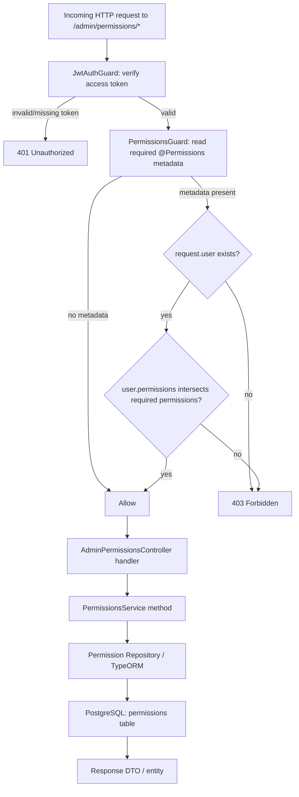
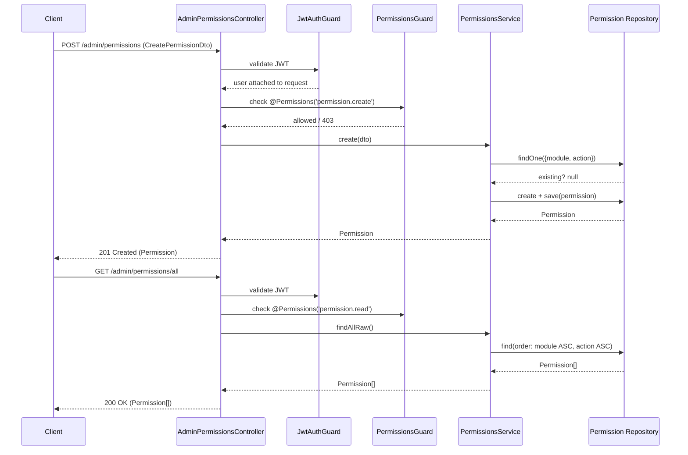

# Permissions

## Overview
- **Purpose**: Manage the catalog of granular RBAC permissions (`module` + `action` pairs) used to authorize admin API access, and expose metadata for building role/permission assignment UIs.
- **Scope**: `src/permissions/` — entity, enum, DTOs, decorator, guard, service, controller. Tightly coupled to `src/roles/` (roles hold a many-to-many set of permissions) and `src/users/` (users can also be granted permissions directly, bypassing roles).
- **Entry point**: `AdminPermissionsController` at `admin/permissions`, protected by `JwtAuthGuard` + `PermissionsGuard`.

---

## Business Rules

- A permission is uniquely identified by `(module, action)` — enforced by a unique composite index on the `permissions` table and a duplicate check in `create()` (throws `ConflictException`).
- `action` must be one of the `PermissionAction` enum values: `create`, `read`, `update`, `delete`, `cancel`, `publish`, `upload`, `assign.role`. `module` is a free-form string (e.g. `user`, `product`, `order`).
- `isSystem` marks a permission as seeded/protected. System permissions (`isSystem: true`) **cannot be updated or deleted** — both `update()` and `remove()` throw `ForbiddenException` when `permission.isSystem === true`.
- `update()` only allows changing `description`; `module`, `action`, and `isSystem` are immutable after creation via this endpoint.
- `remove()` performs a hard delete (`repo.remove`), not a soft delete.
- Authorization string format is `"{module}.{action}"` (e.g. `permission.create`, `user.read`) — this is the exact string checked by `@Permissions(...)` decorators and produced when building a user's effective permission set.
- A user's effective permissions are the **union** of permissions granted directly to the user (`user_permission` join table) and permissions inherited from all assigned roles (`role_permission` join table), deduplicated. This aggregation happens in `UsersService.getUserProfile()`, not in the permissions module itself.
- `PermissionsGuard` logic:
  - Reads required permissions from handler metadata (set via `@Permissions('a', 'b', ...)`).
  - If no metadata is present (empty/undefined), access is **allowed** (guard is a no-op).
  - If metadata is present but `request.user` is missing (not authenticated), access is **denied**.
  - Otherwise access is granted if the user's `permissions` array contains **at least one** (`.some()`, OR semantics) of the required permission strings — not all of them.
- `GET /admin/permissions/meta` groups permissions by module and by whether *any* permission sharing that action value has `isSystem: true` (`systemActions`) vs `false` (`customActions`). This is explicitly documented in code as "not for auth" — it's UI-rendering metadata only.
- `GET /admin/permissions/all` returns the complete, unpaginated permission list (sorted by `module`, `action` ASC) — intended for populating role/permission assignment UIs (added alongside the seed-data commit).
- `GET /admin/permissions` (paginated list) supports optional `module` and `action` equality filters, default `page=1`, `limit=20` (max `limit=100`), sorted by `createdAt DESC`.

---

## Flow Diagram



---

## Sequence Diagram



---

## Module Structure

| Module | Responsibility |
|---|---|
| `admin-permissions.controller.ts` | HTTP routes under `admin/permissions`, applies guards and `@Permissions` decorators |
| `permissions.service.ts` | Business logic: CRUD, pagination, metadata aggregation |
| `permissions.module.ts` | Registers `Permission` entity with TypeORM, wires controller/service, exports `TypeOrmModule` (so other modules, e.g. Roles/Users, can inject `Permission` repository) |
| `guards/permissions.guard.ts` | Authorization guard — compares required permissions (from decorator metadata) against `request.user.permissions` |
| `decorators/permissions.decorator.ts` | `@Permissions(...)` — attaches required permission strings as route metadata |
| `entities/permission.entity.ts` | TypeORM entity: `module`, `action`, `description`, `isSystem`, M2M to `Role` and `User` |
| `enums/permission-action.enum.ts` | Enumerates allowed `action` values |
| `dto/*.ts` | Request/response/query shapes (create, update, list query, meta response, paginated response) |

---

## API

### Endpoint
`POST /admin/permissions`

Required permission: `permission.create`

### Request
```json
{
  "module": "user",
  "action": "read",
  "description": "Xem danh sách người dùng",
  "isSystem": false
}
```

### Response
```json
{
  "id": "123e4567-e89b-12d3-a456-426614174000",
  "module": "user",
  "action": "read",
  "description": "Xem danh sách người dùng",
  "isSystem": false,
  "createdAt": "2026-01-01T00:00:00.000Z",
  "updatedAt": "2026-01-01T00:00:00.000Z"
}
```

---

### Endpoint
`GET /admin/permissions/meta`

Required permission: `permission.read`

### Request
```json
{}
```
_No body/query params._

### Response
```json
{
  "modules": ["user", "product", "order"],
  "systemActions": ["read", "create", "update", "delete"],
  "customActions": []
}
```

---

### Endpoint
`GET /admin/permissions`

Required permission: `permission.read`

### Request
```json
{
  "page": 1,
  "limit": 20,
  "module": "user",
  "action": "read"
}
```
_Query params, all optional (`page`/`limit` default to 1/20)._

### Response
```json
{
  "data": [
    {
      "id": "123e4567-e89b-12d3-a456-426614174000",
      "module": "user",
      "action": "read",
      "description": "Xem danh sách người dùng",
      "isSystem": true,
      "createdAt": "2026-01-01T00:00:00.000Z",
      "updatedAt": "2026-01-01T00:00:00.000Z"
    }
  ],
  "total": 1,
  "page": 1,
  "limit": 20
}
```

---

### Endpoint
`GET /admin/permissions/all`

Required permission: `permission.read`

### Request
```json
{}
```
_No params — returns full unpaginated list._

### Response
```json
[
  {
    "id": "123e4567-e89b-12d3-a456-426614174000",
    "module": "address",
    "action": "create",
    "description": "Tạo địa chỉ cho người dùng",
    "isSystem": true,
    "createdAt": "2026-01-01T00:00:00.000Z",
    "updatedAt": "2026-01-01T00:00:00.000Z"
  }
]
```

---

### Endpoint
`GET /admin/permissions/:id`

Required permission: `permission.read`

### Request
```json
{ "id": "123e4567-e89b-12d3-a456-426614174000" }
```
_Path parameter only._

### Response
```json
{
  "id": "123e4567-e89b-12d3-a456-426614174000",
  "module": "user",
  "action": "read",
  "description": "Xem danh sách người dùng",
  "isSystem": true,
  "createdAt": "2026-01-01T00:00:00.000Z",
  "updatedAt": "2026-01-01T00:00:00.000Z"
}
```

---

### Endpoint
`PUT /admin/permissions/:id`

Required permission: `permission.update`

### Request
```json
{
  "description": "Xem & tìm kiếm người dùng"
}
```

### Response
```json
{
  "id": "123e4567-e89b-12d3-a456-426614174000",
  "module": "user",
  "action": "read",
  "description": "Xem & tìm kiếm người dùng",
  "isSystem": false,
  "createdAt": "2026-01-01T00:00:00.000Z",
  "updatedAt": "2026-01-01T00:00:00.000Z"
}
```

---

### Endpoint
`DELETE /admin/permissions/:id`

Required permission: `permission.delete`

### Request
```json
{ "id": "123e4567-e89b-12d3-a456-426614174000" }
```
_Path parameter only._

### Response
```json
{
  "message": "Permission deleted"
}
```

---

## Processing Steps

### Permission guard check (applies to every endpoint above)
1. `JwtAuthGuard` validates the bearer token and attaches `CurrentUser` (`id`, `email`, `roles`, `permissions`) to the request.
2. `PermissionsGuard` reads the `permissions` metadata array set by `@Permissions(...)` on the route handler.
3. If no metadata is set, the guard allows the request through unconditionally.
4. If metadata is set, the guard requires `request.user` to exist; otherwise denies.
5. The guard checks whether `user.permissions` contains **any** of the required permission strings (`Array.prototype.some`); denies otherwise.
6. On denial, Nest's default `CanActivate` behavior returns `403 Forbidden`.

### `GET /admin/permissions/all` (list-all, seed-related)
1. Client calls the endpoint (requires `permission.read`).
2. `PermissionsService.findAllRaw()` queries all rows from the `permissions` table, ordered by `module` ASC then `action` ASC.
3. Full list returned as a plain array (no pagination wrapper) — used by admin UIs to render checkboxes for role/user permission assignment.

### Create permission
1. Validate `CreatePermissionDto` (module, action enum, optional description/isSystem).
2. Check for an existing permission with the same `(module, action)`; throw `ConflictException` if found.
3. Create and persist the new `Permission` row (`isSystem` defaults to `false` if omitted).
4. Return the saved entity.

### Update / Delete permission
1. Look up the permission by `id`; throw `NotFoundException` if missing.
2. If `permission.isSystem === true`, throw `ForbiddenException` (blocks both update and delete).
3. Otherwise apply the change (`description` update, or hard delete) and persist/return.

---

## Database

| Entity | Description |
|---|---|
| `Permission` (`permissions` table) | Core entity: `module`, `action` (enum), `description`, `isSystem`, unique on `(module, action)` |
| `Role` (`roles` table) | Many-to-many with `Permission` via `role_permission` join table (roles.service.ts assigns/reads permissions) |
| `User` (`users` table) | Many-to-many with `Permission` via `user_permission` join table (direct, role-independent permission grants) |

Join tables: `role_permission` (`role_id`, `permission_id`), `user_permission` (`user_id`, `permission_id`).

---

## Events

None. TODO: no domain/application events are emitted by this module — confirm with the team if audit-log events for permission changes are planned.

---

## Exception Flow

- `ConflictException` — `create()` when a permission with the same `(module, action)` already exists.
- `NotFoundException` — `findOne()`, `update()`, `remove()` when the permission `id` does not exist.
- `ForbiddenException` — `update()` / `remove()` when targeting a system permission (`isSystem: true`).
- `403 Forbidden` (via `PermissionsGuard` returning `false`) — authenticated user lacks all of the required permission strings for the route, or `request.user` is absent despite required permissions being set.
- `401 Unauthorized` — implicit, via `JwtAuthGuard`/Passport `jwt` strategy, when the bearer token is missing/invalid/expired.
- Class-validator DTO failures (`400 Bad Request`) — e.g. invalid `PermissionAction` enum value, missing `module`, non-integer `page`/`limit`, `limit` > 100.

---

## Related Components

- `AdminPermissionsController` (`src/permissions/admin-permissions.controller.ts`)
- `PermissionsService` (`src/permissions/permissions.service.ts`)
- `Permission` repository (TypeORM, injected via `@InjectRepository(Permission)`)
- `PermissionsGuard` (`src/permissions/guards/permissions.guard.ts`) and `@Permissions()` decorator (`src/permissions/decorators/permissions.decorator.ts`)
- `JwtAuthGuard` (`src/auth/guards/jwt-auth.guard.ts`) — upstream authentication guard applied before `PermissionsGuard`
- Roles module (`src/roles/`) — `RolesService.assignPermissions()` attaches `Permission` rows to a `Role`; `AdminRolesController` also gates its own routes with `@Permissions('role.*')` + `PermissionsGuard`
- Users module (`src/users/`) — `UsersService.getUserProfile()` merges role-derived and directly-assigned permissions into the JWT payload consumed by `PermissionsGuard`
- Database seeds (`src/database/seeds/permission.seed.ts`, `src/database/seeds/role.seed.ts`) — bootstrap the full permission catalog and default roles (`super-admin`, `admin`, `member`)

---

## Notes

- Seed data (`permission.seed.ts`) creates ~40 permissions across modules (`user`, `role`, `category`, `product`, `order`, `payment`, `review`, `permission`, `address`, `cart`, `wishlist`, `discount`, `banner`, `media`), all marked `isSystem: true` — meaning none of the seeded permissions can be edited or deleted through the API, only newly created custom ones can.
- `role.seed.ts` grants `super-admin` **all** permissions (`allPermissions`, no filtering), `admin` a curated subset (excludes `role`/`permission` write actions — "dành riêng cho super-admin"), and `member` only `user.read`.
- `GET /admin/permissions/all` (list-all) was added specifically to support role/permission assignment UIs (per commit `987fa32`), complementing the paginated `GET /admin/permissions`.
- `GET /admin/permissions/meta` is explicitly documented in code as *"Not for auth"* — it exists purely to help the frontend render forms (e.g. dropdowns of known modules/actions), not to drive any authorization decision.
- TODO: `RolesService.update()`/`remove()` block modification of a role literally named `'ADMIN'` (`role.name === 'ADMIN'`), but seed data creates roles named `'admin'` and `'super-admin'` (lowercase). Since role names are case-sensitive in this check, the seeded `admin`/`super-admin` roles are **not** actually protected by this guard — verify whether this is intentional or a latent bug.
- TODO: `PermissionsGuard` uses OR semantics (`.some()`) across multiple permissions passed to a single `@Permissions(...)` call, but every current usage in this codebase passes exactly one permission string per route, so this multi-permission behavior is currently unexercised.
