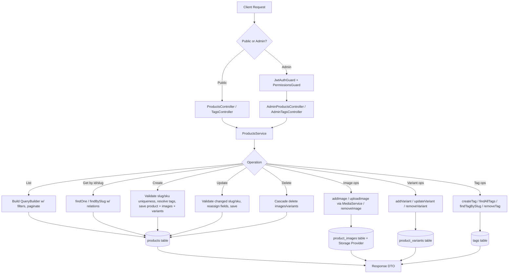
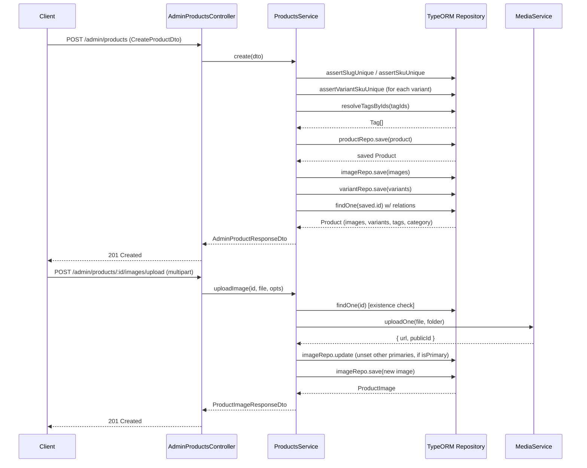

# Products

## Overview
- **Purpose**: Manage the product catalog — products, their images, variants, and tags — for both public storefront consumption and admin/back-office management.
- **Scope**: CRUD for products, product images (URL-based or file upload), product variants (SKU/price/stock/attributes), and tags. Excludes inventory transactions, pricing/discount rules, and reviews (owned by other modules).
- **Entry point**: `src/products/products.module.ts` wires up `ProductsController`, `TagsController` (public), `AdminProductsController`, `AdminTagsController` (admin) and `ProductsService`, backed by TypeORM repositories for `Product`, `ProductImage`, `ProductVariant`, `Tag`.

---

## Business Rules

- Product `slug` must be globally unique; if not supplied on create, it is auto-generated from `name` via `generateUniqueSlug` (falls back to a random suffix on collision).
- On update, if `name` changes and no explicit `slug` is given, the slug is regenerated from the new name (uniqueness check excludes the current product `id`).
- Product `sku` must be globally unique (`assertSkuUnique`), checked on create and on update (only when `sku` changes).
- Each `ProductVariant.sku` must be globally unique across all variants of all products (`assertVariantSkuUnique`), checked on variant create/update and when creating a product with nested variants.
- `Tag.name` and `Tag.slug` must each be unique; slug is auto-generated from `name` if omitted.
- `tagIds` supplied on create/update must all resolve to existing tags; any missing id throws `NotFoundException` listing the missing ids.
- Setting `isPrimary: true` on a product image (via `addImage` or `uploadImage`) unsets `isPrimary` on all other images of that product first (only one primary image per product).
- Product `status` defaults to `draft` (enum: `draft`, `published`, `archived`); `isFeatured` defaults to `false`.
- Product `basePrice` and variant `price` must be `>= 0` (`@Min(0)`, max 2 decimal places).
- Variant `stock` defaults to `0`, must be `>= 0`; variant `isActive` defaults to `true`.
- Removing a product image also attempts to delete the underlying asset from the storage/cloud provider via `MediaService.delete`; a failure to delete the cloud asset is logged as a warning but does not block removal of the DB record.
- File uploads for product images are validated by `MediaService` against `maxFileSizeBytes` and `allowedMimeTypes` from config before upload.
- Deleting a product (`remove`) cascades to its images and variants at the DB/ORM level (`cascade: true` on `images`/`variants` relations, `onDelete: 'CASCADE'` on the FK side).
- All admin endpoints require JWT authentication (`JwtAuthGuard`) plus a specific permission (`PermissionsGuard` + `@Permissions(...)`): `product.read`, `product.create`, `product.update`, `product.delete`.
- Public endpoints (`ProductsController`, `TagsController`) have no auth guard — open read access.
- Product listing filters by `name` (ILIKE partial match), `category_id`, `status`, `isFeatured`; results are always ordered by `createdAt DESC` and paginated (`page`, `limit`, default 1/20, max limit 100).

---

## Flow Diagram



---

## Sequence Diagram



---

## Module Structure

| Module | Responsibility |
|---|---|
| `ProductsController` | Public read-only endpoints: list, get by id, get by slug |
| `TagsController` | Public read-only endpoints for tags |
| `AdminProductsController` | Admin CRUD for products, images, variants (JWT + permission guarded) |
| `AdminTagsController` | Admin create/delete for tags (JWT + permission guarded) |
| `ProductsService` | All business logic: uniqueness checks, slug generation, CRUD for products/images/variants/tags |
| `Product` / `ProductImage` / `ProductVariant` / `Tag` entities | TypeORM entities mapping to `products`, `product_images`, `product_variants`, `tags` (+ `product_tag` join table) |
| `MediaModule` (external) | File upload/delete abstraction (Cloudinary/local storage) used for product image uploads |
| `CategoriesModule` (external, referenced) | `Product.category` many-to-one relation |
| `ReviewsModule` (external, referenced) | `Review.product` many-to-one relation (reviews reference products; products do not embed review/rating data) |

---

## API

### Endpoint
`GET /products`

#### Request
```json
{
  "page": 1,
  "limit": 20,
  "name": "iphone",
  "category_id": "uuid-v4",
  "status": "published",
  "isFeatured": true
}
```

#### Response
```json
{
  "data": [
    {
      "id": "uuid-v4",
      "category_id": "uuid-v4",
      "name": "iPhone 15 Pro",
      "slug": "iphone-15-pro",
      "basePrice": 29990000,
      "sku": "IPH-15-PRO",
      "status": "published",
      "isFeatured": true,
      "createdAt": "2026-01-01T10:00:00Z",
      "updatedAt": "2026-01-01T10:05:00Z"
    }
  ],
  "total": 100,
  "page": 1,
  "limit": 20
}
```

---

### Endpoint
`GET /products/slug/:slug`

#### Request
```json
{ "slug": "iphone-15-pro" }
```

#### Response
```json
{
  "id": "uuid-v4",
  "category_id": "uuid-v4",
  "name": "iPhone 15 Pro",
  "slug": "iphone-15-pro",
  "description": "Flagship phone",
  "basePrice": 29990000,
  "sku": "IPH-15-PRO",
  "status": "published",
  "isFeatured": true,
  "images": [
    { "id": "uuid-v4", "variant_id": null, "url": "https://cdn/...", "alt": "front", "isPrimary": true, "sortOrder": 0 }
  ],
  "variants": [
    { "id": "uuid-v4", "name": "Đỏ - L", "sku": "PROD-001-RED-L", "price": 299000, "stock": 100, "attributes": { "color": "red" }, "isActive": true, "createdAt": "...", "updatedAt": "..." }
  ],
  "tags": [
    { "id": "uuid-v4", "name": "sale", "slug": "sale" }
  ],
  "createdAt": "2026-01-01T10:00:00Z",
  "updatedAt": "2026-01-01T10:05:00Z"
}
```

---

### Endpoint
`GET /products/:id`

#### Request
```json
{ "id": "uuid-v4" }
```

#### Response
Same shape as `GET /products/slug/:slug`.

---

### Endpoint
`GET /tags`

#### Request
_None_

#### Response
```json
[
  { "id": "uuid-v4", "name": "sale", "slug": "sale" }
]
```

---

### Endpoint
`GET /tags/slug/:slug`

#### Request
```json
{ "slug": "sale" }
```

#### Response
```json
{ "id": "uuid-v4", "name": "sale", "slug": "sale" }
```

---

### Endpoint
`GET /admin/products`

Requires: JWT + `product.read`. Same request/response shape as `GET /products`.

---

### Endpoint
`GET /admin/products/:id`

Requires: JWT + `product.read`. Same response shape as `GET /products/:id` (`AdminProductResponseDto` extends `ProductResponseDto`).

---

### Endpoint
`POST /admin/products`

Requires: JWT + `product.create`.

#### Request
```json
{
  "category_id": "uuid-v4",
  "name": "iPhone 15 Pro",
  "slug": "iphone-15-pro",
  "description": "Flagship phone",
  "basePrice": 29990000,
  "sku": "IPH-15-PRO",
  "status": "draft",
  "isFeatured": false,
  "images": [
    { "url": "https://cdn.example.com/img.jpg", "alt": "front", "isPrimary": true, "sortOrder": 0 }
  ],
  "variants": [
    { "name": "Đỏ - L", "sku": "PROD-001-RED-L", "price": 299000, "stock": 100, "attributes": { "color": "red", "size": "L" }, "isActive": true }
  ],
  "tagIds": ["uuid-tag-1", "uuid-tag-2"]
}
```

#### Response
`201` — full `AdminProductResponseDto` (same shape as `GET /products/:id`).

---

### Endpoint
`PATCH /admin/products/:id`

Requires: JWT + `product.update`. All fields optional (`PartialType(CreateProductDto)`), same shape as create request minus required fields.

#### Response
Full `AdminProductResponseDto`.

---

### Endpoint
`DELETE /admin/products/:id`

Requires: JWT + `product.delete`.

#### Response
```json
{ "success": true }
```

---

### Endpoint
`POST /admin/products/:id/images`

Requires: JWT + `product.update`.

#### Request
```json
{
  "url": "https://cdn.example.com/img.jpg",
  "variant_id": "uuid-v4",
  "alt": "Product front view",
  "isPrimary": false,
  "sortOrder": 0
}
```

#### Response
```json
{
  "id": "uuid-v4",
  "variant_id": null,
  "url": "https://cdn.example.com/img.jpg",
  "alt": "Product front view",
  "isPrimary": false,
  "sortOrder": 0
}
```

---

### Endpoint
`POST /admin/products/:id/images/upload`

Requires: JWT + `product.update`. `multipart/form-data`.

#### Request
```
file: <binary>
alt: "Product front view"
isPrimary: "true"
sortOrder: "0"
variant_id: "uuid-v4"
```

#### Response
Same shape as `ProductImageResponseDto` above (`url`/`publicId` populated by storage provider).

---

### Endpoint
`DELETE /admin/products/:id/images/:imageId`

Requires: JWT + `product.update`. Also deletes the asset from the cloud/storage provider if `publicId` is set.

#### Response
```json
{ "success": true }
```

---

### Endpoint
`POST /admin/products/:id/variants`

Requires: JWT + `product.update`.

#### Request
```json
{
  "name": "Đỏ - L",
  "sku": "PROD-001-RED-L",
  "price": 299000,
  "stock": 100,
  "attributes": { "color": "red", "size": "L" },
  "isActive": true
}
```

#### Response
```json
{
  "id": "uuid-v4",
  "name": "Đỏ - L",
  "sku": "PROD-001-RED-L",
  "price": 299000,
  "stock": 100,
  "attributes": { "color": "red", "size": "L" },
  "isActive": true,
  "createdAt": "2026-01-01T10:00:00Z",
  "updatedAt": "2026-01-01T10:05:00Z"
}
```

---

### Endpoint
`PATCH /admin/products/:id/variants/:variantId`

Requires: JWT + `product.update`. All fields optional (`PartialType(CreateProductVariantDto)`).

#### Response
Same shape as `ProductVariantResponseDto` above.

---

### Endpoint
`DELETE /admin/products/:id/variants/:variantId`

Requires: JWT + `product.update`.

#### Response
```json
{ "success": true }
```

---

### Endpoint
`POST /admin/tags`

Requires: JWT + `product.create`.

#### Request
```json
{ "name": "sale", "slug": "sale" }
```

#### Response
```json
{ "id": "uuid-v4", "name": "sale", "slug": "sale" }
```

---

### Endpoint
`DELETE /admin/tags/:id`

Requires: JWT + `product.delete`.

#### Response
```json
{ "success": true }
```

---

## Processing Steps

**Create product** (`POST /admin/products`):
1. Determine slug: use provided `slug` after uniqueness check, or auto-generate from `name`.
2. Assert `sku` uniqueness across products.
3. If nested `variants` present, assert each variant `sku` is unique.
4. Resolve `tagIds` to `Tag` entities; throw `NotFoundException` if any id is missing.
5. Create and save the `Product` row with resolved tags.
6. Bulk-save nested `images` (if any), linked to the new product id.
7. Bulk-save nested `variants` (if any), linked to the new product id.
8. Reload and return the full product with `images`, `variants`, `tags`, `category` relations.

**Update product** (`PATCH /admin/products/:id`):
1. Load existing product (404 if not found).
2. If `slug` changed, assert uniqueness.
3. If `sku` changed, assert uniqueness.
4. If `tagIds` provided, resolve and replace `tags`.
5. If `name` changed and no explicit `slug` given, regenerate slug from new name (excluding current id from uniqueness check).
6. Apply remaining changed fields (`category_id`, `description`, `basePrice`, `sku`, `status`, `isFeatured`).
7. Save and return updated product.

**Upload product image** (`POST /admin/products/:id/images/upload`):
1. Verify product exists.
2. Validate file (size/mime type) and upload via `MediaService` → storage provider, returning `{ url, publicId }`.
3. If `isPrimary`, unset `isPrimary` on all existing images of the product.
4. Save new `ProductImage` row with returned `url`/`publicId` and supplied metadata.

**Remove product image**:
1. Load image scoped to the given product id (404 if not found).
2. If `publicId` set, attempt cloud delete (log warning on failure, do not fail request).
3. Remove DB row, return `{ success: true }`.

---

## Database

| Entity | Description |
|---|---|
| `Product` (`products`) | Core product record: category, name, slug, description, basePrice, sku, status, isFeatured; relations to images, variants, tags, category |
| `ProductImage` (`product_images`) | Image URL/publicId tied to a product and optionally a specific variant; primary/sort-order flags |
| `ProductVariant` (`product_variants`) | Purchasable variant of a product: name, sku, price, stock, jsonb attributes, isActive |
| `Tag` (`tags`) | Named/slugged label, many-to-many with products via `product_tag` join table |
| `Category` (`categories`, external) | Referenced by `Product.category_id` / `Product.category` (many-to-one) |
| `Review` (`reviews`, external) | References `Product` via `product_id` (many-to-one); not embedded in product responses |

---

## Events

None. TODO: no `EventEmitter`/domain events found emitted from `src/products/*` — confirm whether downstream modules (e.g. search indexing, cache invalidation) need product-change notifications.

---

## Exception Flow

- `NotFoundException('Product not found')` — `findOne`/`findBySlug` when id/slug doesn't match any product; also propagates from `update`/`addImage`/`uploadImage`/`addVariant` which call `findOne` internally.
- `ConflictException("Slug '<slug>' already exists")` — creating/updating a product with a duplicate slug.
- `ConflictException("SKU '<sku>' already exists")` — creating/updating a product with a duplicate SKU.
- `ConflictException("Variant SKU '<sku>' already exists")` — creating/updating a variant with a duplicate SKU.
- `NotFoundException('Tags not found: <ids>')` — `tagIds` containing one or more non-existent tag ids.
- `NotFoundException('Image not found')` — removing an image not belonging to the given product (or non-existent).
- `NotFoundException('Variant not found')` — updating/removing a variant not belonging to the given product (or non-existent).
- `ConflictException('Tag name already exists')` — creating a tag with a duplicate name.
- `ConflictException('Tag slug already exists')` — creating a tag with an explicit duplicate slug.
- `NotFoundException('Tag not found')` — `findTagBySlug`/`removeTag` on a non-existent tag.
- `BadRequestException` (from `MediaService.validateFile`) — uploaded image exceeds `maxFileSizeBytes` or has a disallowed mime type.
- Cloud asset delete failure during `removeImage` is caught and logged (`logger.warn`), not surfaced as an exception — DB removal still proceeds.
- Class-validator DTO validation errors (400) — e.g. invalid UUIDs, missing required fields, negative prices, invalid enum `status` values — thrown by the global validation pipe before reaching the service.

---

## Related Components

- Controllers: `ProductsController`, `TagsController` (`src/products/products.controller.ts`); `AdminProductsController`, `AdminTagsController` (`src/products/admin-products.controller.ts`)
- Service: `ProductsService` (`src/products/products.service.ts`)
- Repositories: TypeORM repositories for `Product`, `ProductImage`, `ProductVariant`, `Tag`
- Guards: `JwtAuthGuard` (`src/auth/guards/jwt-auth.guard.ts`), `PermissionsGuard` (`src/permissions/guards/permissions.guard.ts`)
- External modules: `MediaModule`/`MediaService` (image upload/delete), `Category` entity (`src/categories`), `Review` entity (`src/reviews`, one-way FK reference only)
- Utility: `generateUniqueSlug` / `generateSlug` (`src/common/utils/slug.util.ts`)
- Shared DTOs: `PaginationDto`, `PaginatedResponseDto` (`src/common/dto/pagination.dto.ts`)
- Base entities: `AbstractBaseEntity`, `AbstractIdEntity` (`src/common/entities/base.entity.ts`)

---

## Notes

- `ProductResponseDto`/`AdminProductResponseDto` are identical in shape (`AdminProductResponseDto extends ProductResponseDto` with no additions) — admin detail responses do not currently expose extra fields beyond the public shape.
- `basePrice` on `Product` appears to be informational/base pricing; actual purchasable price/stock is per-variant (`ProductVariant.price`/`stock`). TODO: confirm how `basePrice` is used when a product has no variants (e.g. cart/order flows).
- Product image `variant_id` allows associating an image with a specific variant (e.g. color-specific photos), enforced only at the FK level (`onDelete: 'SET NULL'`), not validated in `CreateProductImageDto`/service logic against the parent product's actual variants.
- `findAll` filtering does not support tag-based filtering, price range, or full-text/relevance search — only `name` (ILIKE), `category_id`, `status`, `isFeatured`.
- No soft-delete: `remove()` performs a hard delete (`productRepo.remove`), cascading to images/variants.
- Reviews/ratings are entirely decoupled from the Products module — no average rating or review count is computed or stored on `Product`.
