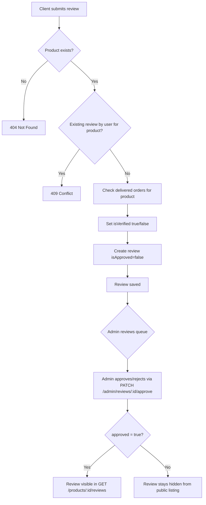
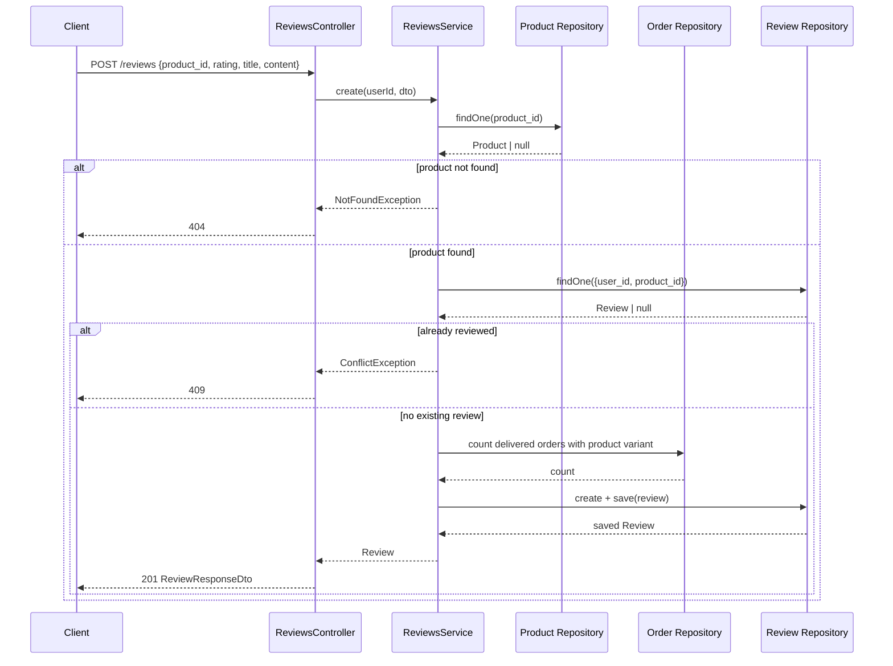

# Reviews

## Overview
- **Purpose**: Allow customers to rate and comment on purchased products, with an admin moderation (approval) workflow before reviews are shown publicly.
- **Scope**: Create/update/delete own review, list own reviews, list approved reviews for a product (public), admin listing with filters, and admin approve/reject.
- **Entry point**: `src/reviews/reviews.controller.ts` (`ReviewsController`, `ProductReviewsController`), `src/reviews/admin-reviews.controller.ts` (`AdminReviewsController`), backed by `src/reviews/reviews.service.ts`.

---

## Business Rules

- A user may create **only one review per product** — enforced both by an application check (`ConflictException` if a review already exists for `user_id` + `product_id`) and a DB-level `@Unique(['user_id', 'product_id'])` constraint on the `reviews` table.
- The target `product_id` must reference an existing product, otherwise `NotFoundException`.
- `rating` must be an integer between 1 and 5 (`@IsInt`, `@Min(1)`, `@Max(5)` on `CreateReviewDto`/`UpdateReviewDto`).
- `title` is optional, max length 255 characters; `content` is optional free text.
- **Verified purchase flag** (`isVerified`) is computed automatically at creation time: true only if the user has an order with status `DELIVERED` containing a variant of the reviewed product (`hasDeliveredOrder`). It is not user-supplied and not recalculated afterwards.
- New reviews are created with `isApproved: false` — reviews are not publicly visible until an admin approves them.
- Public product review listing (`GET /products/:productId/reviews`) always forces `isApproved: true`, regardless of query filters.
- A non-admin user editing their own review causes `isApproved` to reset to `false` (must be re-reviewed by an admin). An admin editing a review (identified by the caller holding the `review.update` permission) does **not** reset approval.
- Only the review's owner, or a user holding `review.update` (update) / `review.delete` (delete) permission, may modify or delete a review; otherwise `ForbiddenException`.
- Admin approve/reject (`PATCH /admin/reviews/:id/approve`) simply sets `isApproved` to the boolean passed in the body — there is no separate "reject" endpoint, rejection is `approved: false`.
- Admin listing (`GET /admin/reviews`) supports filtering by `product_id`, `user_id`, `rating`, `isApproved`, `isVerified`, plus pagination (`page`, `limit`, max `limit` 100).

---

## Flow Diagram



---

## Sequence Diagram



---

## Module Structure

| Module | Responsibility |
|---|---|
| `ReviewsController` | Authenticated endpoints for creating/updating/deleting own reviews and listing own reviews (`/reviews`). |
| `ProductReviewsController` | Public endpoint to list approved reviews of a product (`/products/:productId/reviews`). |
| `AdminReviewsController` | Permission-gated endpoints to list all reviews and approve/reject a review (`/admin/reviews`). |
| `ReviewsService` | Business logic: purchase verification, duplicate checks, approval reset, filtering/pagination. |
| `Review` entity | TypeORM entity/table `reviews`, unique on `(user_id, product_id)`. |
| `ReviewsModule` | Wires controllers/service and registers `Review`, `Product`, `Order` repositories via `TypeOrmModule.forFeature`. |

---

## API

### Endpoint
`POST /reviews`

Auth: `JwtAuthGuard` (any authenticated user).

### Request
```json
{
  "product_id": "e4b5f7a0-1c2d-4e3f-8a9b-0c1d2e3f4a5b",
  "rating": 5,
  "title": "Great product",
  "content": "Works exactly as described."
}
```

### Response
```json
{
  "id": "b1a2c3d4-...",
  "user_id": "u-uuid",
  "product_id": "e4b5f7a0-1c2d-4e3f-8a9b-0c1d2e3f4a5b",
  "rating": 5,
  "title": "Great product",
  "content": "Works exactly as described.",
  "isVerified": true,
  "isApproved": false,
  "createdAt": "2026-07-22T10:00:00Z",
  "updatedAt": "2026-07-22T10:00:00Z"
}
```

---

### Endpoint
`GET /reviews/me`

Auth: `JwtAuthGuard`. Query: `ReviewListQueryDto` (`page`, `limit`, `rating`, `isApproved`, `isVerified`; `user_id`/`product_id` are overridden to the current user).

### Request
```json
{ "page": 1, "limit": 20, "rating": 5 }
```

### Response
```json
{
  "data": [
    {
      "id": "b1a2c3d4-...",
      "user_id": "u-uuid",
      "user": { "id": "u-uuid", "fullName": "Jane Doe", "avatar": null },
      "product_id": "e4b5f7a0-...",
      "rating": 5,
      "title": "Great product",
      "content": "Works exactly as described.",
      "isVerified": true,
      "isApproved": false,
      "createdAt": "2026-07-22T10:00:00Z",
      "updatedAt": "2026-07-22T10:00:00Z"
    }
  ],
  "total": 1,
  "page": 1,
  "limit": 20
}
```

---

### Endpoint
`PATCH /reviews/:id`

Auth: `JwtAuthGuard`. Owner may edit own review; a caller with `review.update` permission may edit any review without resetting approval.

### Request
```json
{
  "rating": 4,
  "title": "Updated title",
  "content": "Updated content."
}
```

### Response
```json
{
  "id": "b1a2c3d4-...",
  "user_id": "u-uuid",
  "product_id": "e4b5f7a0-...",
  "rating": 4,
  "title": "Updated title",
  "content": "Updated content.",
  "isVerified": true,
  "isApproved": false,
  "createdAt": "2026-07-22T10:00:00Z",
  "updatedAt": "2026-07-22T10:05:00Z"
}
```

---

### Endpoint
`DELETE /reviews/:id`

Auth: `JwtAuthGuard`. Owner may delete own review; a caller with `review.delete` permission may delete any review.

### Request
_No body._

### Response
```json
{ "success": true }
```

---

### Endpoint
`GET /products/:productId/reviews`

Public (no guard). Always filtered to `isApproved: true` for the given `productId`.

### Request
```json
{ "page": 1, "limit": 20 }
```

### Response
```json
{
  "data": [
    {
      "id": "b1a2c3d4-...",
      "user_id": "u-uuid",
      "user": { "id": "u-uuid", "fullName": "Jane Doe", "avatar": null },
      "product_id": "e4b5f7a0-...",
      "rating": 5,
      "title": "Great product",
      "content": "Works exactly as described.",
      "isVerified": true,
      "isApproved": true,
      "createdAt": "2026-07-22T10:00:00Z",
      "updatedAt": "2026-07-22T10:00:00Z"
    }
  ],
  "total": 1,
  "page": 1,
  "limit": 20
}
```

---

### Endpoint
`GET /admin/reviews`

Auth: `JwtAuthGuard` + `PermissionsGuard`, requires `review.read` permission.

### Request
```json
{
  "page": 1,
  "limit": 20,
  "product_id": "e4b5f7a0-...",
  "user_id": "u-uuid",
  "rating": 5,
  "isApproved": false,
  "isVerified": true
}
```

### Response
```json
{
  "data": [
    {
      "id": "b1a2c3d4-...",
      "user_id": "u-uuid",
      "user": { "id": "u-uuid", "fullName": "Jane Doe", "avatar": null },
      "product_id": "e4b5f7a0-...",
      "rating": 5,
      "title": "Great product",
      "content": "Works exactly as described.",
      "isVerified": true,
      "isApproved": false,
      "createdAt": "2026-07-22T10:00:00Z",
      "updatedAt": "2026-07-22T10:00:00Z"
    }
  ],
  "total": 1,
  "page": 1,
  "limit": 20
}
```

---

### Endpoint
`PATCH /admin/reviews/:id/approve`

Auth: `JwtAuthGuard` + `PermissionsGuard`, requires `review.update` permission.

### Request
```json
{ "approved": true }
```

### Response
```json
{
  "id": "b1a2c3d4-...",
  "user_id": "u-uuid",
  "product_id": "e4b5f7a0-...",
  "rating": 5,
  "title": "Great product",
  "content": "Works exactly as described.",
  "isVerified": true,
  "isApproved": true,
  "createdAt": "2026-07-22T10:00:00Z",
  "updatedAt": "2026-07-22T10:10:00Z"
}
```

---

## Processing Steps

**Create review (`POST /reviews`)**
1. Look up `Product` by `product_id`; throw `NotFoundException` if missing.
2. Check for an existing `Review` with the same `user_id` + `product_id`; throw `ConflictException` if found.
3. Query `Order` (joined to `items` → `variant`) for a `DELIVERED` order belonging to the user containing a variant of the product; set `isVerified` accordingly.
4. Create the `Review` row with `isApproved: false`, then save and return it.

**Update review (`PATCH /reviews/:id`)**
1. Load review by id; throw `NotFoundException` if missing.
2. If caller is not admin and not the owner, throw `ForbiddenException`.
3. Apply provided fields (`rating`, `title`, `content`) when defined.
4. If caller is not admin, reset `isApproved` to `false`.
5. Save and return the updated review.

**Delete review (`DELETE /reviews/:id`)**
1. Load review by id; throw `NotFoundException` if missing.
2. If caller is not admin and not the owner, throw `ForbiddenException`.
3. Remove the row; return `{ success: true }`.

**List approved reviews for product (`GET /products/:productId/reviews`)**
1. Delegate to `findAll` with `product_id` and `isApproved: true` forced.
2. Return paginated result ordered by `createdAt DESC`.

**Admin approve/reject (`PATCH /admin/reviews/:id/approve`)**
1. Load review by id; throw `NotFoundException` if missing.
2. Set `isApproved` to the boolean supplied in the request body.
3. Save and return.

---

## Database

| Entity | Description |
|---|---|
| `Review` (`reviews` table) | Core review record: `user_id`, `product_id` (unique pair), `rating`, `title`, `content`, `isVerified`, `isApproved`, timestamps. |
| `Product` | Referenced to validate `product_id` exists on create; not modified by this feature. |
| `Order` / `OrderItem` / variant | Queried (read-only) to determine `isVerified` — checks for a `DELIVERED` order containing a variant of the reviewed product. |
| `User` | Joined (`leftJoinAndSelect`) in list queries to expose reviewer identity (`id`, `fullName`, `avatar`). |

---

## Events

None — TODO: no event emission (e.g. `EventEmitter2`) found in `src/reviews/`; review creation/approval does not trigger notifications or other side effects in code.

---

## Exception Flow

- `NotFoundException('Product not found')` — creating a review for a non-existent product.
- `ConflictException('You have already reviewed this product')` — duplicate review by same user for same product.
- `NotFoundException('Review not found')` — `findOne`/`update`/`remove`/`approve` on a non-existent review id.
- `ForbiddenException('You can only edit your own reviews')` — non-owner, non-`review.update`-permission caller attempting `PATCH /reviews/:id`.
- `ForbiddenException('You can only delete your own reviews')` — non-owner, non-`review.delete`-permission caller attempting `DELETE /reviews/:id`.
- DB-level unique constraint violation on `(user_id, product_id)` is a secondary safeguard against races not fully covered by the pre-check (not explicitly caught/translated in service code — TODO: confirm how a raw DB unique-violation error surfaces to the client).
- Validation errors (400) from `class-validator`/global `ValidationPipe` for malformed `rating`, `product_id` (non-UUID), oversized `title`, invalid pagination/filter query params.

---

## Related Components

- `ReviewsController` / `ProductReviewsController` (`src/reviews/reviews.controller.ts`)
- `AdminReviewsController` (`src/reviews/admin-reviews.controller.ts`)
- `ReviewsService` (`src/reviews/reviews.service.ts`)
- `Review` entity, `Repository<Review>` (TypeORM)
- `Product` entity/repository (`src/products/entities/product.entity.ts`) — existence check only
- `Order` entity/repository, `OrderStatus` enum (`src/orders/entities/order.entity.ts`, `src/orders/enums/order-status.enum.ts`) — delivered-purchase verification
- `JwtAuthGuard` (`src/auth/guards/jwt-auth.guard.ts`)
- `PermissionsGuard` + `@Permissions` decorator (`src/permissions/...`) — admin endpoints
- `CurrentUser` decorator/interface (`src/common/decorators/current-user.decorator.ts`, `src/common/interfaces/current-user.interface.ts`)
- `PaginatedResponseDto` (`src/common/dto/pagination.dto.ts`)

---

## Notes

- Authorization for owner-vs-admin actions on `PATCH /reviews/:id` and `DELETE /reviews/:id` is decided **inline in the controller** via `user.permissions.includes('review.update' | 'review.delete')`, not via the `PermissionsGuard`/`@Permissions` decorator used on `AdminReviewsController`. This means the same non-nested `/reviews/:id` routes serve both self-service and privileged admin edits/deletes, depending on the caller's permissions.
- Response DTOs (`ReviewResponseDto`, `AdminReviewResponseDto`) are Swagger-only shapes for documentation — the service methods return raw TypeORM `Review` entities and there is no global `ClassSerializerInterceptor`/mapper in the controllers. The `user` relation is only populated when going through `findAll`/`findOne`/`findMyReviews`/`findApproved` (which `leftJoinAndSelect` it); `create`, `update`, and `approve` return a `Review` without the `user` relation loaded, so the `user` field will be absent from those responses despite the DTO declaring it.
- `AdminReviewResponseDto` is currently identical to `ReviewResponseDto` (empty subclass) — no admin-only extra fields are exposed today.
- `isVerified` is set once at creation time based on delivered-order history; it is not recomputed if the order is later refunded/cancelled or if a delivery happens after the review was created.
- No endpoint recalculates a product's average rating/rating summary in this module — TODO: check `src/products` if aggregate rating display is needed elsewhere.
