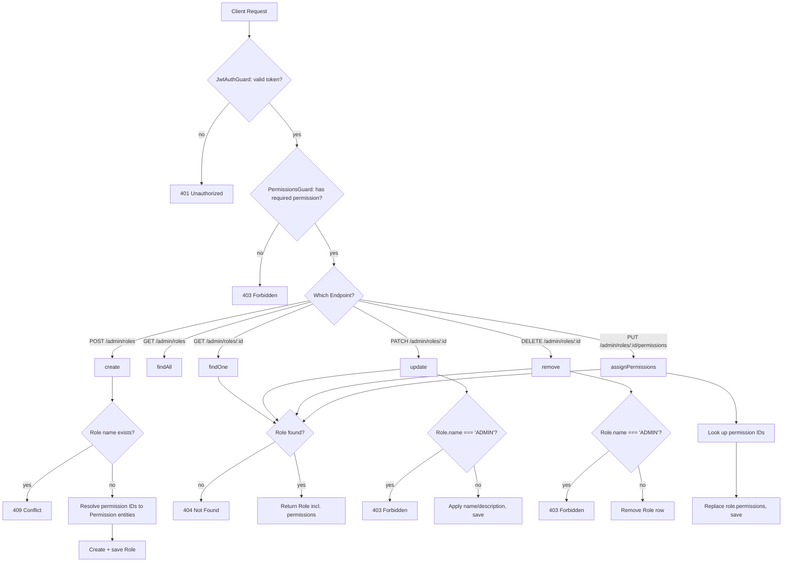
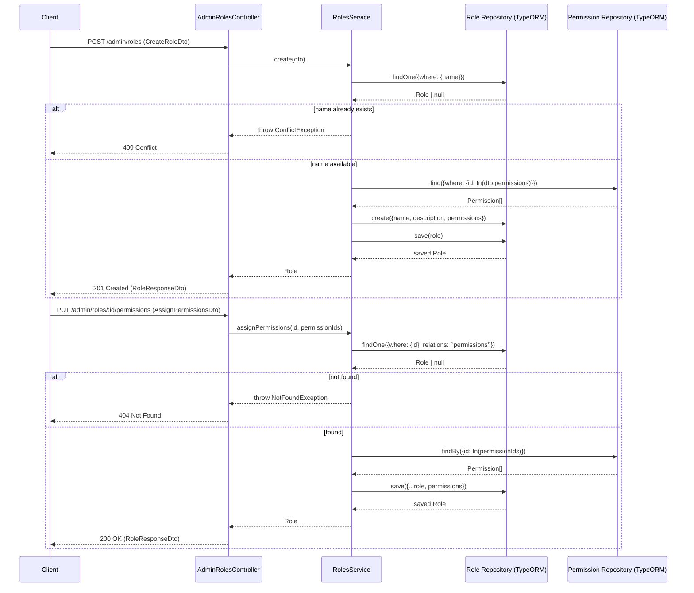

# Roles

## Overview
- **Purpose**: Admin management of RBAC roles — create, list, view, update, delete roles, and assign permissions to a role.
- **Scope**: Admin-only CRUD on `Role` entities and the `role_permission` join table. Roles are consumed at auth time via `CurrentUser.roles`/`CurrentUser.permissions` (populated elsewhere, e.g. login/JWT strategy) and checked by `PermissionsGuard`/`RolesGuard` on protected routes across the app.
- **Entry point**: `AdminRolesController` at route prefix `admin/roles`, protected by `JwtAuthGuard` + `PermissionsGuard`.

---

## Business Rules

- Role `name` is unique — `create` throws `ConflictException` if a role with the same `name` already exists (`repo.findOne({ where: { name } })`).
- The role named exactly `'ADMIN'` (uppercase) cannot be modified (`update`) or deleted (`remove`) — both throw `ForbiddenException('Cannot modify the ADMIN role')` / `('Cannot delete the ADMIN role')`.
  - **Note**: seed data (`src/database/seeds/role.seed.ts`) creates roles named `super-admin`, `admin`, `member` (lowercase) — none matches the literal string `'ADMIN'`, so this protection currently does not guard any seeded role. TODO: confirm intended casing/target role name with the team.
- On `create`, permissions are optional; if `permissions` (array of permission IDs) is provided, only permissions that actually exist (`permissionRepo.find({ where: { id: In(ids) } })`) are attached — unknown IDs are silently dropped, not rejected.
- `assignPermissions` fully replaces a role's permission set (`role.permissions = permissions`), it does not merge/append; unknown permission IDs are silently dropped (`findBy` returns only matching rows).
- Every read/update/delete/assign operation first loads the role via `findOne`, which throws `NotFoundException('Role not found')` if the `id` doesn't exist.
- All admin-roles endpoints require a valid JWT (`JwtAuthGuard`) and the specific permission for the action (`PermissionsGuard` + `@Permissions(...)`):
  - `POST /admin/roles` → `role.create`
  - `GET /admin/roles`, `GET /admin/roles/:id` → `role.read`
  - `PATCH /admin/roles/:id`, `PUT /admin/roles/:id/permissions` → `role.update`
  - `DELETE /admin/roles/:id` → `role.delete`
- `PermissionsGuard` grants access if the user has **any** of the required permission strings (`some`), and allows the request through if no permissions are declared or the request has no `user` bound. `RolesGuard` (separate, decorator-based) similarly checks `user.roles` includes any of the required role names, but `RolesGuard`/`@Roles(...)` are defined in `src/roles/` and not currently applied to any controller in the codebase (`grep` found no usages outside their own definition files) — role-based route guarding is effectively unused in favor of permission-based guarding.
- List (`findAll`) supports optional case-insensitive substring filter on `name` (`ILike('%name%')`) and pagination (`page`, default 1; `limit`, default 20, max 100 per `PaginationDto`), ordered by `createdAt DESC`.
- `UpdateRoleDto` fields (`name`, `description`) are both optional; only fields explicitly present (`!== undefined`) are applied, so partial updates don't clear unspecified fields.

---

## Flow Diagram



---

## Sequence Diagram



---

## Module Structure

| Module | Responsibility |
|---|---|
| `AdminRolesController` | Exposes REST endpoints under `admin/roles`; enforces `JwtAuthGuard` + `PermissionsGuard`; delegates to `RolesService`. |
| `RolesService` | Business logic: uniqueness check, ADMIN-role protection, permission attachment/replacement, pagination/filtering, CRUD orchestration via TypeORM repositories. |
| `Role` (entity) | TypeORM entity/table mapping (`roles`), `ManyToMany` to `User` and to `Permission` (via `role_permission` join table). |
| `RoleMapper` | Maps `Role` entity → `RoleResponseDto` (`id`, `name`, `description`, `createdAt`, `updatedAt`); used by `UserMapper` for embedding a user's roles in `UserResponseDto`, **not** invoked anywhere inside `RolesService`/`AdminRolesController` (those return raw `Role` entities / plain object literals directly). |
| `RolesGuard` / `Roles` decorator | Metadata-based role check (`user.roles.includes(...)`); defined but not currently wired into any controller. |
| `CreateRoleDto`, `UpdateRoleDto`, `RoleListQueryDto`, `AssignPermissionsDto` | Request validation/shape (class-validator). |
| `RoleResponseDto`, `RolePaginatedResponseDto` | Swagger response typing. |
| `RolesModule` | Wires `TypeOrmModule.forFeature([Role, Permission])`, controller, service; exports `TypeOrmModule` (so other modules, e.g. Users, can inject the `Role` repository). |

---

## API

### Endpoint
POST /admin/roles

### Request
```json
{
  "name": "admin",
  "description": "Administrator role with full access",
  "permissions": [
    "123e4567-e89b-12d3-a456-426614174000",
    "123e4567-e89b-12d3-a456-426614174001"
  ]
}
```

### Response
```json
{
  "id": "123e4567-e89b-12d3-a456-426614174000",
  "name": "admin",
  "description": "Administrator role with full access",
  "permissions": [
    {
      "id": "123e4567-e89b-12d3-a456-426614174000",
      "module": "user",
      "action": "read",
      "description": "Xem danh sách người dùng",
      "isSystem": true,
      "createdAt": "2026-01-01T00:00:00.000Z",
      "updatedAt": "2026-01-01T00:00:00.000Z"
    }
  ],
  "createdAt": "2026-01-01T00:00:00.000Z",
  "updatedAt": "2026-01-01T00:00:00.000Z"
}
```

---

### Endpoint
GET /admin/roles

### Request
Query params (all optional): `page` (default 1), `limit` (default 20, max 100), `name` (case-insensitive substring filter).

### Response
```json
{
  "data": [
    {
      "id": "123e4567-e89b-12d3-a456-426614174000",
      "name": "admin",
      "description": "Administrator role with full access",
      "permissions": [],
      "createdAt": "2026-01-01T00:00:00.000Z",
      "updatedAt": "2026-01-01T00:00:00.000Z"
    }
  ],
  "total": 1,
  "page": 1,
  "limit": 20
}
```

---

### Endpoint
GET /admin/roles/:id

### Request
No body. `id` path param (UUID).

### Response
```json
{
  "id": "123e4567-e89b-12d3-a456-426614174000",
  "name": "admin",
  "description": "Administrator role with full access",
  "permissions": [
    {
      "id": "123e4567-e89b-12d3-a456-426614174000",
      "module": "user",
      "action": "read",
      "description": "Xem danh sách người dùng",
      "isSystem": true,
      "createdAt": "2026-01-01T00:00:00.000Z",
      "updatedAt": "2026-01-01T00:00:00.000Z"
    }
  ],
  "createdAt": "2026-01-01T00:00:00.000Z",
  "updatedAt": "2026-01-01T00:00:00.000Z"
}
```

---

### Endpoint
PATCH /admin/roles/:id

### Request
```json
{
  "name": "editor",
  "description": "Editor role"
}
```

### Response
```json
{
  "id": "123e4567-e89b-12d3-a456-426614174000",
  "name": "editor",
  "description": "Editor role",
  "permissions": [],
  "createdAt": "2026-01-01T00:00:00.000Z",
  "updatedAt": "2026-01-01T00:10:00.000Z"
}
```

---

### Endpoint
DELETE /admin/roles/:id

### Request
No body. `id` path param (UUID).

### Response
```json
{ "success": true }
```

---

### Endpoint
PUT /admin/roles/:id/permissions

### Request
```json
{
  "permissionIds": [
    "9d1c9c9e-8b7e-4f12-9f8b-123456789abc",
    "2c7e3d1a-1234-4b6c-9a11-abcdefabcdef"
  ]
}
```

### Response
```json
{
  "id": "123e4567-e89b-12d3-a456-426614174000",
  "name": "admin",
  "description": "Administrator role with full access",
  "permissions": [
    {
      "id": "9d1c9c9e-8b7e-4f12-9f8b-123456789abc",
      "module": "product",
      "action": "publish",
      "description": "Xuất bản / ẩn sản phẩm",
      "isSystem": true,
      "createdAt": "2026-01-01T00:00:00.000Z",
      "updatedAt": "2026-01-01T00:00:00.000Z"
    }
  ],
  "createdAt": "2026-01-01T00:00:00.000Z",
  "updatedAt": "2026-01-01T00:15:00.000Z"
}
```

---

## Processing Steps

**Create (`POST /admin/roles`)**
1. `JwtAuthGuard` validates the access token; `PermissionsGuard` checks the caller has `role.create`.
2. Service checks no existing role has the same `name`; throws `ConflictException` if found.
3. If `dto.permissions` is non-empty, resolves those IDs to existing `Permission` entities (non-matching IDs are dropped).
4. Builds and saves a new `Role` with `name`, `description`, `permissions`.
5. Returns the saved `Role`.

**List (`GET /admin/roles`)**
1. Guards check auth + `role.read`.
2. Service builds a `where` clause from `name` (ILike) if provided, applies pagination (`skip`/`take`) and `createdAt DESC` order, loads `permissions` relation.
3. Maps results to plain objects (`id`, `name`, `description`, `permissions`, `createdAt`, `updatedAt`) wrapped in `{ data, total, page, limit }`.

**Get one (`GET /admin/roles/:id`)**
1. Guards check auth + `role.read`.
2. Service loads the role with its `permissions` relation; throws `NotFoundException` if absent.
3. Returns the `Role`.

**Update (`PATCH /admin/roles/:id`)**
1. Guards check auth + `role.update`.
2. Service calls `findOne` (existence check).
3. Throws `ForbiddenException` if `role.name === 'ADMIN'`.
4. Applies `name`/`description` only for fields present in the DTO, saves.
5. Returns the updated `Role`.

**Delete (`DELETE /admin/roles/:id`)**
1. Guards check auth + `role.delete`.
2. Service calls `findOne` (existence check).
3. Throws `ForbiddenException` if `role.name === 'ADMIN'`.
4. Removes the row.
5. Returns `{ success: true }`.

**Assign permissions (`PUT /admin/roles/:id/permissions`)**
1. Guards check auth + `role.update`.
2. Service calls `findOne` (existence check).
3. Looks up `Permission` entities matching `permissionIds` (non-matching IDs are dropped).
4. Replaces `role.permissions` entirely with the resolved list and saves (updates `role_permission` join rows).
5. Returns the updated `Role`.

---

## Database

| Entity | Description |
|---|---|
| `Role` (`roles` table) | `name` (unique), `description` (nullable), `ManyToMany` to `User` (inverse side `user.roles`), `ManyToMany` to `Permission` via join table `role_permission` (`role_id`, `permission_id`). Extends `AbstractBaseEntity` (`id`, `createdAt`, `updatedAt`). |
| `Permission` (`permissions` table) | `module`, `action` (enum `PermissionAction`), `description`, `isSystem` flag; unique index on `(module, action)`; `ManyToMany` to `Role` and to `User`. Read/attached by this feature but owned by `src/permissions/`. |
| `role_permission` (join table) | Links `roles.id` ↔ `permissions.id`; fully managed by TypeORM via the `@JoinTable` on `Role.permissions`. |
| `User` | Referenced via `Role.users` (inverse `ManyToMany`); not modified by this feature. |

---

## Events

None. TODO: no event emitters (`EventEmitter2`, message queue, etc.) found in `src/roles/`; role/permission changes are not published anywhere for downstream consumers (e.g. cache/token invalidation for already-issued JWTs).

---

## Exception Flow

- `ConflictException("Role '<name>' already exists")` — `create`, when a role with the same `name` already exists.
- `NotFoundException('Role not found')` — `findOne`, when no role matches the given `id`; also surfaces through `update`, `remove`, `assignPermissions` (all call `findOne` first).
- `ForbiddenException('Cannot modify the ADMIN role')` — `update`, when `role.name === 'ADMIN'`.
- `ForbiddenException('Cannot delete the ADMIN role')` — `remove`, when `role.name === 'ADMIN'`.
- Implicit `401 Unauthorized` — from `JwtAuthGuard` when the request lacks a valid bearer token (enforced by the guard, not explicit in controller/service code).
- Implicit `403 Forbidden` — from `PermissionsGuard` when the authenticated user lacks the required permission string for the endpoint.
- DTO validation errors (`class-validator`: missing/empty `name`, non-UUID entries in `permissions`/`permissionIds`, wrong types) — produce NestJS's default `400 Bad Request` via the global validation pipe (not explicit in this module's code).
- Unknown permission IDs passed to `create` or `assignPermissions` are **not** an error — they are silently filtered out (`find`/`findBy` simply return fewer rows than requested).

---

## Related Components

- `AdminRolesController` — `src/roles/admin-roles.controller.ts`
- `RolesService` — `src/roles/roles.service.ts`
- `Role` repository (TypeORM) — injected via `@InjectRepository(Role)`
- `Permission` repository (TypeORM) — injected via `@InjectRepository(Permission)` (cross-module dependency on `src/permissions/entities/permission.entity.ts`)
- `JwtAuthGuard` — `src/auth/guards/jwt-auth.guard.ts`
- `PermissionsGuard` / `@Permissions(...)` decorator — `src/permissions/guards/permissions.guard.ts`, `src/permissions/decorators/permissions.decorator.ts`
- `RolesGuard` / `@Roles(...)` decorator — `src/roles/guards/roles.guard.ts`, `src/roles/decorators/roles.decorator.ts` (defined, unused by any controller)
- `RoleMapper` — `src/roles/mapper/role.mapper.ts` (used by `UserMapper`, not by this module's own controller/service)
- `Permissions` module — `src/permissions/` (owns `Permission` entity, `AdminPermissionsController` for permission CRUD + `GET /admin/permissions/all` "list all" endpoint used to populate role-assignment UIs)
- `RolesModule` — `src/roles/roles.module.ts`, exports `TypeOrmModule` so `Role` repository is available to other modules (e.g. `UsersModule` for role assignment)

---

## Notes

- Seed data (`src/database/seeds/role.seed.ts`, run alongside `src/database/seeds/permission.seed.ts` via `src/database/seeds/index.ts`) creates three default roles on seed/re-seed (idempotent upsert by `name`):
  - `super-admin` — assigned **all** permissions in the system.
  - `admin` — assigned a curated subset (users, categories, products, orders, payments, reviews, addresses, carts, wishlists, discounts, banners, media full/partial CRUD; only `role.read` and `permission.read` — explicitly **not** given create/update/delete on roles or permissions, reserved for `super-admin`).
  - `member` — assigned only `user.read`.
  - Re-running the seed updates `description`/`permissions` on existing roles by name rather than duplicating them.
- The ADMIN-role protection in `RolesService` (`update`/`remove`) checks for the literal name `'ADMIN'` (uppercase), which does not match any seeded role name (`super-admin`, `admin`, `member` are lowercase) — this guard is effectively dead in the current seed data. TODO: confirm with the team whether the check should target `'super-admin'` (or be case-insensitive).
- `RoleResponseDto`/`RolePaginatedResponseDto` are Swagger typing artifacts; `findOne`, `update`, `remove`, `assignPermissions` all return the raw TypeORM `Role` entity (no explicit `RoleMapper`/`plainToInstance` step), so any additional entity fields (e.g. `users` relation, if loaded) could technically be present on the response beyond what's declared in the DTO. TODO: confirm whether global serialization (e.g. `ClassSerializerInterceptor`) strips undeclared fields.
- `findAll` is the only method in `RolesService` that manually maps to plain objects matching `RoleResponseDto` shape; it does not use `RoleMapper` either.
- `GET /admin/permissions/all` (`AdminPermissionsController.findAllRaw`, `permission.read`) returns the full unpaginated permission list — intended for populating a role/permission-assignment UI; it is a `permissions.service.findAllRaw()` call unrelated to role-specific logic but directly supports the "assign permissions to role" workflow described here.
- `assignPermissions` and permission attachment in `create` are not wrapped in an explicit DB transaction; TypeORM's `save` on the `permissions` relation handles join-table diffing internally, but multi-repository operations (`findOne` role, `find`/`findBy` permissions, `save` role) are separate round-trips.
