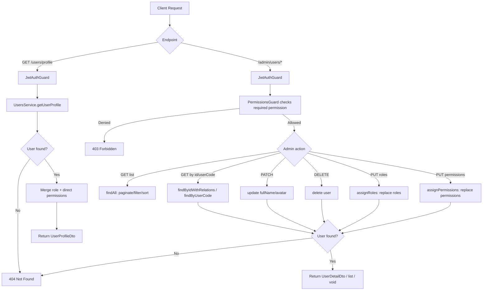
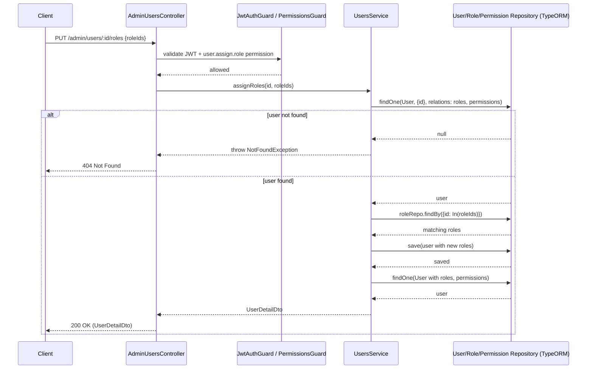

# Users

## Overview
- **Purpose**: Manage application user records — self-service profile retrieval, and admin-side listing, lookup, update, deletion, and role/permission assignment.
- **Scope**: `src/users/*` (controllers, service, DTOs, mapper, util, entity). User *creation* (registration/OAuth) is handled by `src/auth` (`AuthService.register`, `AuthService` OAuth login flow), not by this module — `CreateUserDto` in this module is an empty, unused stub.
- **Entry point**: `UsersController` (`/users`, self-service) and `AdminUsersController` (`/admin/users`, admin management), both backed by `UsersService`.

---

## Business Rules

- Every authenticated user can fetch only their own profile via `GET /users/profile`; there is no path to fetch another user's profile through the self-service controller.
- `GET /users/profile` returns 404 (`User profile not found`) if `UsersService.getUserProfile` finds no user for the current JWT's `id`.
- A user's effective permission set in the profile response is the union of permissions inherited from their roles and permissions assigned directly to the user (deduplicated).
- All `/admin/users/*` routes require a valid JWT (`JwtAuthGuard`) **and** pass `PermissionsGuard`, which checks the caller's JWT-embedded `permissions` array against the route's required permission(s) via `@Permissions(...)`.
  - `GET /admin/users`, `GET /admin/users/by-code/:userCode`, `GET /admin/users/:id` require `user.read`.
  - `PATCH /admin/users/:id` and `PUT /admin/users/:id/permissions` require `user.update`.
  - `DELETE /admin/users/:id` requires `user.delete`.
  - `PUT /admin/users/:id/roles` requires `user.assign.role`.
- `PermissionsGuard` allows the request through if the handler declares no `@Permissions` metadata, and denies it (returns `false`, i.e. 403) if there is no `user` on the request or none of the required permissions match (permissions check is OR-based: any one match passes).
- `PATCH /admin/users/:id` only allows updating `fullName` and `avatar` (`SafeUserUpdate` = `Pick<User, 'fullName' | 'avatar'>`); email, userCode, roles, and permissions cannot be changed through this endpoint.
- `PUT /admin/users/:id/roles` **replaces** the user's entire role set with the given `roleIds`; an empty array clears all roles. Non-existent role IDs are silently ignored (`roleRepo.findBy({ id: In(roleIds) })` only returns matches).
- `PUT /admin/users/:id/permissions` **replaces** the user's entire direct-permission set the same way (replace-all semantics, empty array clears, unknown IDs silently ignored).
- `roleIds` / `permissionIds` in assignment DTOs must each be a valid UUID v4 (`@IsUUID('4', { each: true })`) and must be an array (`@IsArray()`).
- `DELETE /admin/users/:id` hard-deletes the user row (`repo.remove`), not a soft delete.
- User listing (`GET /admin/users`) supports pagination (`page`, default 1; `limit`, default 20, max 100), filtering by `email` (case-insensitive partial match, `ILIKE`) and exact `userCode` match, and always eager-loads the user's `roles`. Results are ordered by `createdAt DESC`.
  - TODO: `UserFilterDto` also declares a `role` query field, but `UsersService.findAll` never applies it — filtering by role name currently has no effect.
- `email` and `userCode` are unique columns on the `users` table (enforced at the DB level).
- `userCode` is generated as `USR-<YYYYMMDD>-<6 random base36 chars uppercased>` (`generateUserCode`), but this generation happens in `AuthService` at user-creation time, not in `UsersService`.

---

## Flow Diagram



---

## Sequence Diagram



---

## Module Structure

| Module | Responsibility |
|---|---|
| `UsersModule` | Wires `User`, `Role`, `Permission` TypeORM repositories; declares `UsersController` and `AdminUsersController`; exports `UsersService` for use by other modules (e.g. `AuthModule`). |
| `UsersController` | Self-service endpoint: current user's own profile. |
| `AdminUsersController` | Admin CRUD + role/permission assignment on any user. |
| `UsersService` | Business logic: lookup, list/filter/paginate, update, delete, assign roles/permissions, build profile. |
| `UserMapper` | Maps `User` entity to `UserResponseDto` (list view). |
| `user-code.util.ts` | Generates the human-readable `userCode` (consumed by `AuthService`, not this module). |
| `User` entity | `users` table: email, userCode, fullName, avatar, identities, addresses, roles, permissions. |

---

## API

### Endpoint
`GET /users/profile`

**Auth**: `JwtAuthGuard` (any authenticated user)

#### Request
No body. Uses JWT-derived current user (`@CurrentUser()`).

#### Response
```json
{
  "id": "e4b5f7a0-1c2d-4e3f-8a9b-0c1d2e3f4a5b",
  "name": "Name",
  "email": "user@example.com",
  "roles": ["ADMIN", "USER"],
  "permissions": ["user.read", "user.create", "post.update"]
}
```

---

### Endpoint
`GET /admin/users`

**Auth**: `JwtAuthGuard` + `PermissionsGuard` (`user.read`)

#### Request
```json
{
  "page": 1,
  "limit": 20,
  "email": "gmail.com",
  "userCode": "USR-20260627-AB12CD",
  "role": "admin"
}
```
(all fields optional; `role` is accepted but currently not applied by the service — see Business Rules)

#### Response
```json
{
  "data": [
    {
      "id": "c1a2b3",
      "userCode": "USR-20260627-AB12CD",
      "email": "user@gmail.com",
      "fullName": "Tan Nguyen",
      "roles": [{ "id": "123e4567-e89b-12d3-a456-426614174000", "name": "admin" }],
      "createdAt": "2026-05-03T10:00:00Z",
      "updatedAt": "2026-05-03T10:00:00Z"
    }
  ],
  "total": 100,
  "page": 1,
  "limit": 20
}
```

---

### Endpoint
`GET /admin/users/by-code/:userCode`

**Auth**: `JwtAuthGuard` + `PermissionsGuard` (`user.read`)

#### Request
Path param: `userCode` (e.g. `USR-20260627-AB12CD`)

#### Response
```json
{
  "id": "uuid-v4",
  "userCode": "USR-20260627-AB12CD",
  "email": "user@example.com",
  "fullName": "Tan Nguyen",
  "avatar": "https://...",
  "roles": [{ "id": "123e4567-...", "name": "admin", "description": "...", "createdAt": "...", "updatedAt": "..." }],
  "permissions": [{ "id": "123e4567-...", "module": "user", "action": "read", "description": "Read users permission", "isSystem": false, "createdAt": "...", "updatedAt": "..." }],
  "createdAt": "2026-01-01T00:00:00Z",
  "updatedAt": "2026-01-01T00:00:00Z"
}
```

---

### Endpoint
`GET /admin/users/:id`

**Auth**: `JwtAuthGuard` + `PermissionsGuard` (`user.read`)

#### Request
Path param: `id` (UUID)

#### Response
Same shape as `GET /admin/users/by-code/:userCode` above (`UserDetailDto`, includes roles and direct permissions).

---

### Endpoint
`PATCH /admin/users/:id`

**Auth**: `JwtAuthGuard` + `PermissionsGuard` (`user.update`)

#### Request
```json
{
  "fullName": "Tan Nguyen",
  "avatar": "https://example.com/avatar.png"
}
```
Note: body is untyped (`{ fullName?: string; avatar?: string }`), no DTO validation decorators applied on this route.

#### Response
`UserDetailDto` — same shape as `GET /admin/users/:id`.

---

### Endpoint
`DELETE /admin/users/:id`

**Auth**: `JwtAuthGuard` + `PermissionsGuard` (`user.delete`)

#### Request
Path param: `id` (UUID). No body.

#### Response
`204 No Content` (empty body).

---

### Endpoint
`PUT /admin/users/:id/roles`

**Auth**: `JwtAuthGuard` + `PermissionsGuard` (`user.assign.role`)

#### Request
```json
{
  "roleIds": ["9d1c9c9e-8b7e-4f12-9f8b-123456789abc"]
}
```

#### Response
`UserDetailDto` — reflects the replaced role set.

---

### Endpoint
`PUT /admin/users/:id/permissions`

**Auth**: `JwtAuthGuard` + `PermissionsGuard` (`user.update`)

#### Request
```json
{
  "permissionIds": ["9d1c9c9e-8b7e-4f12-9f8b-123456789abc"]
}
```

#### Response
`UserDetailDto` — reflects the replaced direct-permission set.

---

## Processing Steps

**Get own profile (`GET /users/profile`)**
1. `JwtAuthGuard` validates the access token and attaches `user` to the request.
2. Controller extracts `user.id` via `@CurrentUser()`.
3. `UsersService.getUserProfile` loads the `User` with `roles`, `roles.permissions`, and `permissions` relations.
4. If not found, returns `null` → controller throws `NotFoundException`.
5. Service derives `roleNames`, flattens role permissions into `module.action` strings, maps direct permissions the same way, and unions/dedupes them.
6. Returns `UserProfileDto` (id, name, email, roles, permissions).

**Assign roles/permissions (`PUT /admin/users/:id/roles` or `/permissions`)**
1. `JwtAuthGuard` + `PermissionsGuard` validate token and required permission.
2. Controller passes `id` and `roleIds`/`permissionIds` to the service.
3. Service loads the target `User` with `roles`/`permissions` relations; throws `NotFoundException` if missing.
4. Service resolves the given IDs to actual `Role`/`Permission` entities (`findBy({ id: In(ids) })`); empty input yields an empty array.
5. Service overwrites `user.roles` (or `user.permissions`) entirely and saves — TypeORM syncs the join table (`user_role` / `user_permission`) to match.
6. Service re-fetches and returns the full `UserDetailDto`.

**List users (`GET /admin/users`)**
1. Guards validate token + `user.read` permission.
2. Service builds a query with `email` (ILIKE) and `userCode` (exact) filters, orders by `createdAt DESC`, paginates via `skip`/`take`, and eager-loads `roles`.
3. Executes `getManyAndCount`, maps rows through `UserMapper.toResponse`, returns `{ data, total, page, limit }`.

---

## Database

| Entity | Description |
|---|---|
| `User` (`users` table) | Core user record: id, email (unique), userCode (unique, nullable), fullName, avatar, timestamps. |
| `Role` | Linked via `user_role` join table (many-to-many); represents assignable roles. |
| `Permission` | Linked via `user_permission` join table (many-to-many); direct permissions bypassing roles. |
| `Identity` | One-to-many from `User`; login identities (local/OAuth) — read by `auth`, referenced in `User.identities`. |
| `Address` | One-to-many from `User`; not exercised by this module's endpoints but part of the entity relations. |

---

## Events

None. TODO: no event emitters (e.g. `EventEmitter2`) found in `src/users/*`.

---

## Exception Flow

- `GET /users/profile` → `NotFoundException('User profile not found')` if `getUserProfile` returns `null`.
- `GET /admin/users/:id`, `GET /admin/users/by-code/:userCode` → `NotFoundException('User not found')` if no matching row.
- `PATCH /admin/users/:id` → underlying `update` does not itself throw on missing id (TypeORM `update` is a no-op update), but the subsequent `findByIdWithRelations(id)` call throws `NotFoundException('User not found')` if the user doesn't exist.
- `DELETE /admin/users/:id` → `NotFoundException('User not found')` if user doesn't exist before removal.
- `PUT /admin/users/:id/roles`, `PUT /admin/users/:id/permissions` → `NotFoundException('User not found')` if the target user doesn't exist.
- `AssignRolesDto` / `AssignUserPermissionsDto` validation → global `ValidationPipe` rejects non-array or non-UUID-v4 entries (400 Bad Request) before reaching the service.
- `PermissionsGuard` → returns `false` (403 Forbidden via Nest's guard mechanism) when the caller lacks the required permission or has no `user` on the request.
- `JwtAuthGuard` → standard Passport JWT failure → 401 Unauthorized for missing/invalid/expired token.
- Unique constraint violations on `email`/`userCode` are enforced at the DB level; not explicitly caught/mapped in `UsersService` (would surface as a raw database error) — TODO: confirm whether a global exception filter maps this to a friendlier 409/400.

---

## Related Components

- `UsersController` (`src/users/users.controller.ts`)
- `AdminUsersController` (`src/users/admin-users.controller.ts`)
- `UsersService` (`src/users/users.service.ts`)
- `UserMapper` (`src/users/mapper/user.mapper.ts`)
- `generateUserCode` util (`src/users/utils/user-code.util.ts`)
- `User` entity (`src/users/entities/user.entity.ts`)
- `JwtAuthGuard` (`src/auth/guards/jwt-auth.guard.ts`) — used on both controllers
- `PermissionsGuard` + `@Permissions` decorator (`src/permissions/guards/permissions.guard.ts`, `src/permissions/decorators/permissions.decorator.ts`) — used on `AdminUsersController`
- `RoleMapper`, `Role` entity (`src/roles/*`) — consumed for role assignment/display
- `Permission` entity, `PermissionResponseDto` (`src/permissions/*`) — consumed for permission assignment/display
- `AuthService` (`src/auth/auth.service.ts`) — creates `User` rows on register/OAuth login using `generateUserCode`; also calls `UsersService.findByEmail` and `getUserProfile`
- `CurrentUser` decorator/interface (`src/common/decorators/current-user.decorator.ts`, `src/common/interfaces/current-user.interface.ts`) — supplies JWT-derived user context
- `PaginationDto` / `PaginatedResponseDto` (`src/common/dto/pagination.dto.ts`) — pagination base for list endpoint

---

## Notes

- `CreateUserDto` and `UpdateUserDto` exist in `src/users/dto/` but are empty/unused stubs (`UpdateUserDto` extends `PartialType(CreateUserDto)`, which itself has no fields); no controller route uses them. Actual user creation lives entirely in `AuthService` (registration and OAuth login).
- `PATCH /admin/users/:id` accepts a plain inline type (`{ fullName?: string; avatar?: string }`) rather than a class-validator DTO, so there is no request-body validation (e.g. length limits, URL format for `avatar`) at this route — TODO: consider introducing a validated `UpdateUserAdminDto`.
- `UserFilterDto.role` is defined but not wired into `UsersService.findAll`'s query — currently has no filtering effect (see Business Rules).
- `PermissionsGuard` permission check is OR (`.some(...)`), not AND: a route requiring `user.update` is satisfied if the caller has that single permission; routes never currently require multiple permissions simultaneously, but the guard implementation would treat multiple declared permissions as "any one suffices."
- `assignRoles` / `assignPermissions` are full-replace operations, not incremental add/remove — callers must resend the complete desired set.
- `UsersService` is exported from `UsersModule` and consumed directly by `AuthModule`, indicating a tight coupling between auth and user management.
