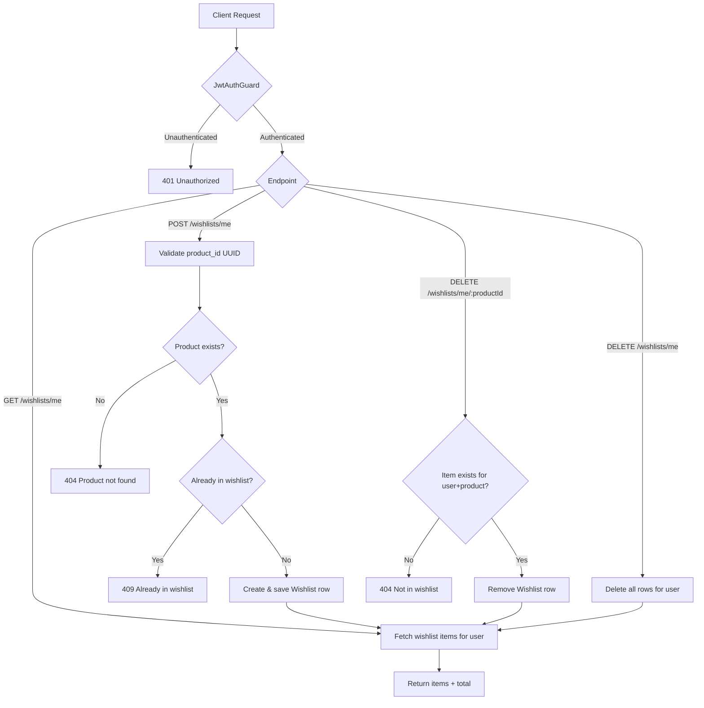
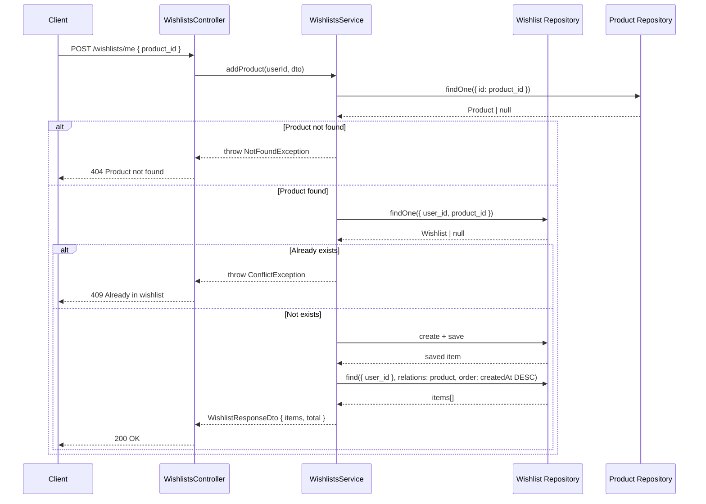

# Wishlists

## Overview
- **Purpose**: Allow an authenticated user to maintain a personal list of products they are interested in (add, view, remove, clear).
- **Scope**: CRUD-lite operations scoped to the current user only; no admin/other-user access, no sharing, no pagination.
- **Entry point**: `WishlistsController` (`src/wishlists/wishlists.controller.ts`), mounted at `/wishlists`.

---

## Business Rules

- All endpoints require authentication via `JwtAuthGuard` (Bearer token) — no anonymous access.
- A wishlist item is always scoped to the current authenticated user (`user.id` from `@CurrentUser()`); users cannot view or modify another user's wishlist.
- A product must exist (`ProductRepository.findOne`) to be added to a wishlist; otherwise a `404 Not Found` is thrown.
- A `(user_id, product_id)` pair is unique — enforced both at the DB level (`@Unique(['user_id', 'product_id'])` on the `Wishlist` entity) and in application logic (existence check before insert).
- Adding a product already present in the wishlist throws `409 Conflict` ("Product is already in your wishlist").
- Removing a product not present in the wishlist throws `404 Not Found` ("Product not in wishlist").
- Clearing the wishlist deletes all rows for the user unconditionally (no error if already empty).
- Every mutating operation (add/remove/clear) returns the full, refreshed wishlist (not just the affected item).
- Wishlist items are returned ordered by `createdAt DESC` (most recently added first).
- Deleting the parent `User` or `Product` cascades to delete the corresponding `Wishlist` row (`onDelete: 'CASCADE'` on both relations).

---

## Flow Diagram



---

## Sequence Diagram



---

## Module Structure

| Module | Responsibility |
|---|---|
| `WishlistsController` | HTTP layer: routes, guards, request/response mapping. |
| `WishlistsService` | Business logic: validation, uniqueness checks, persistence orchestration. |
| `Wishlist` entity | TypeORM entity mapping the `wishlists` table, relations to `User` and `Product`. |
| `AddToWishlistDto` | Input validation for adding a product (UUID check). |
| `WishlistResponseDto` / `WishlistItemResponseDto` / `WishlistProductDto` | Output shape for API responses. |
| `WishlistsModule` | Wires controller, service, and `TypeOrmModule.forFeature([Wishlist, Product])`. |

---

## API

### Endpoint
`GET /wishlists/me`

**Auth**: Bearer JWT required.

#### Request
```json
{}
```
No body or params; user identity comes from the JWT.

#### Response
```json
{
  "items": [
    {
      "id": "e4b5f7a0-1c2d-4e3f-8a9b-0c1d2e3f4a5b",
      "product_id": "b1c2d3e4-f5a6-4b7c-8d9e-0f1a2b3c4d5e",
      "product": {
        "id": "b1c2d3e4-f5a6-4b7c-8d9e-0f1a2b3c4d5e",
        "name": "Wireless Mouse",
        "slug": "wireless-mouse",
        "basePrice": 19.99,
        "sku": "SKU-001",
        "status": "active",
        "isFeatured": false,
        "description": "Ergonomic wireless mouse"
      },
      "createdAt": "2026-01-01T10:00:00Z"
    }
  ],
  "total": 1
}
```

---

### Endpoint
`POST /wishlists/me`

**Auth**: Bearer JWT required.

#### Request
```json
{
  "product_id": "b1c2d3e4-f5a6-4b7c-8d9e-0f1a2b3c4d5e"
}
```

#### Response
```json
{
  "items": [
    {
      "id": "e4b5f7a0-1c2d-4e3f-8a9b-0c1d2e3f4a5b",
      "product_id": "b1c2d3e4-f5a6-4b7c-8d9e-0f1a2b3c4d5e",
      "product": {
        "id": "b1c2d3e4-f5a6-4b7c-8d9e-0f1a2b3c4d5e",
        "name": "Wireless Mouse",
        "slug": "wireless-mouse",
        "basePrice": 19.99,
        "sku": "SKU-001",
        "status": "active",
        "isFeatured": false,
        "description": "Ergonomic wireless mouse"
      },
      "createdAt": "2026-01-01T10:00:00Z"
    }
  ],
  "total": 1
}
```

---

### Endpoint
`DELETE /wishlists/me/:productId`

**Auth**: Bearer JWT required.

#### Request
```json
{}
```
Path parameter `productId` (UUID) identifies the product to remove.

#### Response
```json
{
  "items": [],
  "total": 0
}
```

---

### Endpoint
`DELETE /wishlists/me`

**Auth**: Bearer JWT required.

#### Request
```json
{}
```
No body or params; clears all items for the current user.

#### Response
```json
{
  "items": [],
  "total": 0
}
```

> Note: Controller decorates this with `@ApiNoContentResponse()` for Swagger docs, but the handler actually returns the refreshed `WishlistResponseDto` (HTTP 200 with a body), not an empty `204 No Content`. This is a discrepancy in the Swagger annotation vs. actual behavior.

---

## Processing Steps

**Get wishlist (`GET /wishlists/me`)**
1. `JwtAuthGuard` authenticates the request and resolves `user.id`.
2. `WishlistsService.getWishlist` queries `Wishlist` rows for `user_id`, joining `product`, ordered by `createdAt DESC`.
3. Returns `{ items, total: items.length }`.

**Add product (`POST /wishlists/me`)**
1. `JwtAuthGuard` authenticates the request.
2. `AddToWishlistDto` validates `product_id` is a UUID.
3. Service looks up the `Product` by id; throws `404` if missing.
4. Service checks for an existing `(user_id, product_id)` wishlist row; throws `409` if found.
5. Creates and saves a new `Wishlist` row.
6. Returns the refreshed wishlist via `getWishlist`.

**Remove product (`DELETE /wishlists/me/:productId`)**
1. `JwtAuthGuard` authenticates the request.
2. Service looks up the wishlist row by `(user_id, productId)`; throws `404` if not found.
3. Removes the row.
4. Returns the refreshed wishlist via `getWishlist`.

**Clear wishlist (`DELETE /wishlists/me`)**
1. `JwtAuthGuard` authenticates the request.
2. Service deletes all `Wishlist` rows matching `user_id` (no existence check, idempotent).
3. Returns the refreshed (empty) wishlist via `getWishlist`.

---

## Database

| Entity | Description |
|---|---|
| `Wishlist` (`wishlists` table) | Join entity linking a `user_id` and `product_id`, with a unique constraint on the pair. Inherits `id`, `createdAt`, `updatedAt` from `AbstractBaseEntity`. |
| `User` | Referenced via `ManyToOne` (`user_id`), `onDelete: 'CASCADE'`. Not modified by this feature. |
| `Product` | Referenced via `ManyToOne` (`product_id`), `onDelete: 'CASCADE'`. Read-only lookup for existence check and to populate response data. |

---

## Events

None.

> TODO: No event emission (e.g. EventEmitter, message queue) found in `wishlists.service.ts`. Confirm with product/eng whether wishlist adds should trigger downstream events (e.g. analytics, notifications).

---

## Exception Flow

- `404 Not Found` — `addProduct`: referenced `product_id` does not exist in `Product` table.
- `409 Conflict` — `addProduct`: product already exists in the user's wishlist (duplicate `(user_id, product_id)`).
- `404 Not Found` — `removeProduct`: no wishlist row exists for `(user_id, productId)`.
- `401 Unauthorized` — implicit via `JwtAuthGuard` on all routes when no/invalid JWT is supplied.
- `400 Bad Request` — implicit via `class-validator` (`@IsUUID()`) when `product_id` in `AddToWishlistDto` is not a valid UUID (assuming a global `ValidationPipe` is configured elsewhere in the app).

---

## Related Components

- `WishlistsController` (`src/wishlists/wishlists.controller.ts`)
- `WishlistsService` (`src/wishlists/wishlists.service.ts`)
- `Wishlist` repository (TypeORM, injected via `@InjectRepository(Wishlist)`)
- `Product` repository (TypeORM, injected via `@InjectRepository(Product)`) — from `src/products`
- `User` entity (`src/users/entities/user.entity.ts`) — relation target only, not directly queried by this feature
- `JwtAuthGuard` (`src/auth/guards/jwt-auth.guard.ts`)
- `CurrentUser` decorator (`src/common/decorators/current-user.decorator.ts`)
- `AbstractBaseEntity` (`src/common/entities/base.entity.ts`)

---

## Notes

- All endpoints are user-scoped (`/wishlists/me` and `/wishlists/me/:productId`); there is no admin endpoint to view/manage another user's wishlist.
- No pagination on `GET /wishlists/me` — all items are returned in one response; could become a concern for large wishlists.
- `WishlistResponseDto` always reflects the full current state after any mutation, so clients don't need to re-fetch separately after add/remove/clear.
- The `@ApiNoContentResponse()` decorator on `clearWishlist` in the controller does not match the actual returned body (`WishlistResponseDto`); Swagger docs for this endpoint should be treated as inaccurate until corrected in code.
- Uniqueness of `(user_id, product_id)` is enforced at both the DB constraint level and via an application-level pre-check, so a race condition between the check and insert could theoretically still raise a DB-level unique violation that is not explicitly caught/mapped to `409` in `addProduct`.
